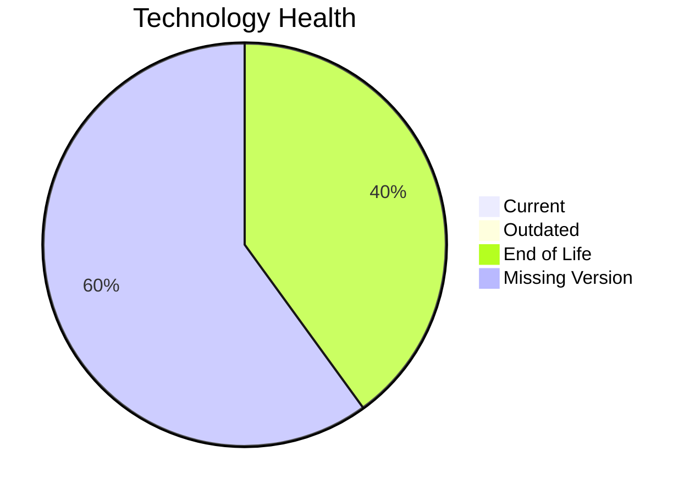

# Application Report: BackupApp-017

**ID:** app017  
**Generated:** 2026-05-14

## Overview

| Attribute | Value |
|-----------|-------|
| Owner | unknown |
| Environment | On-Premise |
| Business Criticality | High |
| Users | 45 |
| Servers | sv24, sv25 |

## Technology Stack

| Component | Technology | Version | Status |
|-----------|-----------|---------|--------|
| os | RHEL 7 | 7 | 🔴 EOL |
| database | Oracle 12c | 12 | 🔴 EOL |
| language | PowerShell | unknown | ⚪ NO_KNOWLEDGE |
| framework | Framework | unknown | ⚪ NO_KNOWLEDGE |
| app_server | Payara 5.0 | 5.0 | ⚪ NO_KNOWLEDGE |

## Complexity Assessment

**Score:** 7/10 — **HIGH**  
**Confidence:** 8

**Reasoning:** Tech age 8/10 (2 EOL, 0 outdated components), integrations 8 interfaces and 0 dependencies, infrastructure 2 servers/5 environments, criticality High, architecture score 5/10, data score 7/10.

## Modernization Scenarios

### Applicable Scenarios

#### ✅ Operating System Update
- **Cost:** €1330 (one-time)
- **Savings:** €500/year
- **Reasoning:** RHEL 7 requires upgrade/security patching.
#### ✅ Application Migration to Cloud Infrastructure (Lift & Shift)
- **Cost:** €6650 (one-time)
- **Savings:** €2400/year
- **Reasoning:** Application appears on-premise and is a cloud migration candidate.
#### ✅ Application Containerization
- **Cost:** €133001 (one-time)
- **Savings:** €80000/year
- **Reasoning:** Containerization could improve portability and operations.
#### ✅ Application Refactoring and De-coupling
- **Cost:** €332502 (one-time)
- **Savings:** €120000/year
- **Reasoning:** Monolithic/tightly integrated footprint suggests refactoring benefits.
#### ✅ Upgrade Legacy Databases
- **Cost:** €13300 (one-time)
- **Savings:** €10000/year
- **Reasoning:** Database Oracle 12c is legacy/outdated.

### Not Applicable / Other

| Scenario | Status | Reason |
|----------|--------|--------|
| Switch to standard Linux Operating System | FULFILLED | Application already runs on a standard Linux platform. |
| Switch to ARM-based CPU | NOT_APPLICABLE | On-premise hosting makes ARM migration less direct. |
| Applications Server replacement | LACK_OF_DATA | Insufficient application server data. |
| Switch DB Engine to open-source database solution | APPLICABLE | Proprietary database engine indicates open-source migration opportunity. |
| Update outdated components | APPLICABLE | Outdated or EOL components identified in technology assessment. |

## Financial Summary

| Metric | Value |
|--------|-------|
| Total One-Time Cost | €486783 |
| Total Yearly Savings | €212900 |
| Break-Even | 2.3 years |
