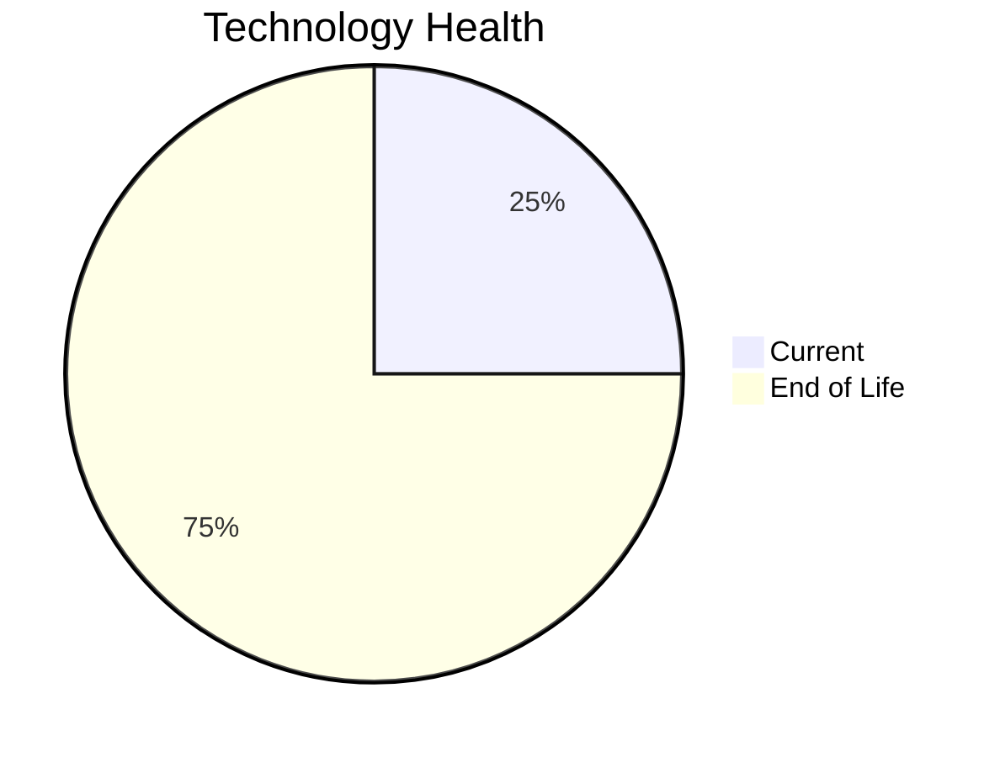

# Application Report: BackupApp-017

**ID:** app017  
**Generated:** 2026-05-05

## Overview

| Attribute | Value |
|-----------|-------|
| Business Unit | IT |
| Deployment Type | On-Premise |
| Business Criticality | High |
| Users | 45 |
| Servers | sv24, sv25 |
| Environments | 5 |
| Architecture | unknown |
| Containerized | No |
| CI/CD | No |
| Solution Type | 3rd party software |
| Data Classification | Confidential |

> Automated backup and disaster recovery system for critical business applications and data

## Technology Stack

| Component | Technology | Version | Status |
|-----------|-----------|---------|--------|
| Os | RHEL | 7 | 🔴 EOL |
| Database | Oracle Database | 12c | 🔴 EOL |
| Language | PowerShell | 7.x | 🟢 CURRENT_VERSION |
| Application Server | Payara | 5.0 | 🔴 EOL |

## Complexity Assessment

**Score:** 7/10 — **HIGH**  
**Confidence:** 7

> Score 7/10 (HIGH). EOL components: 3, Outdated: 0. External interfaces: 8. Servers: 2. Criticality: High. Architecture: unknown. DB storage: 350.0GB.

| Factor | Value |
|--------|-------|
| Servers | 2 |
| Environments | 5 |
| External Interfaces | 8 |
| Business Criticality | High |
| EOL Technologies | 3 |
| Outdated Technologies | 0 |
| CI/CD | No |
| Containerized | No |

## Modernization Scenarios

### ✅ Applicable Scenarios

#### ✅ Operating System Update

- **Priority:** High
- **Effort:** Low
- **One-Time Cost:** €1,330
- **Yearly Savings:** €500
- **Reasoning:** OS RHEL 7 is EOL. RHEL 7 reached End of Maintenance Support on June 30, 2024. No security updates without ELS. OS update is required.

#### ✅ Application Migration to Cloud (Lift & Shift)

- **Priority:** High
- **Effort:** Low
- **One-Time Cost:** €6,650
- **Yearly Savings:** €2,400
- **Reasoning:** Application is hosted on-premise. Migration to cloud (Lift & Shift) is recommended to reduce infrastructure costs.

#### ✅ Upgrade Legacy Databases

- **Priority:** High
- **Effort:** Medium
- **One-Time Cost:** €13,300
- **Yearly Savings:** €10,000
- **Reasoning:** Database Oracle Database 12c is EOL. Oracle Database 12c R2 (12.2) reached End of Premier Support in November 2020 and Extended Support ended July 2022. Immediate upgrade is required.

### Other Scenarios

| Scenario | Status | Reason |
|----------|--------|--------|
| Switch to Standard Linux OS | ✔️ FULFILLED | Application already runs on a Linux-based OS (RHEL 7). However, OS version is EOL; upgrade (os_update_security_patch) is... |
| Switch to ARM-based CPU | ❌ NOT_APPLICABLE | Third-party application; ARM compatibility depends on vendor support, which is not confirmed. |
| Application Server Replacement | ❌ NOT_APPLICABLE | SaaS/3rd-party application; application server is vendor-managed. |
| Application Containerization | ❌ NOT_APPLICABLE | Third-party software; customer cannot modify runtime packaging or container images. |
| Application Refactoring and De-coupling | ❌ NOT_APPLICABLE | Third-party software; internal architecture cannot be refactored by the customer. |
| Switch DB Engine to Open-Source | ❌ NOT_APPLICABLE | Third-party application; database selection may be vendor-mandated. |
| Update Outdated Components | ❌ NOT_APPLICABLE | Third-party software; component versions (language runtime, framework) are vendor-managed and not upgradeable by the cus... |

## Financial Summary

| Metric | Value |
|--------|-------|
| Total One-Time Cost | €21,280 |
| Total Yearly Savings | €12,900 |
| Break-Even | 1.6 years |
