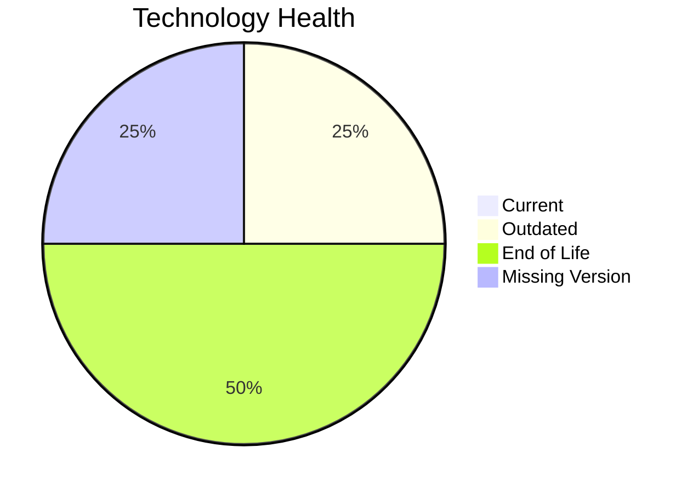

# Application Report: BackupApp-017

**ID:** app017
**Generated:** 2026-05-11

## Overview

| Attribute | Value |
|-----------|-------|
| Owner | IT |
| Environment | On-Premise |
| Business Criticality | High |
| Users | 45 |
| Servers | 2 |

## Technology Stack

| Component | Technology | Version | Status |
|-----------|-----------|---------|--------|
| Operating System | RHEL | RHEL 7 | 🔴 EOL |
| Database | Oracle | Oracle 12c | 🔴 EOL |
| Language | PowerShell | PowerShell | ⚪ NO_KNOWLEDGE |
| Framework | N/A | N/A | ⚪ |
| App Server | Payara | Payara 5.0 | 🟡 OUTDATED |

## Complexity Assessment

**Score:** 8/10 — **HIGH**
**Confidence:** 7

Technology age score 9/10 (EOL=2, outdated=1, unknown=1); integration score 8/10 (interfaces=8, api_endpoints=2); infrastructure score 8/10 (servers=2, environments=5); business criticality score 8/10 (High, users=45); architecture score 6/10 (architecture=unknown, CI/CD=No, containerized=No); data score 7/10 (db_count=1, db_storage_gb=350).

## Modernization Scenarios

### Applicable Scenarios

#### ✅ Operating System Update

- **Priority:** High
- **Effort:** Low
- **Effects:** security
- **Cost:** €1530 (one-time)
- **Savings:** €500/year
- **Reasoning:** Operating system is outdated or end-of-life per technology assessment.

#### ✅ Application Migration to Cloud Infrastructure (Lift & Shift)

- **Priority:** High
- **Effort:** Low
- **Effects:** security, agility
- **Cost:** €7648 (one-time)
- **Savings:** €2400/year
- **Reasoning:** On-premise deployment indicates lift-and-shift opportunity to cloud.

#### ✅ Upgrade Legacy Databases

- **Priority:** High
- **Effort:** Medium
- **Effects:** security, agility
- **Cost:** €15295 (one-time)
- **Savings:** €10000/year
- **Reasoning:** Database engine is outdated or end-of-life.

### Not Applicable / Other

| Scenario | Status | Reason |
|----------|--------|--------|
| Switch to standard Linux Operating System | FULFILLED | Application already runs on a standard Linux distribution. |
| Switch to ARM-based CPU | BLOCKED | Third-party software dependency may block ARM compatibility changes. |
| Applications Server replacement | BLOCKED | Application server lifecycle for third-party stack is vendor-controlled. |
| Application Containerization | BLOCKED | Third-party software may not permit customer-managed container packaging. |
| Application Refactoring and De-coupling | BLOCKED | Source code ownership is vendor-controlled for third-party software. |
| Switch DB Engine to open-source database solution | BLOCKED | Database migration path for third-party application is constrained. |
| Update outdated components | BLOCKED | Component lifecycle updates are vendor-managed for third-party software. |

## Financial Summary

| Metric | Value |
|--------|-------|
| Total One-Time Cost | €24473 |
| Total Yearly Savings | €12900 |
| Break-Even | 1.9 years |
