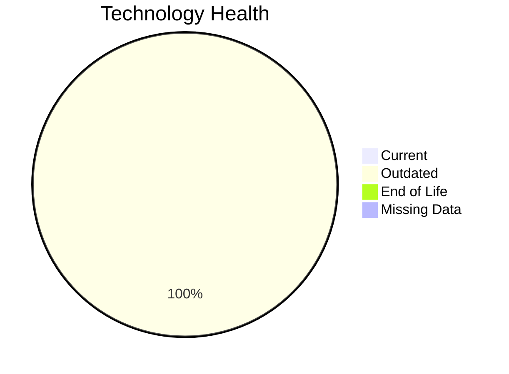

# Application Report: BackupApp-017

**ID:** app017  
**Generated:** 2026-05-07

## Overview

| Attribute | Value |
|-----------|-------|
| Business Unit | IT |
| Deployment Type | On-Premise |
| Business Criticality | High |
| Users | 45 |
| Servers | 2 |
| Solution Type | 3rd party software |

**Description:** Automated backup and disaster recovery system for critical business applications and data

## Technology Stack

| Component | Technology | Status |
|-----------|-----------|--------|
| Os | RHEL 7 | 🟡 OUTDATED |
| Database | Oracle 12c | 🟡 OUTDATED |
| Language | PowerShell None | 🟡 OUTDATED |
| App_Server | Payara 5.0 | 🟡 OUTDATED |

## Complexity Assessment

**Score:** 7/10 — **HIGH**  
**Confidence:** 9/10

**Reasoning:** Technology age: 6/10 (0 EOL, 4 outdated components) | Integration: 8/10 (8 external interfaces) | Infrastructure: 7/10 (2 servers, 5 environments) | Criticality: 9/10 (high) | Architecture: 5/10 (containerized: no, CI/CD: no) | Data: 4/10 (350 GB storage)

### Contributing Factors

| Factor | Value |
|--------|-------|
| Servers | 2 |
| Databases | 1 |
| Environments | 5 |
| Interfaces | 8 |
| EOL Technologies | 0 |
| Outdated Technologies | 4 |
| Containerized | No |
| CI/CD Present | No |

## Modernization Scenarios

### Applicable Scenarios

#### ✅ Operating System Update

- **Priority:** High
- **Effort:** Low
- **Effects:** security
- **Cost:** $1,330.01 (one-time)
- **Savings:** $500.00/year
- **Reasoning:** Triggered by: Operating System Version is Outdated, Operating System Version is Unsupported. Supporting conditions: Compliance requirements not met

#### ✅ Applications Server replacement

- **Priority:** Medium
- **Effort:** Medium
- **Effects:** agility, cost
- **Cost:** $13,300.10 (one-time)
- **Savings:** $9,600.00/year
- **Reasoning:** Triggered by: Application Server lacks container support

#### ✅ Application Migration to Cloud Infrastructure (Lift & Shift)

- **Priority:** High
- **Effort:** Low
- **Effects:** security, agility
- **Cost:** $6,650.05 (one-time)
- **Savings:** $2,400.00/year
- **Reasoning:** Triggered by: Environment Type is On-Premise

#### ✅ Application Refactoring and De-coupling

- **Priority:** High
- **Effort:** High
- **Effects:** agility, cost, sustainability
- **Cost:** $332,502.49 (one-time)
- **Savings:** $120,000.00/year
- **Reasoning:** Triggered by: Architecture is Tightly Coupled

#### ✅ Upgrade Legacy Databases

- **Priority:** High
- **Effort:** Medium
- **Effects:** security, agility
- **Cost:** $13,300.10 (one-time)
- **Savings:** $10,000.00/year
- **Reasoning:** Triggered by: Database Support is End of Life / Outdated

#### ✅ Update outdated components

- **Priority:** High
- **Effort:** High
- **Effects:** security, agility, cost
- **Cost:** $0.00 (one-time)
- **Savings:** $0.00/year
- **Reasoning:** Triggered by: Used Programming language is legacy or outdated (e.g. Java 6 or older, .NET Framework 3.5 or older, PHP 5.x or older, Python 2.x), Used programming language is no longer supported by vendor or community

### Other Scenarios

| Scenario | Status | Reason |
|----------|--------|--------|
| Switch to standard Linux Operating System | ✔️ FULFILLED | Fulfilled: Application already runs on a standard, widely supported Linux distri... |
| Switch to ARM-based CPU | ❌ NOT_APPLICABLE | No primary triggers matched for this application. |
| Application Containerization | ❌ NOT_APPLICABLE | No primary triggers matched for this application. |
| Switch DB Engine to open-source database solution | ❌ NOT_APPLICABLE | No primary triggers matched for this application. |

## Financial Summary

| Metric | Value |
|--------|-------|
| Total One-Time Cost | $367,082.74 |
| Total Yearly Savings | $142,500.00 |
| Break-Even | 2.58 years |

---

*This report was automatically generated from application portfolio analysis.*
