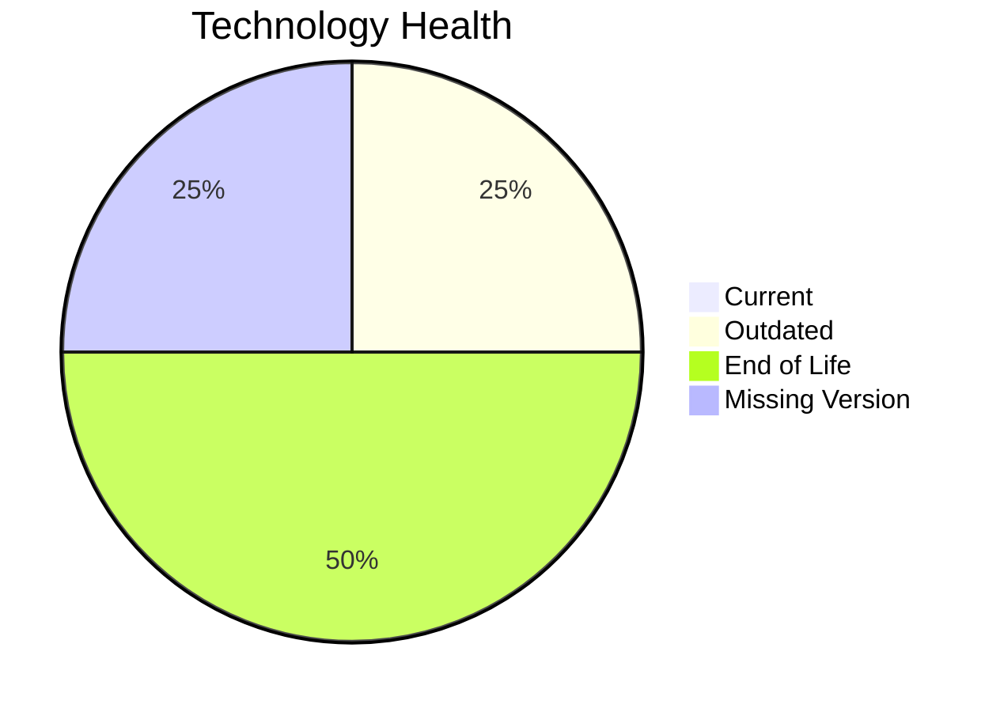

# Application Report: BackupApp-017

**ID:** app017  
**Generated:** 2026-05-17

## Overview

| Attribute | Value |
|-----------|-------|
| Owner | N/A |
| Environment | On-Premise |
| Business Criticality | High |
| Users | 45 |
| Servers | 2 |

## Technology Stack

| Component | Technology | Version | Status |
|-----------|-----------|---------|--------|
| Operating System | RHEL | 7 | 🔴 EOL |
| Database | Oracle | 12c | 🔴 EOL |
| Language | PowerShell | N/A | ⚪ NO_KNOWLEDGE |
| Framework | N/A | N/A | ⚪ NO_KNOWLEDGE |
| App Server | Payara | 5.0 | 🟡 OUTDATED |

## Complexity Assessment

**Score:** 8/10 — **HIGH**  
**Confidence:** 7

| Factor | Score | Notes |
|--------|-------|-------|
| Technology Age | 9/10 | 2 components are EOL. |
| Integration | 8/10 | High integration surface with 8 external interfaces and 2 APIs. |
| Infrastructure | 8/10 | Infrastructure spans 2 servers and 5 environments. |
| Business Criticality | 8/10 | Business criticality is High. |
| Architecture | 8/10 | not containerized, no CI/CD, vendor-controlled architecture. |
| Data | 7/10 | 1 database engine(s), 350 GB storage, legacy database support status. |

## Modernization Scenarios

### Applicable Scenarios

#### ✅ Operating System Update

- **Priority:** High
- **Effort:** Low
- **Effects:** security
- **Cost:** €1530 (one-time)
- **Savings:** €500/year
- **Reasoning:** RHEL 7 is assessed as EOL, which triggers an OS update scenario.

#### ✅ Application Migration to Cloud Infrastructure (Lift & Shift)

- **Priority:** High
- **Effort:** Low
- **Effects:** security, agility
- **Cost:** €7648 (one-time)
- **Savings:** €2400/year
- **Reasoning:** Application still runs on-premises or in a hybrid footprint, so lift-and-shift to public cloud remains applicable.

#### ✅ Upgrade Legacy Databases

- **Priority:** High
- **Effort:** Medium
- **Effects:** security, agility
- **Cost:** €15295 (one-time)
- **Savings:** €10000/year
- **Reasoning:** Oracle 12c is assessed as EOL and is a candidate for upgrade.

### Not Applicable / Other

| Scenario | Status | Reason |
|----------|--------|--------|
| Switch to standard Linux Operating System | FULFILLED | RHEL 7 already belongs to a standard Linux family. |
| Switch to ARM-based CPU | LACK_OF_DATA | CPU architecture is not documented in the workbook, so ARM suitability cannot be assessed confidently. |
| Applications Server replacement | BLOCKED | The application is third-party software, so replacing the application server is likely constrained by vendor certification. |
| Application Containerization | BLOCKED | Third-party packaging is likely vendor-controlled, so customer-led containerization is blocked. |
| Application Refactoring and De-coupling | BLOCKED | Application is third-party software and its internal architecture is not under customer control. |
| Switch DB Engine to open-source database solution | BLOCKED | Third-party application/database certification likely constrains engine replacement. |
| Update outdated components | BLOCKED | Application is third-party software and component upgrades are likely vendor-managed. |

## Financial Summary

| Metric | Value |
|--------|-------|
| Total One-Time Cost | €24473 |
| Total Yearly Savings | €12900 |
| Break-Even | 1.9 years |
