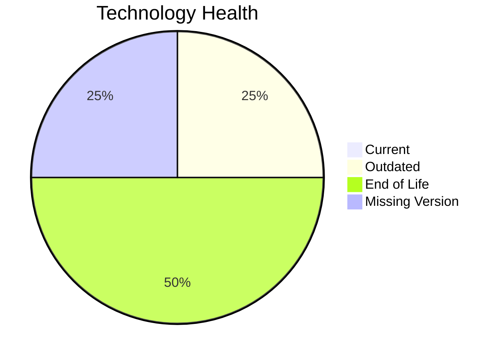

# Application Report: BackupApp-017

**ID:** app017
**Generated:** 2026-05-19

## Overview

| Attribute | Value |
|-----------|-------|
| Owner | unknown |
| Environment | On-Premise |
| Business Criticality | High |
| Users | 45 |
| Servers | 2 |

## Technology Stack

| Component | Technology | Version | Status |
|-----------|-----------|---------|--------|
| Operating System | RHEL 7 | 7 | 🔴 EOL |
| Database | Oracle 12c | 12c | 🔴 EOL |
| Language | PowerShell | None | ⚪ NO_KNOWLEDGE |
| Framework | N/A | N/A | ⚪ N/A |
| App Server | Payara 5.0 | 5.0 | 🟡 OUTDATED |

## Complexity Assessment

**Score:** 8/10 — **HIGH**
**Confidence:** 8

| Factor | Score | Notes |
|--------|-------|-------|
| Technology Age | n/a | High-critical app with complexity driven by technology age, integrations, and architecture characteristics. |
| Integration | n/a | Interfaces: 8 |
| Infrastructure | n/a | Environments: 5 |
| Business Criticality | n/a | High |
| Architecture | n/a | Containerized: No; CI/CD: No |
| Data | n/a | Databases: 1 |

## Scenario Applicability

### Applicable Scenarios

#### ✅ Operating System Update

- **Priority:** High
- **Effort:** Low
- **Effects:** security
- **Cost:** €1,530 (one-time)
- **Savings:** €500/year
- **Reasoning:** RHEL 7 is classified as EOL, which triggers an operating system update scenario.

#### ✅ Application Migration to Cloud Infrastructure (Lift & Shift)

- **Priority:** High
- **Effort:** Low
- **Effects:** security, agility
- **Cost:** €7,648 (one-time)
- **Savings:** €2,400/year
- **Reasoning:** Application is hosted on-premise only, so lift-and-shift cloud migration is applicable.

#### ✅ Upgrade Legacy Databases

- **Priority:** High
- **Effort:** Medium
- **Effects:** security, agility
- **Cost:** €15,295 (one-time)
- **Savings:** €10,000/year
- **Reasoning:** Oracle 12c is EOL and fits database upgrade triggers.

### Not Applicable / Other

| Scenario | Status | Reason |
|----------|--------|--------|
| Switch to standard Linux Operating System | ✔️ FULFILLED | RHEL 7 is already a standard Linux distribution. |
| Switch to ARM-based CPU | 🚫 BLOCKED | Third-party software stack may depend on vendor-certified x86 builds. |
| Applications Server replacement | 🚫 BLOCKED | Application server appears to be part of a third-party stack, so direct replacement is constrained by vendor support. |
| Application Containerization | 🚫 BLOCKED | Third-party packaged software may not support customer-led containerization. |
| Application Refactoring and De-coupling | 🚫 BLOCKED | Refactoring a third-party application is typically constrained by vendor ownership. |
| Switch DB Engine to open-source database solution | 🚫 BLOCKED | Database platform choice for third-party software is usually vendor-constrained. |
| Update outdated components | 🚫 BLOCKED | Outdated components exist, but remediation likely depends on the third-party vendor roadmap. |

## Financial Summary

| Metric | Value |
|--------|-------|
| Total One-Time Cost | €24,473 |
| Total Yearly Savings | €12,900 |
| Break-Even | 1.9 years |
