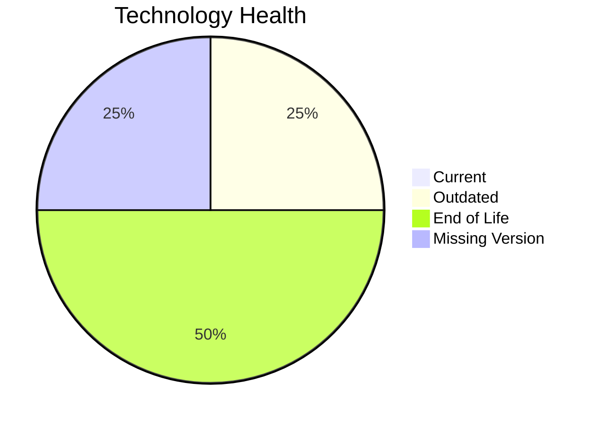

# Application Report: BackupApp-017

Modernization assessment for BackupApp-017 based solely on the Excel portfolio row and derived workflow outputs.

**ID:** app017  
**Generated:** 2026-05-07

## Overview

| Attribute | Value |
|-----------|-------|
| Owner | IT |
| Environment | On-Premise |
| Business Criticality | High |
| Users | 45 |
| Servers | sv24, sv25 |

## Technology Stack

| Component | Technology | Version | Status |
|-----------|-----------|---------|--------|
| Operating System | RHEL | 7 | 🔴 |
| Database | Oracle Database | 12c | 🔴 |
| Language | PowerShell | unknown | ⚪ |
| Framework | N/A | N/A | ⚪ |
| App Server | Payara | 5.0 | 🟡 |

## Complexity Assessment

**Score:** 8/10 — **HIGH**  
**Confidence:** 7

| Factor | Score | Notes |
|--------|-------|-------|
| Technology Age | 9/10 | 2 EOL, 1 outdated, 1 unknown lifecycle components. |
| Integration | 8/10 | 8 external interfaces and 2 API endpoints indicate the integration footprint. |
| Infrastructure | 8/10 | 2 listed server instances and 5 environments drive infrastructure coordination. |
| Business Criticality | 8/10 | Business criticality is High with approximately 45 users. |
| Architecture | 7/10 | application is not containerized; CI/CD is not present; third-party software limits internal modernization control |
| Data | 7/10 | database storage is 350 GB; proprietary or enterprise database migration complexity; database platform is EOL |

## Modernization Scenarios

### Applicable Scenarios

#### ✅ Operating System Update

- **Priority:** High
- **Effort:** Low
- **Effects:** security
- **Cost:** €1530 (one-time)
- **Savings:** €500/year
- **Reasoning:** Operating system RHEL 7 is eol and matches the OS update trigger.

#### ✅ Application Migration to Cloud Infrastructure (Lift & Shift)

- **Priority:** High
- **Effort:** Low
- **Effects:** security, agility
- **Cost:** €7648 (one-time)
- **Savings:** €2400/year
- **Reasoning:** The application is still on-premise and matches the lift-and-shift trigger.

### Not Applicable / Other

| Scenario | Status | Reason |
|----------|--------|--------|
| Switch to standard Linux Operating System | PARTIALLY_FULFILLED | The application already runs on Linux, but the distribution/version is not current and still needs standardization or upgrade. |
| Switch to ARM-based CPU | LACK_OF_DATA | CPU architecture is not present in the Excel input, so the primary ARM migration trigger cannot be confirmed. |
| Applications Server replacement | BLOCKED | The application server is legacy, but the application is third-party software and likely tied to a vendor-managed stack. |
| Application Containerization | BLOCKED | The application is third-party software and container packaging is unlikely to be under customer control. |
| Application Refactoring and De-coupling | BLOCKED | The application is third-party software, so internal refactoring is not under customer control. |
| Upgrade Legacy Databases | BLOCKED | Database upgrade looks relevant, but the application is third-party software and may require vendor-managed migration. |
| Switch DB Engine to open-source database solution | BLOCKED | The application is third-party software and database engine substitution is unlikely to be customer-controlled. |
| Update outdated components | BLOCKED | The application is third-party software, so runtime component upgrades are likely vendor-managed. |

## Financial Summary

| Metric | Value |
|--------|-------|
| Total One-Time Cost | €9178 |
| Total Yearly Savings | €2900 |
| Break-Even | 3.2 years |
