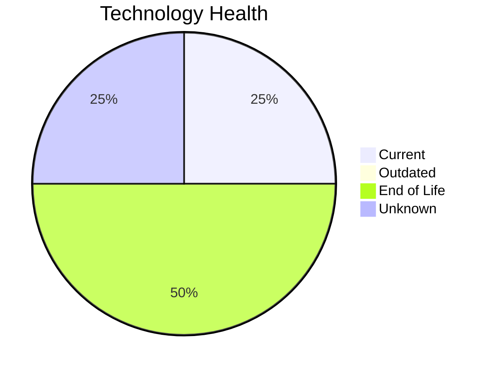

# Application Report: BackupApp-017

**ID:** app017  
**Generated:** 2026-05-06

## Overview

| Attribute | Value |
|-----------|-------|
| Business Unit | IT |
| Deployment | On-Premise |
| Business Criticality | High |
| Users | 45 |
| Servers | 2 |
| Architecture | unknown |
| Containerized | No |
| CI/CD | No |

## Technology Stack

| Component | Technology | Status |
|-----------|-----------|--------|
| Operating System | RHEL 7 | 🔴 EOL |
| Database | Oracle 12c | 🔴 EOL |
| Language | PowerShell | 🟢 CURRENT_VERSION |
| App Server | Payara 5.0 | ⚪ NO_KNOWLEDGE |

## Complexity Assessment

**Score:** 7/10 — **HIGH**  
**Confidence:** 8/10

> Complexity score 7/10 (HIGH). 2 EOL component(s), 8 external interfaces, High business criticality.

| Factor | Score |
|--------|-------|
| Technology Age & EOL | 9/10 |
| Integration Complexity | 7/10 |
| Infrastructure Scale | 9/10 |
| Business Criticality | 7/10 |
| Code & Architecture | 5/10 |
| Data Complexity | 6/10 |

## Modernization Scenarios

### Applicable Scenarios

#### ✅ Operating System Update

- **Priority:** High
- **Effort:** Low
- **Effects:** security
- **Cost:** €1,330 (one-time)
- **Savings:** €500/year
- **Reasoning:** OS (RHEL 7) is EOL; update to a current, supported version.

#### ✅ Application Migration to Cloud Infrastructure (Lift & Shift)

- **Priority:** High
- **Effort:** Low
- **Effects:** security, agility
- **Cost:** €6,650 (one-time)
- **Savings:** €2,400/year
- **Reasoning:** Application is on-premise; cloud migration could reduce infrastructure costs.

#### ✅ Application Containerization

- **Priority:** High
- **Effort:** High
- **Effects:** agility, cost, sustainability
- **Cost:** €133,001 (one-time)
- **Savings:** €80,000/year
- **Reasoning:** Application is not containerized; containerization could improve portability and deployment efficiency.

#### ✅ Upgrade Legacy Databases

- **Priority:** High
- **Effort:** Medium
- **Effects:** security, agility
- **Cost:** €13,300 (one-time)
- **Savings:** €10,000/year
- **Reasoning:** Database (Oracle 12c) is EOL; upgrade required.

#### ✅ Switch DB Engine to open-source database solution

- **Priority:** High
- **Effort:** Medium
- **Effects:** cost
- **Cost:** N/A (one-time)
- **Savings:** N/A
- **Reasoning:** Oracle database requires expensive licensing; migration to PostgreSQL could reduce costs.

#### ✅ Update outdated components

- **Priority:** High
- **Effort:** High
- **Effects:** security, agility, cost
- **Cost:** N/A (one-time)
- **Savings:** N/A
- **Reasoning:** Components need updating. EOL: RHEL 7, Oracle 12c.

### Other Scenarios

| Scenario | Status | Reason |
|----------|--------|--------|
| Switch to standard Linux Operating System | FULFILLED | Application runs on standard Linux (RHEL 7). |
| Switch to ARM-based CPU | LACK_OF_DATA | CPU architecture not documented in application data. |
| Applications Server replacement | LACK_OF_DATA | Application server lifecycle status unknown. |
| Application Refactoring and De-coupling | LACK_OF_DATA | Architecture not clearly identified. |

## Financial Summary

| Metric | Value |
|--------|-------|
| Total One-Time Investment | €154,281 |
| Total Annual Savings | €92,900 |
| Break-Even | 1.7 years |
