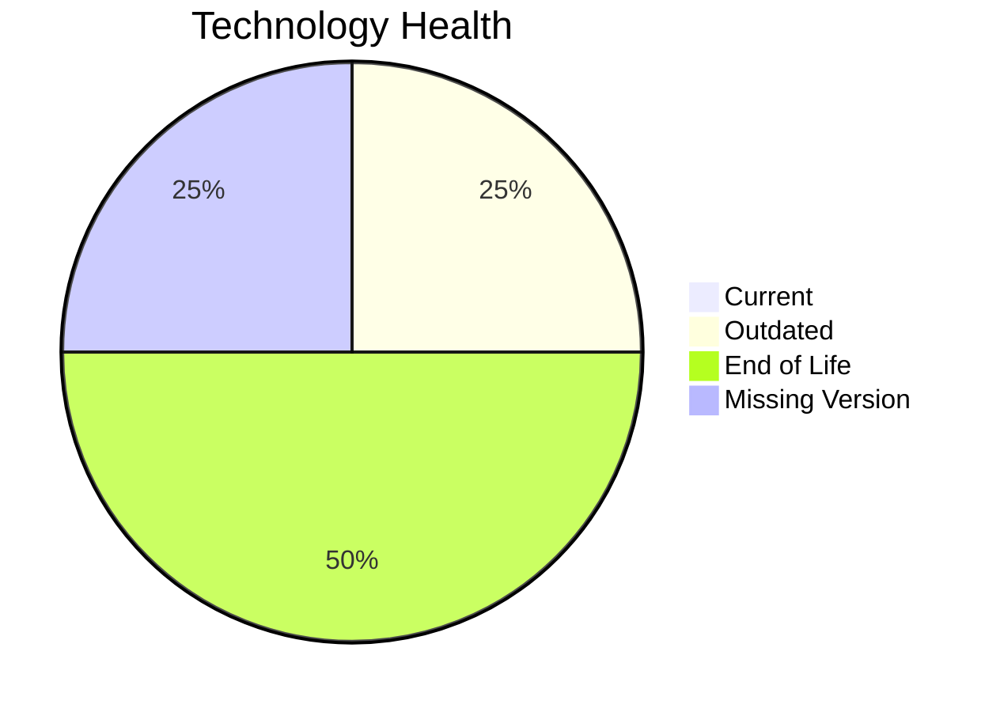

# Application Report: BackupApp-017

**ID:** app017  
**Generated:** 2026-05-13

## Overview
| Attribute | Value |
|---|---|
| Owner | IT |
| Environment | On-Premise |
| Business Criticality | High |
| Users | 45 |
| Servers | 2 |

## Technology Stack
| Component | Technology | Status |
|---|---|---|
| Operating System | RHEL 7 | 🔴 EOL |
| Language | PowerShell | ⚪ NO_KNOWLEDGE |
| Application Server | Payara 5.0 | 🟡 OUTDATED |
| Database | Oracle 12c | 🔴 EOL |

## Complexity Assessment
**Score:** 8/10 — **HIGH**  
**Confidence:** Medium

## Modernization Scenarios
| Applicable Scenario | Priority | Cost | Savings/Year |
|---|---|---:|---:|
| Operating System Update | High | €1530 | €500 |
| Application Migration to Cloud Infrastructure (Lift & Shift) | High | €7648 | €2400 |
| Upgrade Legacy Databases | High | €15295 | €10000 |

## Financial Summary
| Metric | Value |
|---|---:|
| Total One-Time Cost | €24473 |
| Total Yearly Savings | €12900 |
| Break-Even | 1.9 years |
