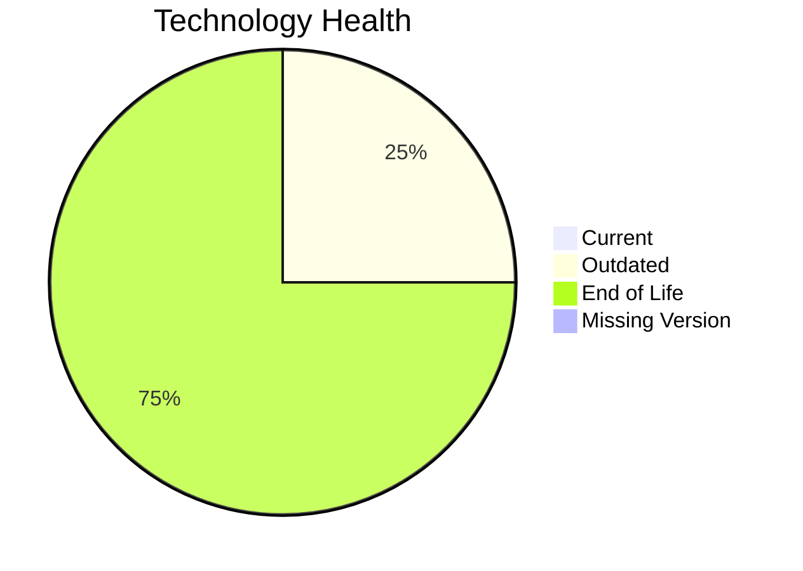

# Application Report: VendorApp-018

**ID:** app018
**Generated:** 2026-05-19

## Overview

| Attribute | Value |
|-----------|-------|
| Owner | unknown |
| Environment | On-Premise |
| Business Criticality | Medium |
| Users | 260 |
| Servers | 2 |

## Technology Stack

| Component | Technology | Version | Status |
|-----------|-----------|---------|--------|
| Operating System | RHEL 7 | 7 | 🔴 EOL |
| Database | PostgreSQL 13 | 13 | 🔴 EOL |
| Language | Java 8 | 8 | 🟡 OUTDATED |
| Framework | N/A | N/A | ⚪ N/A |
| App Server | Glassfish 4.5 | 4.5 | 🔴 EOL |

## Complexity Assessment

**Score:** 7/10 — **HIGH**
**Confidence:** 9

| Factor | Score | Notes |
|--------|-------|-------|
| Technology Age | n/a | Medium-critical app with complexity driven by technology age, integrations, and architecture characteristics. |
| Integration | n/a | Interfaces: 6 |
| Infrastructure | n/a | Environments: 6 |
| Business Criticality | n/a | Medium |
| Architecture | n/a | Containerized: No; CI/CD: No |
| Data | n/a | Databases: 1 |

## Scenario Applicability

### Applicable Scenarios

#### ✅ Operating System Update

- **Priority:** High
- **Effort:** Low
- **Effects:** security
- **Cost:** €1,330 (one-time)
- **Savings:** €500/year
- **Reasoning:** RHEL 7 is classified as EOL, which triggers an operating system update scenario.

#### ✅ Applications Server replacement

- **Priority:** Medium
- **Effort:** Medium
- **Effects:** agility, cost
- **Cost:** €13,300 (one-time)
- **Savings:** €9,600/year
- **Reasoning:** Glassfish 4.5 is EOL and fits server replacement triggers.

#### ✅ Application Migration to Cloud Infrastructure (Lift & Shift)

- **Priority:** High
- **Effort:** Low
- **Effects:** security, agility
- **Cost:** €6,650 (one-time)
- **Savings:** €2,400/year
- **Reasoning:** Application is hosted on-premise only, so lift-and-shift cloud migration is applicable.

#### ✅ Application Containerization

- **Priority:** High
- **Effort:** High
- **Effects:** agility, cost, sustainability
- **Cost:** €133,001 (one-time)
- **Savings:** €80,000/year
- **Reasoning:** Application is not containerized yet and runs on a platform that can support container adoption.

#### ✅ Application Refactoring and De-coupling

- **Priority:** High
- **Effort:** High
- **Effects:** agility, cost, sustainability
- **Cost:** €332,502 (one-time)
- **Savings:** €120,000/year
- **Reasoning:** Legacy architecture signals or coupling indicators suggest refactoring and de-coupling would add value.

#### ✅ Upgrade Legacy Databases

- **Priority:** High
- **Effort:** Medium
- **Effects:** security, agility
- **Cost:** €13,300 (one-time)
- **Savings:** €10,000/year
- **Reasoning:** PostgreSQL 13 is EOL and fits database upgrade triggers.

#### ✅ Update outdated components

- **Priority:** High
- **Effort:** High
- **Effects:** security, agility, cost
- **Cost:** N/A (one-time)
- **Savings:** N/A/year
- **Reasoning:** The technology assessment found outdated or EOL components that justify a component refresh.

### Not Applicable / Other

| Scenario | Status | Reason |
|----------|--------|--------|
| Switch to standard Linux Operating System | ✔️ FULFILLED | RHEL 7 is already a standard Linux distribution. |
| Switch to ARM-based CPU | ❓ LACK_OF_DATA | CPU architecture is not captured in the inventory, so ARM applicability cannot be confirmed. |
| Switch DB Engine to open-source database solution | ✔️ FULFILLED | PostgreSQL 13 already aligns with an open-source database family. |

## Financial Summary

| Metric | Value |
|--------|-------|
| Total One-Time Cost | €500,083 |
| Total Yearly Savings | €222,500 |
| Break-Even | 2.2 years |
