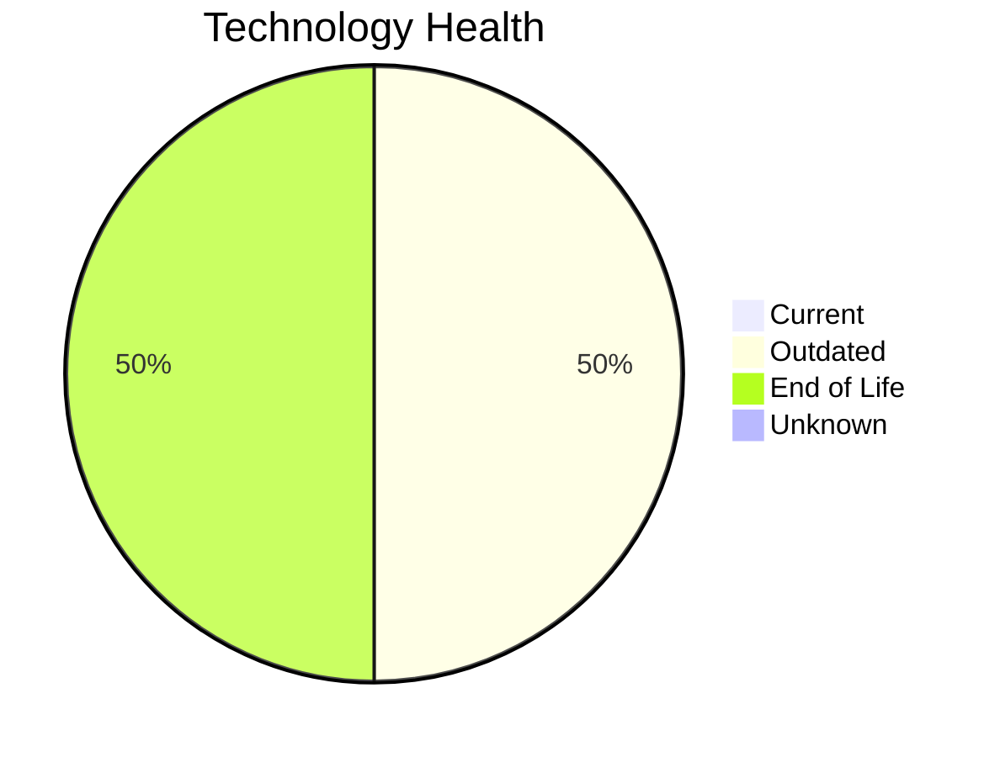

# Application Report: VendorApp-018

**ID:** app018  
**Generated:** 2026-05-15

## Overview

| Attribute | Value |
|-----------|-------|
| Business Unit | Procurement |
| Deployment | On-Premise |
| Business Criticality | Medium |
| Users | 260 |
| Solution Type | Custom made |
| Architecture | 3-Tier |
| Containerized | No |
| CI/CD | No |
| External Interfaces | 6 |

## Technology Stack

| Component | Technology | Status |
|-----------|-----------|--------|
| Operating System | RHEL 7 | 🔴 EOL |
| Database | PostgreSQL 13 | 🟡 Outdated |
| Language | Java 8 | 🟡 Outdated |
| App Server | Glassfish 4.5 | 🔴 EOL |

## Complexity Assessment

**Score:** 6/10 — **MEDIUM**  
**Confidence:** 8

| Factor | Score | Notes |
|--------|-------|-------|
| Technology Age | 7/10 | 2 EOL and 2 outdated components — significant aging |
| Integration | 6/10 | 6 external interfaces, 0 dependencies — moderately integrated |
| Infrastructure | 8/10 | 2 server instances, 6 environments |
| Business Criticality | 5/10 | Business criticality: medium, 260 users |
| Architecture | 6/10 | 3-tier architecture; not containerized; no CI/CD |
| Data | 3/10 | Standard data complexity |

## Modernization Scenarios

### Applicable Scenarios

#### ✅ Operating System Update

- **Priority:** High
- **Effort:** Low
- **Effects:** security
- **One-time Cost:** €1,157
- **Yearly Savings:** €500/year
- **Reasoning:** OS 'RHEL 7' has reached EOL — critical security risk. Immediate OS update required.

#### ✅ Applications Server replacement

- **Priority:** Medium
- **Effort:** Medium
- **Effects:** agility, cost
- **One-time Cost:** €11,565
- **Yearly Savings:** €10,800/year
- **Reasoning:** Application server 'Glassfish 4.5' has reached EOL. Replacement is needed to maintain security and support.

#### ✅ Application Migration to Cloud Infrastructure (Lift & Shift)

- **Priority:** High
- **Effort:** Low
- **Effects:** security, agility
- **One-time Cost:** €5,783
- **Yearly Savings:** €2,700/year
- **Reasoning:** Application is fully on-premise. Migration to cloud (Lift & Shift) can reduce infrastructure costs and improve agility.

#### ✅ Application Containerization

- **Priority:** High
- **Effort:** High
- **Effects:** agility, cost, sustainability
- **One-time Cost:** €115,653
- **Yearly Savings:** €90,000/year
- **Reasoning:** Application is not containerized. Containerization would improve deployment consistency and scalability.

#### ✅ Application Refactoring and De-coupling

- **Priority:** High
- **Effort:** High
- **Effects:** agility, cost, sustainability
- **One-time Cost:** €289,133
- **Yearly Savings:** €135,000/year
- **Reasoning:** No CI/CD, not containerized — indicates potential for architectural modernization.

#### ✅ Upgrade Legacy Databases

- **Priority:** High
- **Effort:** Medium
- **Effects:** security, agility
- **One-time Cost:** €11,565
- **Yearly Savings:** €10,000/year
- **Reasoning:** Database 'PostgreSQL 13' is outdated. Upgrading to a current version is recommended.

#### ✅ Update outdated components

- **Priority:** High
- **Effort:** High
- **Effects:** security, agility, cost
- **One-time Cost:** N/A
- **Yearly Savings:** N/A
- **Reasoning:** Multiple EOL/outdated components detected (2 EOL, 2 outdated). Systematic update program needed.

### Other Scenarios

| Scenario | Status | Reason |
|----------|--------|--------|
| Switch to standard Linux Operating System | ✔️ Fulfilled | OS 'RHEL 7' is already a standard Linux distribution. |
| Switch to ARM-based CPU | ❓ No Data | On-premise application. CPU architecture not specified in available data. |
| Switch DB Engine to open-source database solution | ✔️ Fulfilled | Database 'PostgreSQL 13' is already an open-source engine. |

## Business Case Summary

| Metric | Value |
|--------|-------|
| Total One-time Cost | €434,856 |
| Total Yearly Savings | €249,000 |
| ROI Break-even | 1.7 years |
