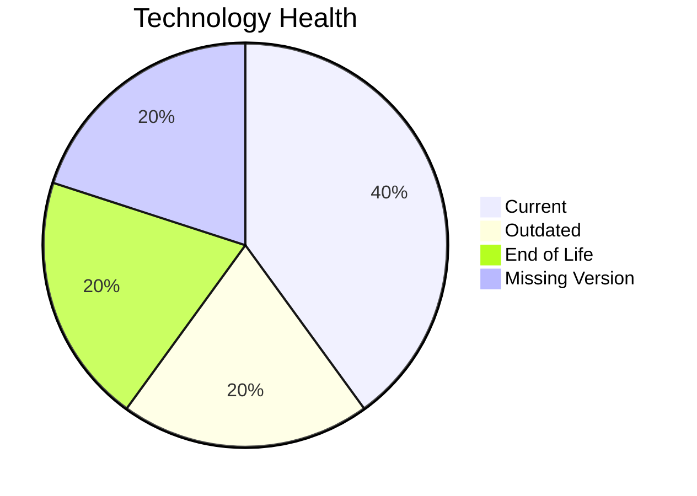

# Application Report: VendorApp-018

**ID:** app018
**Generated:** 2026-05-14

## Overview

| Attribute | Value |
|-----------|-------|
| Owner | Procurement |
| Environment | On-Premise |
| Business Criticality | Medium |
| Users | 260 |
| Servers | sv26, sv27 |

## Technology Stack

| Component | Technology | Status |
|-----------|-----------|--------|
| Operating System | RHEL 7 | 🔴 |
| Database | PostgreSQL 13 | 🟢 |
| Language | Java 8 | 🟡 |

## Complexity Assessment

**Score:** 6/10 — **MEDIUM**

## Modernization Scenarios

### ✅ Os Update Security Patch
- **Reasoning:** EOL operating system/server components require security remediation.

### ✅ App Deployment To Cloud
- **Reasoning:** On-premise deployment model is a direct cloud-migration opportunity.

### ✅ App Containerization
- **Reasoning:** Application is not containerized and can benefit from platform standardization.

### ✅ App Refactor Decoupling
- **Reasoning:** High coupling and/or monolithic architecture indicates refactor opportunity.

### ✅ Switch To Managed Db
- **Reasoning:** On-prem database workloads can move to managed database services.

## Financial Summary

| Metric | Value |
|--------|-------|
| Total One-Time Cost | €417509 |
| Total Yearly Savings | €238200 |
| Break-Even | 1.8 years |
