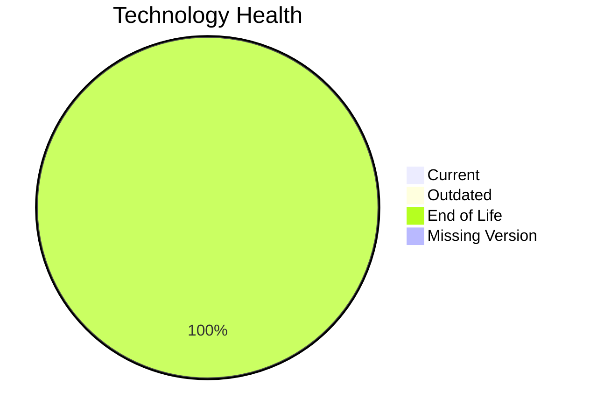

# Application Report: VendorApp-018

**ID:** app018  
**Generated:** 2026-05-17

## Overview

| Attribute | Value |
|-----------|-------|
| Owner | N/A |
| Environment | On-Premise |
| Business Criticality | Medium |
| Users | 260 |
| Servers | 2 |

## Technology Stack

| Component | Technology | Version | Status |
|-----------|-----------|---------|--------|
| Operating System | RHEL | 7 | 🔴 EOL |
| Database | PostgreSQL | 13 | 🔴 EOL |
| Language | Java | 8 | 🔴 EOL |
| Framework | N/A | N/A | ⚪ NO_KNOWLEDGE |
| App Server | GlassFish | 4.5 | 🔴 EOL |

## Complexity Assessment

**Score:** 8/10 — **HIGH**  
**Confidence:** 8

| Factor | Score | Notes |
|--------|-------|-------|
| Technology Age | 9/10 | 4 components are EOL. |
| Integration | 8/10 | High integration surface with 6 external interfaces and 5 APIs. |
| Infrastructure | 8/10 | Infrastructure spans 2 servers and 6 environments. |
| Business Criticality | 5/10 | Business criticality is Medium. |
| Architecture | 9/10 | not containerized, no CI/CD, traditional multi-tier architecture, legacy application server. |
| Data | 7/10 | 1 database engine(s), 250 GB storage, legacy database support status. |

## Modernization Scenarios

### Applicable Scenarios

#### ✅ Operating System Update

- **Priority:** High
- **Effort:** Low
- **Effects:** security
- **Cost:** €1530 (one-time)
- **Savings:** €500/year
- **Reasoning:** RHEL 7 is assessed as EOL, which triggers an OS update scenario.

#### ✅ Applications Server replacement

- **Priority:** Medium
- **Effort:** Medium
- **Effects:** agility, cost
- **Cost:** €15295 (one-time)
- **Savings:** €9600/year
- **Reasoning:** Glassfish 4.5 is assessed as EOL and should be modernized or replaced.

#### ✅ Application Migration to Cloud Infrastructure (Lift & Shift)

- **Priority:** High
- **Effort:** Low
- **Effects:** security, agility
- **Cost:** €7648 (one-time)
- **Savings:** €2400/year
- **Reasoning:** Application still runs on-premises or in a hybrid footprint, so lift-and-shift to public cloud remains applicable.

#### ✅ Application Containerization

- **Priority:** High
- **Effort:** High
- **Effects:** agility, cost, sustainability
- **Cost:** €152951 (one-time)
- **Savings:** €80000/year
- **Reasoning:** Application is not containerized and the runtime stack appears containerizable with modernization effort.

#### ✅ Application Refactoring and De-coupling

- **Priority:** High
- **Effort:** High
- **Effects:** agility, cost, sustainability
- **Cost:** €382378 (one-time)
- **Savings:** €120000/year
- **Reasoning:** Architecture and integration signals point to a tightly coupled design that would benefit from refactoring.

#### ✅ Upgrade Legacy Databases

- **Priority:** High
- **Effort:** Medium
- **Effects:** security, agility
- **Cost:** €15295 (one-time)
- **Savings:** €10000/year
- **Reasoning:** PostgreSQL 13 is assessed as EOL and is a candidate for upgrade.

#### ✅ Update outdated components

- **Priority:** High
- **Effort:** High
- **Effects:** security, agility, cost
- **Cost:** €0 (one-time)
- **Savings:** €0/year
- **Reasoning:** One or more application components are outdated or end-of-life.

### Not Applicable / Other

| Scenario | Status | Reason |
|----------|--------|--------|
| Switch to standard Linux Operating System | FULFILLED | RHEL 7 already belongs to a standard Linux family. |
| Switch to ARM-based CPU | LACK_OF_DATA | CPU architecture is not documented in the workbook, so ARM suitability cannot be assessed confidently. |
| Switch DB Engine to open-source database solution | FULFILLED | PostgreSQL 13 already uses an open-source-compatible engine family. |

## Financial Summary

| Metric | Value |
|--------|-------|
| Total One-Time Cost | €575097 |
| Total Yearly Savings | €222500 |
| Break-Even | 2.6 years |
