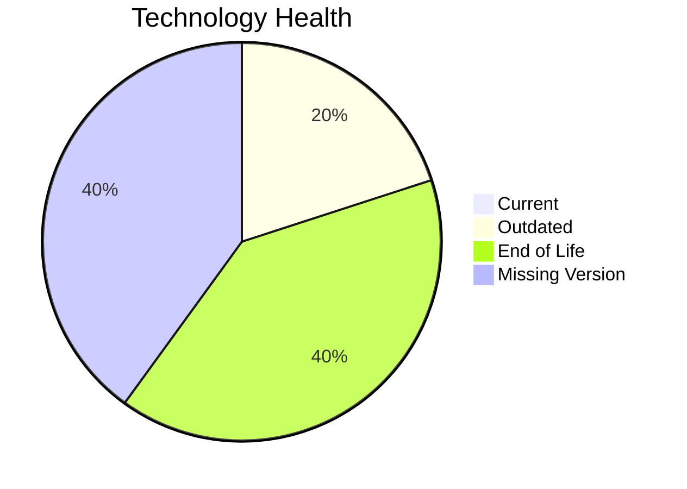

# Application Report: VendorApp-018

**ID:** app018  
**Generated:** 2026-05-14

## Overview

| Attribute | Value |
|-----------|-------|
| Owner | unknown |
| Environment | On-Premise |
| Business Criticality | Medium |
| Users | 260 |
| Servers | sv26, sv27 |

## Technology Stack

| Component | Technology | Version | Status |
|-----------|-----------|---------|--------|
| os | RHEL 7 | 7 | 🔴 EOL |
| database | PostgreSQL 13 | 13 | 🟡 OUTDATED |
| language | Java 8 | 8 | 🔴 EOL |
| framework | Framework | unknown | ⚪ NO_KNOWLEDGE |
| app_server | Glassfish 4.5 | 4.5 | ⚪ NO_KNOWLEDGE |

## Complexity Assessment

**Score:** 6/10 — **MEDIUM**  
**Confidence:** 8

**Reasoning:** Tech age 9/10 (2 EOL, 1 outdated components), integrations 6 interfaces and 0 dependencies, infrastructure 2 servers/6 environments, criticality Medium, architecture score 5/10, data score 5/10.

## Modernization Scenarios

### Applicable Scenarios

#### ✅ Operating System Update
- **Cost:** €1157 (one-time)
- **Savings:** €500/year
- **Reasoning:** RHEL 7 requires upgrade/security patching.
#### ✅ Application Migration to Cloud Infrastructure (Lift & Shift)
- **Cost:** €5783 (one-time)
- **Savings:** €2700/year
- **Reasoning:** Application appears on-premise and is a cloud migration candidate.
#### ✅ Application Containerization
- **Cost:** €115653 (one-time)
- **Savings:** €90000/year
- **Reasoning:** Containerization could improve portability and operations.
#### ✅ Upgrade Legacy Databases
- **Cost:** €11565 (one-time)
- **Savings:** €10000/year
- **Reasoning:** Database PostgreSQL 13 is legacy/outdated.

### Not Applicable / Other

| Scenario | Status | Reason |
|----------|--------|--------|
| Switch to standard Linux Operating System | FULFILLED | Application already runs on a standard Linux platform. |
| Switch to ARM-based CPU | NOT_APPLICABLE | On-premise hosting makes ARM migration less direct. |
| Applications Server replacement | LACK_OF_DATA | Insufficient application server data. |
| Application Refactoring and De-coupling | PARTIALLY_FULFILLED | Architecture shows partial decoupling already. |
| Switch DB Engine to open-source database solution | FULFILLED | Application already uses open-source database engine. |
| Update outdated components | APPLICABLE | Outdated or EOL components identified in technology assessment. |

## Financial Summary

| Metric | Value |
|--------|-------|
| Total One-Time Cost | €134158 |
| Total Yearly Savings | €103200 |
| Break-Even | 1.3 years |
