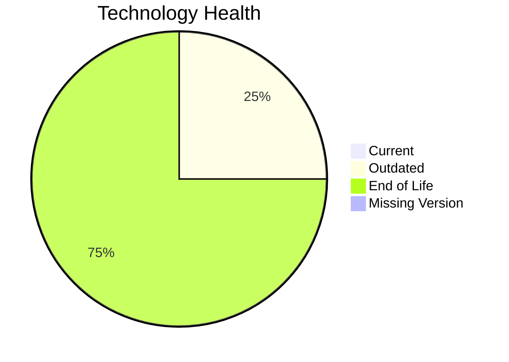

# Application Report: VendorApp-018

**ID:** app018  
**Generated:** 2026-05-13

## Overview
| Attribute | Value |
|---|---|
| Owner | Procurement |
| Environment | On-Premise |
| Business Criticality | Medium |
| Users | 260 |
| Servers | 2 |

## Technology Stack
| Component | Technology | Status |
|---|---|---|
| Operating System | RHEL 7 | 🔴 EOL |
| Language | Java 8 | 🔴 EOL |
| Application Server | Glassfish 4.5 | 🔴 EOL |
| Database | PostgreSQL 13 | 🟡 OUTDATED |

## Complexity Assessment
**Score:** 7/10 — **HIGH**  
**Confidence:** Medium

## Modernization Scenarios
| Applicable Scenario | Priority | Cost | Savings/Year |
|---|---|---:|---:|
| Operating System Update | High | €1330 | €500 |
| Applications Server replacement | Medium | €13300 | €9600 |
| Application Migration to Cloud Infrastructure (Lift & Shift) | High | €6650 | €2400 |
| Application Containerization | High | €133001 | €80000 |
| Application Refactoring and De-coupling | High | €332502 | €120000 |
| Upgrade Legacy Databases | High | €13300 | €10000 |
| Update outdated components | High | €N/A | €N/A |

## Financial Summary
| Metric | Value |
|---|---:|
| Total One-Time Cost | €500083 |
| Total Yearly Savings | €222500 |
| Break-Even | 2.2 years |
