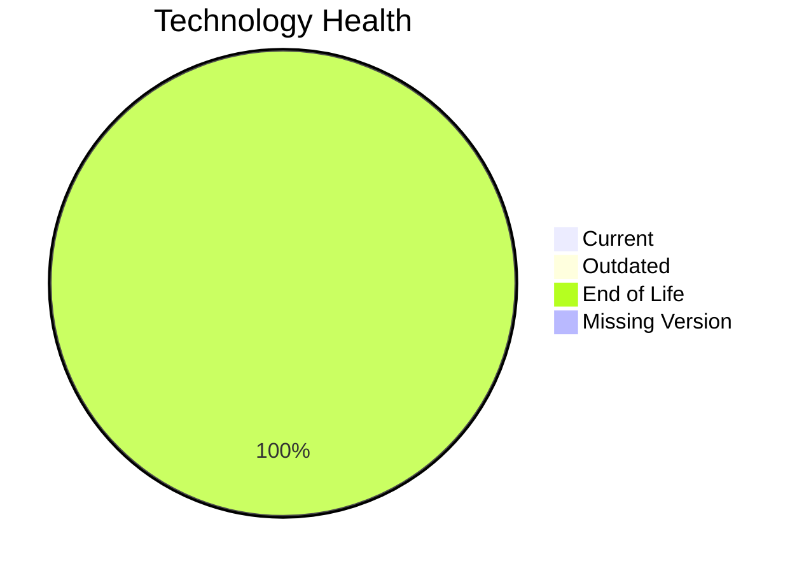

# Application Report: VendorApp-018

**ID:** app018
**Generated:** 2026-05-11

## Overview

| Attribute | Value |
|-----------|-------|
| Owner | Procurement |
| Environment | On-Premise |
| Business Criticality | Medium |
| Users | 260 |
| Servers | 2 |

## Technology Stack

| Component | Technology | Version | Status |
|-----------|-----------|---------|--------|
| Operating System | RHEL | RHEL 7 | 🔴 EOL |
| Database | PostgreSQL | PostgreSQL 13 | 🔴 EOL |
| Language | Java | Java 8 | 🔴 EOL |
| Framework | N/A | N/A | ⚪ |
| App Server | GlassFish | Glassfish 4.5 | 🔴 EOL |

## Complexity Assessment

**Score:** 7/10 — **HIGH**
**Confidence:** 8

Technology age score 9/10 (EOL=4, outdated=0, unknown=0); integration score 8/10 (interfaces=6, api_endpoints=5); infrastructure score 8/10 (servers=2, environments=6); business criticality score 5/10 (Medium, users=260); architecture score 5/10 (architecture=3-Tier, CI/CD=No, containerized=No); data score 3/10 (db_count=1, db_storage_gb=250).

## Modernization Scenarios

### Applicable Scenarios

#### ✅ Operating System Update

- **Priority:** High
- **Effort:** Low
- **Effects:** security
- **Cost:** €1330 (one-time)
- **Savings:** €500/year
- **Reasoning:** Operating system is outdated or end-of-life per technology assessment.

#### ✅ Applications Server replacement

- **Priority:** Medium
- **Effort:** Medium
- **Effects:** agility, cost
- **Cost:** €13300 (one-time)
- **Savings:** €9600/year
- **Reasoning:** Application server version is legacy or unsupported.

#### ✅ Application Migration to Cloud Infrastructure (Lift & Shift)

- **Priority:** High
- **Effort:** Low
- **Effects:** security, agility
- **Cost:** €6650 (one-time)
- **Savings:** €2400/year
- **Reasoning:** On-premise deployment indicates lift-and-shift opportunity to cloud.

#### ✅ Application Containerization

- **Priority:** High
- **Effort:** High
- **Effects:** agility, cost, sustainability
- **Cost:** €133001 (one-time)
- **Savings:** €80000/year
- **Reasoning:** Traditional non-container deployment on supported OS can be containerized.

#### ✅ Application Refactoring and De-coupling

- **Priority:** High
- **Effort:** High
- **Effects:** agility, cost, sustainability
- **Cost:** €332502 (one-time)
- **Savings:** €120000/year
- **Reasoning:** Architecture and integration profile indicate decoupling/refactoring opportunity.

#### ✅ Upgrade Legacy Databases

- **Priority:** High
- **Effort:** Medium
- **Effects:** security, agility
- **Cost:** €13300 (one-time)
- **Savings:** €10000/year
- **Reasoning:** Database engine is outdated or end-of-life.

#### ✅ Update outdated components

- **Priority:** High
- **Effort:** High
- **Effects:** security, agility, cost
- **Cost:** N/A
- **Savings:** N/A
- **Reasoning:** Language/framework/server components are outdated or end-of-life.

### Not Applicable / Other

| Scenario | Status | Reason |
|----------|--------|--------|
| Switch to standard Linux Operating System | FULFILLED | Application already runs on a standard Linux distribution. |
| Switch to ARM-based CPU | LACK_OF_DATA | CPU architecture (x86/x64/ARM) is not provided in source data. |
| Switch DB Engine to open-source database solution | FULFILLED | Database engine is already open-source compatible. |

## Financial Summary

| Metric | Value |
|--------|-------|
| Total One-Time Cost | €500083 |
| Total Yearly Savings | €222500 |
| Break-Even | 2.2 years |
