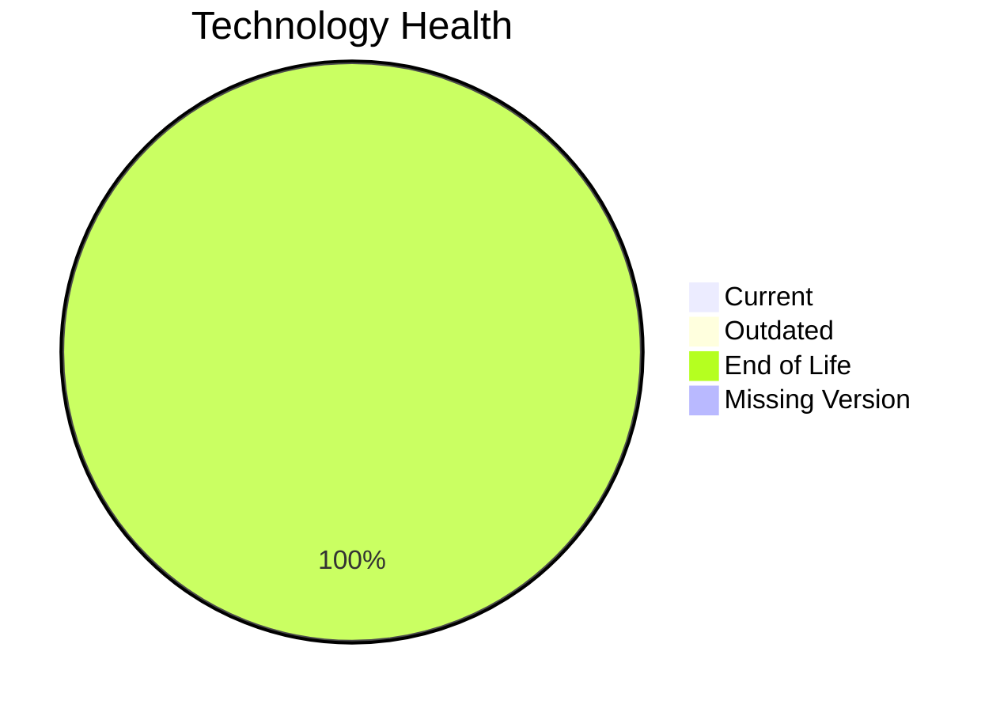

# Application Report: VendorApp-018

**ID:** app018
**Generated:** 2026-05-18T00:00:00Z

## Overview

| Attribute | Value |
|-----------|-------|
| Owner | Procurement |
| Environment | On-Premise |
| Business Criticality | Medium |
| Users | 260 |
| Servers | 2 |

## Technology Stack

| Component | Technology | Version | Status |
|-----------|-----------|---------|--------|
| Operating System | RHEL | 7 | 🔴 EOL |
| Database | PostgreSQL | 13 | 🔴 EOL |
| Language | Java | 8 | 🔴 EOL |
| Framework | N/A | N/A | ⚪ N/A |
| App Server | GlassFish | 4.x | 🔴 EOL |

## Complexity Assessment

**Score:** 7/10 — **HIGH**
**Confidence:** 8

| Factor | Score | Notes |
|--------|-------|-------|
| Technology Age | 9/10 | 4 components are EOL. |
| Integration | 7/10 | 6 external interfaces and 5 API endpoints. |
| Infrastructure | 8/10 | 2 server instance(s) across 6 environment(s). |
| Business Criticality | 5/10 | Criticality is Medium with 260 users. |
| Architecture | 4/10 | Architecture is 3-Tier; containerized=No; CI/CD=No. |
| Data | 6/10 | Database storage is 250 GB on PostgreSQL 13.  |

## Modernization Scenarios

### Applicable Scenarios

#### ✅ Operating System Update

- **Priority:** High
- **Effort:** Low
- **Effects:** security
- **Cost:** €1,330 (one-time)
- **Savings:** €500/year
- **Reasoning:** RHEL 7 is assessed as EOL.

#### ✅ Applications Server replacement

- **Priority:** Medium
- **Effort:** Medium
- **Effects:** agility, cost
- **Cost:** €13,300 (one-time)
- **Savings:** €9,600/year
- **Reasoning:** Glassfish 4.5 is assessed as EOL, which directly triggers server replacement.

#### ✅ Application Migration to Cloud Infrastructure (Lift & Shift)

- **Priority:** High
- **Effort:** Low
- **Effects:** security, agility
- **Cost:** €6,650 (one-time)
- **Savings:** €2,400/year
- **Reasoning:** The application is still on-premise, which is the main trigger for lift-and-shift cloud migration.

#### ✅ Application Containerization

- **Priority:** High
- **Effort:** High
- **Effects:** agility, cost, sustainability
- **Cost:** €133,001 (one-time)
- **Savings:** €80,000/year
- **Reasoning:** The application is not yet containerized and the runtime/OS stack is compatible with container packaging.

#### ✅ Application Refactoring and De-coupling

- **Priority:** High
- **Effort:** High
- **Effects:** agility, cost, sustainability
- **Cost:** €332,502 (one-time)
- **Savings:** €120,000/year
- **Reasoning:** Architecture and integration signals indicate a tightly coupled estate that would benefit from refactoring.

#### ✅ Upgrade Legacy Databases

- **Priority:** High
- **Effort:** Medium
- **Effects:** security, agility
- **Cost:** €13,300 (one-time)
- **Savings:** €10,000/year
- **Reasoning:** PostgreSQL 13 is assessed as EOL.

#### ✅ Update outdated components

- **Priority:** High
- **Effort:** High
- **Effects:** security, agility, cost
- **Cost:** €N/A (one-time)
- **Savings:** €N/A/year
- **Reasoning:** At least one application runtime component is outdated or end of life.

### Not Applicable / Other

| Scenario | Status | Reason |
|----------|--------|--------|
| Switch to standard Linux Operating System | PARTIALLY_FULFILLED | The application already runs on Linux, but the current distribution/version is outdated or unsupported. |
| Switch to ARM-based CPU | LACK_OF_DATA | CPU architecture is not documented in the workbook, so ARM suitability cannot be confirmed. |
| Switch DB Engine to open-source database solution | FULFILLED | PostgreSQL 13 is already an open-source or open-source-compatible database option. |

## Financial Summary

| Metric | Value |
|--------|-------|
| Total One-Time Cost | €500,083 |
| Total Yearly Savings | €222,500 |
| Break-Even | 2.2 years |
