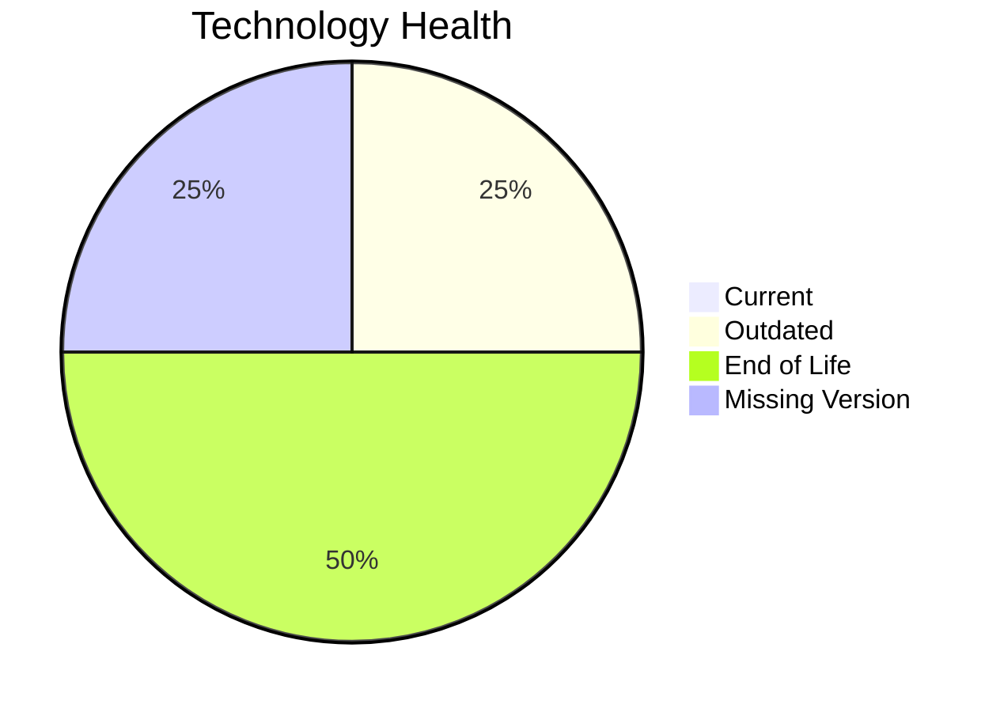

# Application Report: VendorApp-018

**ID:** app018
**Generated:** 2026-04-24

## Overview

| Attribute | Value |
|-----------|-------|
| Owner | Procurement |
| Business Unit | Procurement |
| Deployment Type | On-Premise |
| Business Criticality | Medium |
| Users | 260 |
| Servers | 2 |
| Architecture | 3-Tier |
| Solution Type | Custom made |
| CI/CD | No |
| Containerized | No |

## Technology Stack

| Component | Technology | Version | Status |
|-----------|-----------|---------|--------|
| Operating System | RHEL 7 | RHEL 7 | 🔴 EOL |
| Language | Java 8 | Java 8 | 🔴 EOL |
| Database | PostgreSQL 13 | PostgreSQL 13 | 🟡 OUTDATED |
| App Server | Glassfish 4.5 | Glassfish 4.5 | ⚪ NO_KNOWLEDGE |

## Complexity Assessment

**Score:** 6/10 — **MEDIUM**
**Confidence:** 7

**Reasoning:** Tech age score 9/10 (2 EOL, 1 outdated components). Integration score 7/10 (6 external interfaces). Infrastructure score 5/10 (2 servers, 6 environments). Business criticality score 5/10 (criticality: Medium). Architecture score 4/10 (architecture: 3-Tier, containerized: No, CI/CD: No). Data score 4/10 (250GB storage).

### Contributing Factors

| Factor | Value |
|--------|-------|
| Servers | 2 |
| Environments | 6 |
| External Interfaces | 6 |
| EOL Technologies | 2 |
| Outdated Technologies | 1 |
| CI/CD | No |
| Containerized | No |

## Modernization Scenarios

### Applicable Scenarios

#### ✅ Operating System Update

- **Priority:** High
- **Effort:** Low
- **Effects:** security
- **Cost:** €1,157 (one-time)
- **Savings:** €500/year
- **Reasoning:** Operating system 'RHEL 7' is EOL. OS update is recommended.

#### ✅ Switch to ARM-based CPU

- **Priority:** Medium
- **Effort:** Medium
- **Effects:** cost, sustainability
- **Cost:** €5,783 (one-time)
- **Savings:** €1,000/year
- **Reasoning:** Custom application on Linux OS is a candidate for ARM-based CPU migration for cost savings.

#### ✅ Application Migration to Cloud Infrastructure (Lift & Shift)

- **Priority:** High
- **Effort:** Low
- **Effects:** security, agility
- **Cost:** €5,783 (one-time)
- **Savings:** €2,700/year
- **Reasoning:** Application is deployed On-Premise. Cloud migration (Lift & Shift) is applicable.

#### ✅ Application Containerization

- **Priority:** High
- **Effort:** High
- **Effects:** agility, cost, sustainability
- **Cost:** €115,653 (one-time)
- **Savings:** €90,000/year
- **Reasoning:** Custom/open-source application not yet containerized is a strong candidate for containerization.

#### ✅ Application Refactoring and De-coupling

- **Priority:** High
- **Effort:** High
- **Effects:** agility, cost, sustainability
- **Cost:** €289,133 (one-time)
- **Savings:** €135,000/year
- **Reasoning:** Custom application with '3-tier' architecture may benefit from refactoring for better agility.

#### ✅ Upgrade Legacy Databases

- **Priority:** High
- **Effort:** Medium
- **Effects:** security, agility
- **Cost:** €11,565 (one-time)
- **Savings:** €10,000/year
- **Reasoning:** Database 'PostgreSQL 13' is outdated. Upgrade recommended.

#### ✅ Update outdated components

- **Priority:** High
- **Effort:** High
- **Effects:** security, agility, cost
- **Cost:** N/A (one-time)
- **Savings:** N/A
- **Reasoning:** Programming language 'Java 8' is EOL. Component updates are needed.

### Not Applicable / Other

| Scenario | Status | Reason |
|----------|--------|--------|
| Switch to standard Linux Operating System | FULFILLED | Application already runs on a standard Linux distribution: 'RHEL 7'.... |
| Applications Server replacement | LACK_OF_DATA | Lifecycle data for application server 'Glassfish 4.5' is not available.... |
| Switch DB Engine to open-source database solution | FULFILLED | Database 'PostgreSQL 13' is already an open-source solution.... |

## Financial Summary

| Metric | Value |
|--------|-------|
| Total One-Time Cost | €429,074 |
| Total Yearly Savings | €239,200 |
| Break-Even | 1.8 years |
