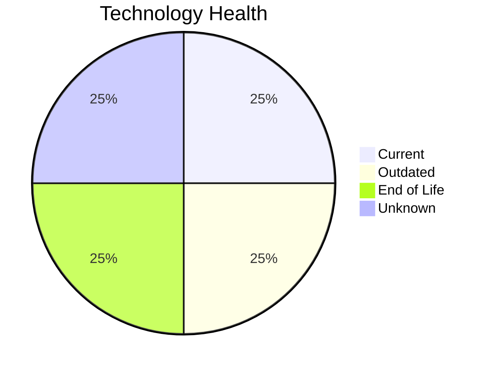

# Application Report: VendorApp-018

**ID:** app018
**Generated:** 2026-05-14

## Overview

| Attribute | Value |
|-----------|-------|
| Owner | Procurement |
| Environment | On-Premise |
| Business Criticality | Medium |
| Users | 260 |
| Servers | 2 |
| Solution Type | Custom made |
| Architecture | 3-Tier |
| Containerized | No |
| CI/CD | No |

## Technology Stack

| Component | Technology | Version | Status |
|-----------|-----------|---------|--------|
| Os | RHEL 7 | 7 | 🔴 EOL |
| Database | PostgreSQL 13 | 13 | 🟢 CURRENT_VERSION |
| Programming Language | Java 8 | 8 | 🟡 OUTDATED |
| Application Server | Glassfish 4.5 | 4.5 | ⚪ NO_KNOWLEDGE |

## Complexity Assessment

**Score:** 7/10 — **HIGH**
**Confidence:** 8/10

| Factor | Score | Notes |
|--------|-------|-------|
| Technology Age | 7/10 | 1 EOL, 1 outdated components |
| Integration | 7/10 | 6 external interfaces |
| Infrastructure | 8/10 | 2 server(s), 6 environment(s) |
| Business Criticality | 4/10 | Medium criticality |
| Architecture | 8/10 | Containerized: No, CI/CD: No |
| Data | 5/10 | DB: PostgreSQL 13 |

## Modernization Scenarios

### Applicable Scenarios

#### ✅ Operating System Update

- **Priority:** High
- **Effort:** Low
- **Effects:** security
- **Cost:** €1,330 (one-time)
- **Savings:** €500/year
- **Reasoning:** Operating system RHEL 7 has reached End of Life and no longer receives security patches. Immediate OS update required.

#### ✅ Application Migration to Cloud Infrastructure (Lift & Shift)

- **Priority:** High
- **Effort:** Low
- **Effects:** security, agility
- **Cost:** €6,650 (one-time)
- **Savings:** €2,400/year
- **Reasoning:** Application is on-premise. Cloud migration (Lift & Shift) offers improved scalability, security, and compliance benefits.

#### ✅ Application Containerization

- **Priority:** High
- **Effort:** High
- **Effects:** agility, cost, sustainability
- **Cost:** €133,001 (one-time)
- **Savings:** €80,000/year
- **Reasoning:** Application is custom-developed, runs on Linux, and is not yet containerized. Good candidate for containerization to improve portability and resource efficiency.

#### ✅ Update outdated components

- **Priority:** High
- **Effort:** High
- **Effects:** security, agility, cost
- **Cost:** N/A (one-time)
- **Savings:** N/A/year
- **Reasoning:** Application has outdated components: programming language Java 8 is outdated. Update recommended.

### Not Applicable / Other

| Scenario | Status | Reason |
|----------|--------|--------|
| Switch to standard Linux Operating System | ✔️ FULFILLED | Application already runs on standard Linux (RHEL 7). No migration needed. |
| Switch to ARM-based CPU | ⚠️ PARTIALLY_FULFILLED | Application runs on Linux (ARM-compatible) and is custom-developed, but is not yet containerized. AR... |
| Applications Server replacement | ❓ LACK_OF_DATA | Cannot assess application server lifecycle for Glassfish 4.5. |
| Application Refactoring and De-coupling | ⚠️ PARTIALLY_FULFILLED | Application has 3-Tier architecture (moderately decoupled) but is not yet containerized or cloud-nat... |
| Upgrade Legacy Databases | ✔️ FULFILLED | Database PostgreSQL 13 is on a current, supported version. No upgrade needed. |
| Switch DB Engine to open-source database solution | ✔️ FULFILLED | Database PostgreSQL 13 is already an open-source or managed solution. No commercial license migratio... |

## Financial Summary

| Metric | Value |
|--------|-------|
| Total One-Time Cost | €140,981 |
| Total Yearly Savings | €82,900 |
| Break-Even | 1.7 years |
