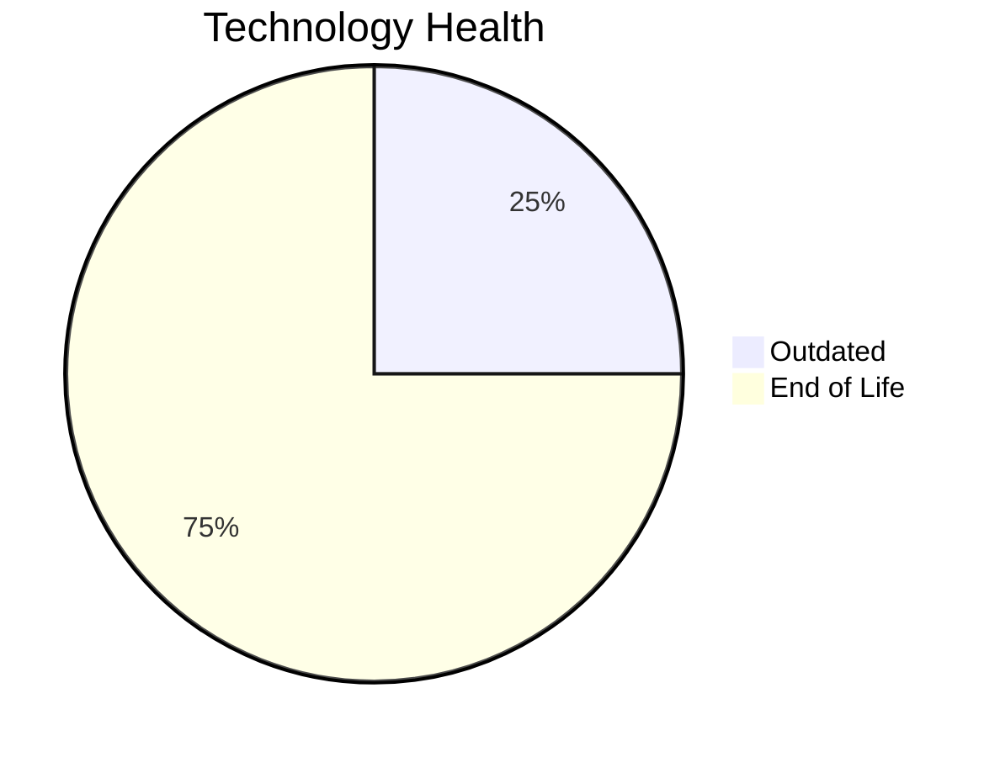

# Application Report: VendorApp-018

**ID:** app018
**Generated:** 2026-05-14

## Overview

| Attribute | Value |
|-----------|-------|
| Business Unit | Procurement |
| Business Criticality | Medium |
| Solution Type | Custom made |
| Deployment Type | On-Premise |
| Users | 260 |
| Servers | 2 |
| External Interfaces | 6 |
| Containerized | No |
| CI/CD Present | No |
| Architecture | 3-Tier |

## Technology Stack

| Component | Technology | Version | Status |
|-----------|-----------|---------|--------|
| Os | RHEL | 7 | 🔴 EOL |
| Language | Java | 8 | 🔴 EOL |
| Database | PostgreSQL | 13 | 🟡 OUTDATED |
| App Server | GlassFish | 4.5 | 🔴 EOL |

## Complexity Assessment

**Score:** 6/10 — **MEDIUM**
**Confidence:** 7

Score 6/10 (MEDIUM): EOL components=3, Outdated=1, Interfaces=6, Servers=2, Criticality=Medium, Architecture=3-Tier.

| Factor | Value |
|--------|-------|
| Servers | 2 |
| Environments | 6 |
| Interfaces | 6 |
| EOL Technologies | 3 |
| Outdated Technologies | 1 |
| Business Criticality | Medium |

## Modernization Scenarios

### Applicable Scenarios

#### ✅ Operating System Update

- **Priority:** High
- **Effort:** Low
- **Effects:** security
- **One-Time Cost:** $1,157
- **Annual Savings:** $500/year
- **Reasoning:** Operating system RHEL 7 is EOL. Update to a current supported OS version is recommended.

#### ✅ Applications Server replacement

- **Priority:** Medium
- **Effort:** Medium
- **Effects:** agility, cost
- **One-Time Cost:** $11,565
- **Annual Savings:** $10,800/year
- **Reasoning:** Application server Glassfish 4.5 is EOL. Replacement with a modern server is recommended.

#### ✅ Application Migration to Cloud Infrastructure (Lift & Shift)

- **Priority:** High
- **Effort:** Low
- **Effects:** security, agility
- **One-Time Cost:** $5,783
- **Annual Savings:** $2,700/year
- **Reasoning:** Application is On-Premise. Lift & Shift to cloud infrastructure is applicable to reduce infrastructure costs.

#### ✅ Application Containerization

- **Priority:** High
- **Effort:** High
- **Effects:** agility, cost, sustainability
- **One-Time Cost:** $115,653
- **Annual Savings:** $90,000/year
- **Reasoning:** Application is not containerized. Containerization would improve deployment consistency and resource efficiency.

#### ✅ Upgrade Legacy Databases

- **Priority:** High
- **Effort:** Medium
- **Effects:** security, agility
- **One-Time Cost:** $11,565
- **Annual Savings:** $10,000/year
- **Reasoning:** Database PostgreSQL 13 is OUTDATED. Upgrade to a current supported version is required.

#### ✅ Update outdated components

- **Priority:** High
- **Effort:** High
- **Effects:** security, agility, cost
- **Reasoning:** Application has EOL or very legacy components. Update of outdated programming language and framework components is required.

### Other Scenarios

| Scenario | Status | Reason |
|----------|--------|--------|
| Switch to standard Linux Operating System | ✔️ FULFILLED | Application already runs on a standard Linux distribution: RHEL 7. |
| Switch to ARM-based CPU | ❓ LACK_OF_DATA | CPU architecture is not explicitly documented as x86/x64. Cannot confirm primary trigger for ARM mig... |
| Application Refactoring and De-coupling | ❌ NOT_APPLICABLE | Application already uses 3-tier architecture. Primary triggers for monolith/tight coupling do not ap... |
| Switch DB Engine to open-source database solution | ✔️ FULFILLED | Database PostgreSQL 13 is already an open-source/license-free solution. |