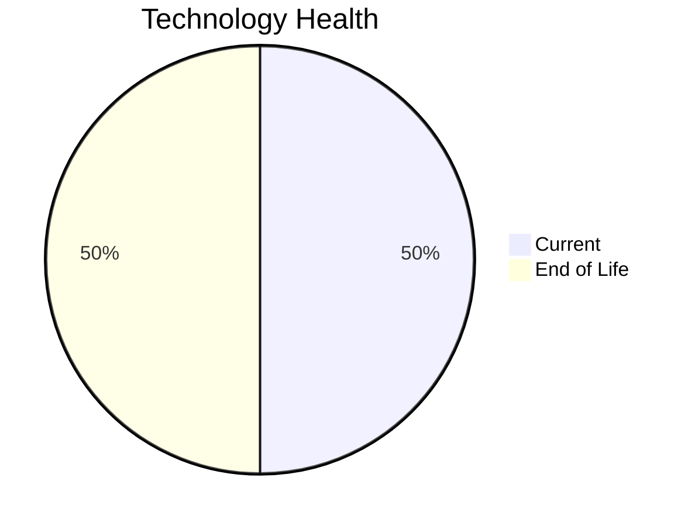

# Application Report: QualityApp-019

**ID:** app019
**Generated:** 2026-05-14

## Overview

| Attribute | Value |
|-----------|-------|
| Business Unit | Quality |
| Business Criticality | High |
| Solution Type | Custom made |
| Deployment Type | AWS, On-premise |
| Users | 180 |
| Servers | 1 |
| External Interfaces | 5 |
| Containerized | No |
| CI/CD Present | Yes |
| Architecture | 3-Tier |

## Technology Stack

| Component | Technology | Version | Status |
|-----------|-----------|---------|--------|
| Os | RHEL | 8 | 🟢 CURRENT_VERSION |
| Language | Python | 3.8 | 🔴 EOL |
| Database | MySQL | 8.0 | 🟢 CURRENT_VERSION |
| App Server | Apache Tomcat | 8.0 | 🔴 EOL |

## Complexity Assessment

**Score:** 6/10 — **MEDIUM**
**Confidence:** 7

Score 6/10 (MEDIUM): EOL components=2, Outdated=0, Interfaces=5, Servers=1, Criticality=High, Architecture=3-Tier.

| Factor | Value |
|--------|-------|
| Servers | 1 |
| Environments | 1 |
| Interfaces | 5 |
| EOL Technologies | 2 |
| Outdated Technologies | 0 |
| Business Criticality | High |

## Modernization Scenarios

### Applicable Scenarios

#### ✅ Applications Server replacement

- **Priority:** Medium
- **Effort:** Medium
- **Effects:** agility, cost
- **One-Time Cost:** $11,565
- **Annual Savings:** $10,800/year
- **Reasoning:** Application server Apache Tomcat  8.0 is EOL. Replacement with a modern server is recommended.

#### ✅ Application Containerization

- **Priority:** High
- **Effort:** High
- **Effects:** agility, cost, sustainability
- **One-Time Cost:** $115,653
- **Annual Savings:** $90,000/year
- **Reasoning:** Application is not containerized. Containerization would improve deployment consistency and resource efficiency.

#### ✅ Update outdated components

- **Priority:** High
- **Effort:** High
- **Effects:** security, agility, cost
- **Reasoning:** Application has EOL or very legacy components. Update of outdated programming language and framework components is required.

### Other Scenarios

| Scenario | Status | Reason |
|----------|--------|--------|
| Operating System Update | ✔️ FULFILLED | Operating system RHEL 8 is on a current, supported version within its vendor support lifecycle. |
| Switch to standard Linux Operating System | ✔️ FULFILLED | Application already runs on a standard Linux distribution: RHEL 8. |
| Switch to ARM-based CPU | ❓ LACK_OF_DATA | CPU architecture is not explicitly documented as x86/x64. Cannot confirm primary trigger for ARM mig... |
| Application Migration to Cloud Infrastructure (Lift & Shift) | ⚠️ PARTIALLY_FULFILLED | Application has hybrid deployment (On-Premise and Cloud: AWS, On-premise). Full cloud migration not ... |
| Application Refactoring and De-coupling | ❌ NOT_APPLICABLE | Application already uses 3-tier architecture. Primary triggers for monolith/tight coupling do not ap... |
| Upgrade Legacy Databases | ✔️ FULFILLED | Database MySQL 8.0 is on a current, supported version. |
| Switch DB Engine to open-source database solution | ✔️ FULFILLED | Database MySQL 8.0 is already an open-source/license-free solution. |