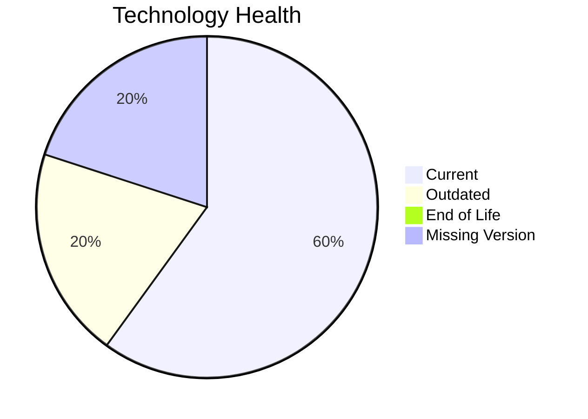

# Application Report: QualityApp-019

**ID:** app019
**Generated:** 2026-05-14

## Overview

| Attribute | Value |
|-----------|-------|
| Owner | Quality |
| Environment | AWS, On-premise |
| Business Criticality | High |
| Users | 180 |
| Servers | sv28 |

## Technology Stack

| Component | Technology | Status |
|-----------|-----------|--------|
| Operating System | RHEL 8 | 🟡 |
| Database | MySQL 8.0 | 🟡 |
| Language | Python 3.8 | 🟢 |

## Complexity Assessment

**Score:** 4/10 — **MEDIUM**

## Modernization Scenarios

### ✅ Switch To Arm Cpu
- **Reasoning:** Cloud-hosted workload with manageable complexity is a candidate for ARM.

### ✅ App Deployment To Cloud
- **Reasoning:** On-premise deployment model is a direct cloud-migration opportunity.

### ✅ App Containerization
- **Reasoning:** Application is not containerized and can benefit from platform standardization.

### ✅ Upgrade Legacy Databases
- **Reasoning:** Database platform is aging and should be upgraded.

### ✅ Switch To Managed Db
- **Reasoning:** On-prem database workloads can move to managed database services.

## Financial Summary

| Metric | Value |
|--------|-------|
| Total One-Time Cost | €109314 |
| Total Yearly Savings | €112600 |
| Break-Even | 1.0 years |
