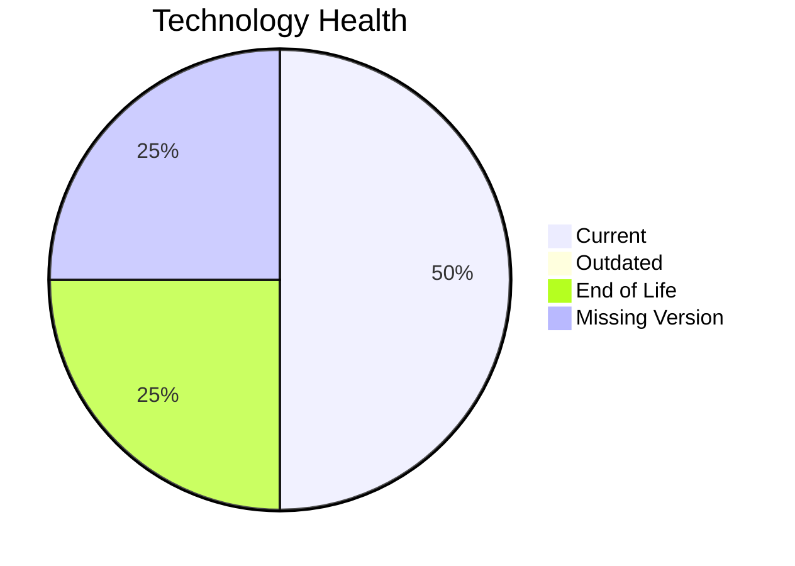

# Application Report: QualityApp-019

**ID:** app019
**Generated:** 2026-04-24

## Overview

| Attribute | Value |
|-----------|-------|
| Owner | Quality |
| Business Unit | Quality |
| Deployment Type | AWS, On-premise |
| Business Criticality | High |
| Users | 180 |
| Servers | N/A |
| Architecture | 3-Tier |
| Solution Type | Custom made |
| CI/CD | Yes |
| Containerized | No |

## Technology Stack

| Component | Technology | Version | Status |
|-----------|-----------|---------|--------|
| Operating System | RHEL 8 | RHEL 8 | 🟢 CURRENT_VERSION |
| Language | Python 3.8 | Python 3.8 | 🔴 EOL |
| Database | MySQL 8.0 | MySQL 8.0 | 🟢 CURRENT_VERSION |
| App Server | Apache Tomcat  8.0 | Apache Tomcat  8.0 | ⚪ NO_KNOWLEDGE |

## Complexity Assessment

**Score:** 5/10 — **MEDIUM**
**Confidence:** 7

**Reasoning:** Tech age score 7/10 (1 EOL, 0 outdated components). Integration score 5/10 (5 external interfaces). Infrastructure score 3/10 (1 servers, 1 environments). Business criticality score 8/10 (criticality: High). Architecture score 3/10 (architecture: 3-Tier, containerized: No, CI/CD: Yes). Data score 4/10 (180GB storage).

### Contributing Factors

| Factor | Value |
|--------|-------|
| Servers | 1 |
| Environments | 1 |
| External Interfaces | 5 |
| EOL Technologies | 1 |
| Outdated Technologies | 0 |
| CI/CD | Yes |
| Containerized | No |

## Modernization Scenarios

### Applicable Scenarios

#### ✅ Switch to ARM-based CPU

- **Priority:** Medium
- **Effort:** Medium
- **Effects:** cost, sustainability
- **Cost:** €5,028 (one-time)
- **Savings:** €1,000/year
- **Reasoning:** Custom application on Linux OS is a candidate for ARM-based CPU migration for cost savings.

#### ✅ Application Containerization

- **Priority:** High
- **Effort:** High
- **Effects:** agility, cost, sustainability
- **Cost:** €100,568 (one-time)
- **Savings:** €90,000/year
- **Reasoning:** Custom/open-source application not yet containerized is a strong candidate for containerization.

#### ✅ Application Refactoring and De-coupling

- **Priority:** High
- **Effort:** High
- **Effects:** agility, cost, sustainability
- **Cost:** €251,420 (one-time)
- **Savings:** €135,000/year
- **Reasoning:** Custom application with '3-tier' architecture may benefit from refactoring for better agility.

#### ✅ Update outdated components

- **Priority:** High
- **Effort:** High
- **Effects:** security, agility, cost
- **Cost:** N/A (one-time)
- **Savings:** N/A
- **Reasoning:** Programming language 'Python 3.8' is EOL. Component updates are needed.

### Not Applicable / Other

| Scenario | Status | Reason |
|----------|--------|--------|
| Operating System Update | FULFILLED | Operating system 'RHEL 8' is currently supported and up to date.... |
| Switch to standard Linux Operating System | FULFILLED | Application already runs on a standard Linux distribution: 'RHEL 8'.... |
| Applications Server replacement | LACK_OF_DATA | Lifecycle data for application server 'Apache Tomcat  8.0' is not available.... |
| Application Migration to Cloud Infrastructure (Lift & Shift) | FULFILLED | Application is already deployed on cloud: 'AWS, On-premise'.... |
| Upgrade Legacy Databases | FULFILLED | Database 'MySQL 8.0' is on a currently supported version.... |
| Switch DB Engine to open-source database solution | FULFILLED | Database 'MySQL 8.0' is already an open-source solution.... |

## Financial Summary

| Metric | Value |
|--------|-------|
| Total One-Time Cost | €357,016 |
| Total Yearly Savings | €226,000 |
| Break-Even | 1.6 years |
