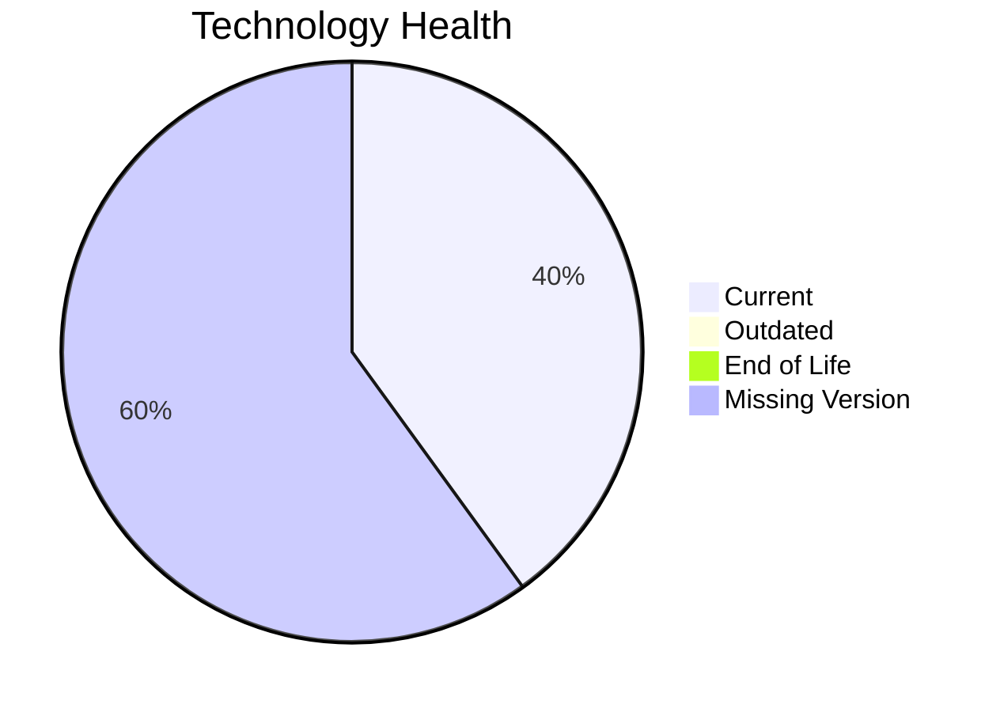

# Application Report: QualityApp-019

**ID:** app019  
**Generated:** 2026-05-14

## Overview

| Attribute | Value |
|-----------|-------|
| Owner | unknown |
| Environment | AWS, On-premise |
| Business Criticality | High |
| Users | 180 |
| Servers | sv28 |

## Technology Stack

| Component | Technology | Version | Status |
|-----------|-----------|---------|--------|
| os | RHEL 8 | 8 | 🟢 CURRENT_VERSION |
| database | MySQL 8.0 | 8.0 | 🟢 CURRENT_VERSION |
| language | Python 3.8 | 3.8 | ⚪ NO_KNOWLEDGE |
| framework | Framework | unknown | ⚪ NO_KNOWLEDGE |
| app_server | Apache Tomcat  8.0 | 8.0 | ⚪ NO_KNOWLEDGE |

## Complexity Assessment

**Score:** 4/10 — **MEDIUM**  
**Confidence:** 8

**Reasoning:** Tech age 2/10 (0 EOL, 0 outdated components), integrations 5 interfaces and 0 dependencies, infrastructure 1 servers/1 environments, criticality High, architecture score 4/10, data score 3/10.

## Modernization Scenarios

### Applicable Scenarios

#### ✅ Switch to ARM-based CPU
- **Cost:** €4373 (one-time)
- **Savings:** €1000/year
- **Reasoning:** Cloud-hosted workload can be evaluated for ARM-based instances.
#### ✅ Application Containerization
- **Cost:** €87450 (one-time)
- **Savings:** €90000/year
- **Reasoning:** Containerization could improve portability and operations.

### Not Applicable / Other

| Scenario | Status | Reason |
|----------|--------|--------|
| Operating System Update | FULFILLED | RHEL 8 appears current. |
| Switch to standard Linux Operating System | FULFILLED | Application already runs on a standard Linux platform. |
| Applications Server replacement | LACK_OF_DATA | Insufficient application server data. |
| Application Migration to Cloud Infrastructure (Lift & Shift) | PARTIALLY_FULFILLED | Hybrid deployment detected; further cloud migration possible. |
| Application Refactoring and De-coupling | PARTIALLY_FULFILLED | Architecture shows partial decoupling already. |
| Upgrade Legacy Databases | FULFILLED | Database engine appears current. |
| Switch DB Engine to open-source database solution | FULFILLED | Application already uses open-source database engine. |
| Update outdated components | FULFILLED | No outdated components detected. |

## Financial Summary

| Metric | Value |
|--------|-------|
| Total One-Time Cost | €91823 |
| Total Yearly Savings | €91000 |
| Break-Even | 1.0 years |
