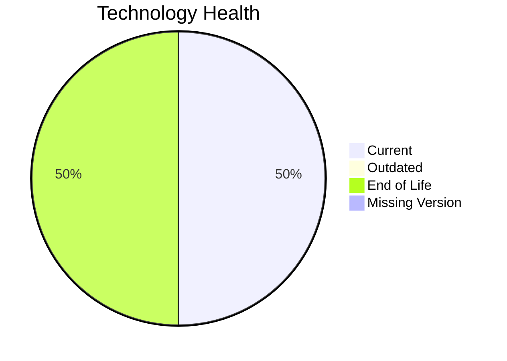

# Application Report: QualityApp-019

**ID:** app019
**Generated:** 2026-05-11

## Overview

| Attribute | Value |
|-----------|-------|
| Owner | Quality |
| Environment | AWS, On-premise |
| Business Criticality | High |
| Users | 180 |
| Servers | 1 |

## Technology Stack

| Component | Technology | Version | Status |
|-----------|-----------|---------|--------|
| Operating System | RHEL | RHEL 8 | 🟢 CURRENT_VERSION |
| Database | MySQL | MySQL 8.0 | 🟢 CURRENT_VERSION |
| Language | Python | Python 3.8 | 🔴 EOL |
| Framework | N/A | N/A | ⚪ |
| App Server | Apache Tomcat | Apache Tomcat  8.0 | 🔴 EOL |

## Complexity Assessment

**Score:** 6/10 — **MEDIUM**
**Confidence:** 8

Technology age score 9/10 (EOL=2, outdated=0, unknown=0); integration score 5/10 (interfaces=5, api_endpoints=9); infrastructure score 2/10 (servers=1, environments=1); business criticality score 8/10 (High, users=180); architecture score 5/10 (architecture=3-Tier, CI/CD=Yes, containerized=No); data score 3/10 (db_count=1, db_storage_gb=180).

## Modernization Scenarios

### Applicable Scenarios

#### ✅ Applications Server replacement

- **Priority:** Medium
- **Effort:** Medium
- **Effects:** agility, cost
- **Cost:** €11565 (one-time)
- **Savings:** €10800/year
- **Reasoning:** Application server version is legacy or unsupported.

#### ✅ Application Migration to Cloud Infrastructure (Lift & Shift)

- **Priority:** High
- **Effort:** Low
- **Effects:** security, agility
- **Cost:** €5783 (one-time)
- **Savings:** €2700/year
- **Reasoning:** On-premise deployment indicates lift-and-shift opportunity to cloud.

#### ✅ Application Containerization

- **Priority:** High
- **Effort:** High
- **Effects:** agility, cost, sustainability
- **Cost:** €115653 (one-time)
- **Savings:** €90000/year
- **Reasoning:** Traditional non-container deployment on supported OS can be containerized.

#### ✅ Update outdated components

- **Priority:** High
- **Effort:** High
- **Effects:** security, agility, cost
- **Cost:** N/A
- **Savings:** N/A
- **Reasoning:** Language/framework/server components are outdated or end-of-life.

### Not Applicable / Other

| Scenario | Status | Reason |
|----------|--------|--------|
| Operating System Update | FULFILLED | Operating system is on a supported current version. |
| Switch to standard Linux Operating System | FULFILLED | Application already runs on a standard Linux distribution. |
| Switch to ARM-based CPU | LACK_OF_DATA | CPU architecture (x86/x64/ARM) is not provided in source data. |
| Application Refactoring and De-coupling | PARTIALLY_FULFILLED | Some modularity exists, but additional decoupling opportunities remain. |
| Upgrade Legacy Databases | FULFILLED | Database version is currently supported. |
| Switch DB Engine to open-source database solution | FULFILLED | Database engine is already open-source compatible. |

## Financial Summary

| Metric | Value |
|--------|-------|
| Total One-Time Cost | €133001 |
| Total Yearly Savings | €103500 |
| Break-Even | 1.3 years |
