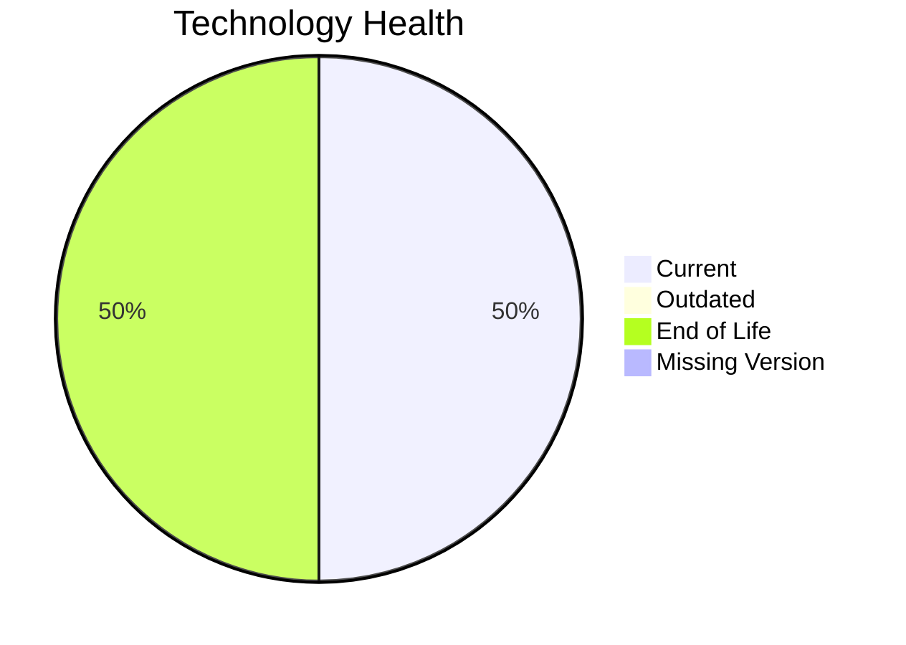

# Application Report: QualityApp-019

**ID:** app019  
**Generated:** 2026-05-13

## Overview
| Attribute | Value |
|---|---|
| Owner | Quality |
| Environment | AWS, On-premise |
| Business Criticality | High |
| Users | 180 |
| Servers | 1 |

## Technology Stack
| Component | Technology | Status |
|---|---|---|
| Operating System | RHEL 8 | 🟢 CURRENT_VERSION |
| Language | Python 3.8 | 🔴 EOL |
| Application Server | Apache Tomcat  8.0 | 🔴 EOL |
| Database | MySQL 8.0 | 🟢 CURRENT_VERSION |

## Complexity Assessment
**Score:** 6/10 — **MEDIUM**  
**Confidence:** Medium

## Modernization Scenarios
| Applicable Scenario | Priority | Cost | Savings/Year |
|---|---|---:|---:|
| Applications Server replacement | Medium | €11565 | €10800 |
| Application Containerization | High | €115653 | €90000 |
| Application Refactoring and De-coupling | High | €289133 | €135000 |
| Update outdated components | High | €N/A | €N/A |

## Financial Summary
| Metric | Value |
|---|---:|
| Total One-Time Cost | €416351 |
| Total Yearly Savings | €235800 |
| Break-Even | 1.8 years |
