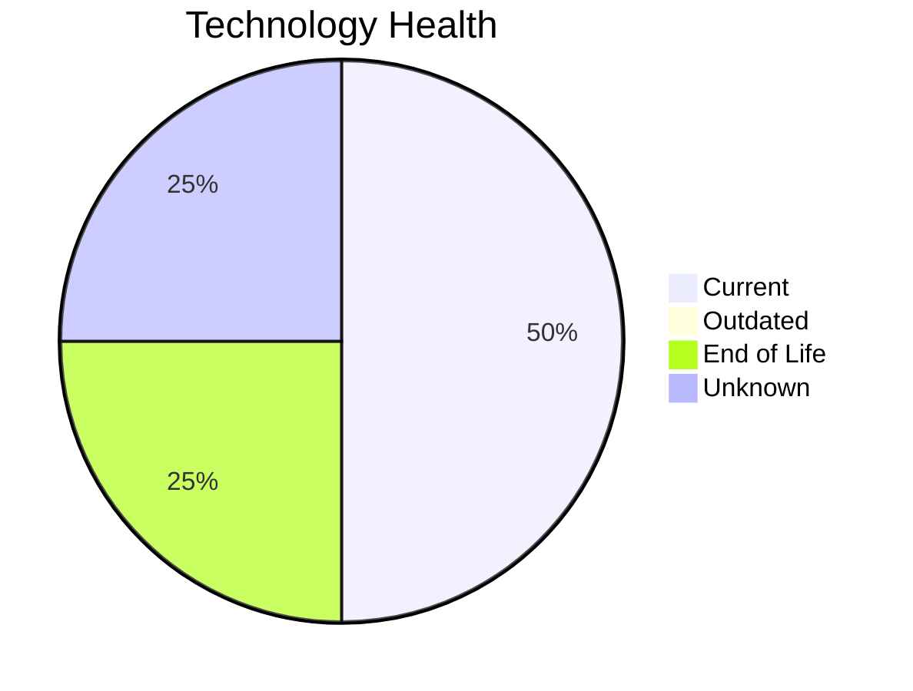

# Application Report: QualityApp-019

**ID:** app019  
**Generated:** 2026-05-06

## Overview

| Attribute | Value |
|-----------|-------|
| Business Unit | Quality |
| Deployment | AWS, On-premise |
| Business Criticality | High |
| Users | 180 |
| Servers | sv28 |
| Architecture | 3-Tier |
| Containerized | No |
| CI/CD | Yes |

## Technology Stack

| Component | Technology | Status |
|-----------|-----------|--------|
| Operating System | RHEL 8 | 🟢 CURRENT_VERSION |
| Database | MySQL 8.0 | 🟢 CURRENT_VERSION |
| Language | Python 3.8 | 🔴 EOL |
| App Server | Apache Tomcat  8.0 | ⚪ NO_KNOWLEDGE |

## Complexity Assessment

**Score:** 5/10 — **MEDIUM**  
**Confidence:** 8/10

> Complexity score 5/10 (MEDIUM). 1 EOL component(s), High business criticality.

| Factor | Score |
|--------|-------|
| Technology Age & EOL | 7/10 |
| Integration Complexity | 5/10 |
| Infrastructure Scale | 2/10 |
| Business Criticality | 7/10 |
| Code & Architecture | 3/10 |
| Data Complexity | 4/10 |

## Modernization Scenarios

### Applicable Scenarios

#### ✅ Application Containerization

- **Priority:** High
- **Effort:** High
- **Effects:** agility, cost, sustainability
- **Cost:** €100,568 (one-time)
- **Savings:** €90,000/year
- **Reasoning:** Application is not containerized; containerization could improve portability and deployment efficiency.

#### ✅ Update outdated components

- **Priority:** High
- **Effort:** High
- **Effects:** security, agility, cost
- **Cost:** N/A (one-time)
- **Savings:** N/A
- **Reasoning:** Components need updating. EOL: Python 3.8.

### Other Scenarios

| Scenario | Status | Reason |
|----------|--------|--------|
| Operating System Update | FULFILLED | Operating system is on a current, supported version. |
| Switch to standard Linux Operating System | FULFILLED | Application runs on standard Linux (RHEL 8). |
| Switch to ARM-based CPU | LACK_OF_DATA | CPU architecture not documented in application data. |
| Applications Server replacement | LACK_OF_DATA | Application server lifecycle status unknown. |
| Application Migration to Cloud Infrastructure (Lift & Shift) | LACK_OF_DATA | Deployment type not clearly identified. |
| Application Refactoring and De-coupling | PARTIALLY_FULFILLED | 3-tier architecture has some separation; further decoupling into microservices i... |
| Upgrade Legacy Databases | FULFILLED | Database (MySQL 8.0) is on a current, supported version. |
| Switch DB Engine to open-source database solution | FULFILLED | Database (MySQL 8.0) is already open-source or compatible. |

## Financial Summary

| Metric | Value |
|--------|-------|
| Total One-Time Investment | €100,568 |
| Total Annual Savings | €90,000 |
| Break-Even | 1.1 years |
