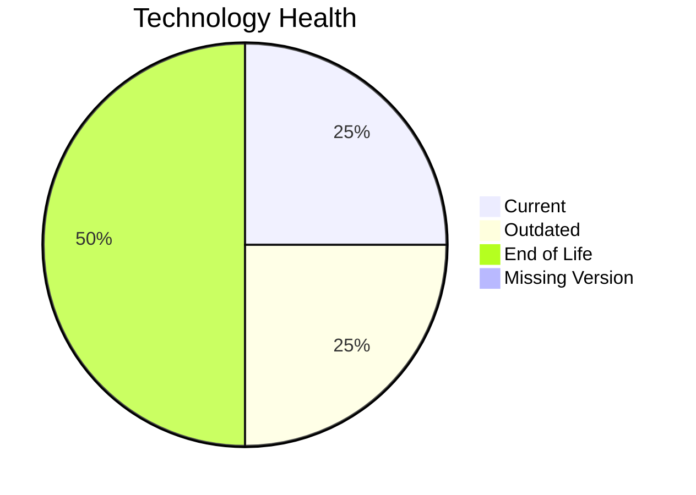

# Application Report: QualityApp-019

**ID:** app019
**Generated:** 2026-05-19

## Overview

| Attribute | Value |
|-----------|-------|
| Owner | unknown |
| Environment | AWS, On-premise |
| Business Criticality | High |
| Users | 180 |
| Servers | 1 |

## Technology Stack

| Component | Technology | Version | Status |
|-----------|-----------|---------|--------|
| Operating System | RHEL 8 | 8 | 🟢 CURRENT_VERSION |
| Database | MySQL 8.0 | 8.0 | 🟡 OUTDATED |
| Language | Python 3.8 | 3.8 | 🔴 EOL |
| Framework | N/A | N/A | ⚪ N/A |
| App Server | Apache Tomcat 8.0 | 8.0 | 🔴 EOL |

## Complexity Assessment

**Score:** 6/10 — **MEDIUM**
**Confidence:** 9

| Factor | Score | Notes |
|--------|-------|-------|
| Technology Age | n/a | High-critical app with complexity driven by technology age, integrations, and architecture characteristics. |
| Integration | n/a | Interfaces: 5 |
| Infrastructure | n/a | Environments: 1 |
| Business Criticality | n/a | High |
| Architecture | n/a | Containerized: No; CI/CD: Yes |
| Data | n/a | Databases: 1 |

## Scenario Applicability

### Applicable Scenarios

#### ✅ Applications Server replacement

- **Priority:** Medium
- **Effort:** Medium
- **Effects:** agility, cost
- **Cost:** €11,565 (one-time)
- **Savings:** €10,800/year
- **Reasoning:** Apache Tomcat  8.0 is EOL and fits server replacement triggers.

#### ✅ Application Containerization

- **Priority:** High
- **Effort:** High
- **Effects:** agility, cost, sustainability
- **Cost:** €115,653 (one-time)
- **Savings:** €90,000/year
- **Reasoning:** Application is not containerized yet and runs on a platform that can support container adoption.

#### ✅ Application Refactoring and De-coupling

- **Priority:** High
- **Effort:** High
- **Effects:** agility, cost, sustainability
- **Cost:** €289,133 (one-time)
- **Savings:** €135,000/year
- **Reasoning:** Legacy architecture signals or coupling indicators suggest refactoring and de-coupling would add value.

#### ✅ Upgrade Legacy Databases

- **Priority:** High
- **Effort:** Medium
- **Effects:** security, agility
- **Cost:** €11,565 (one-time)
- **Savings:** €10,000/year
- **Reasoning:** MySQL 8.0 is OUTDATED and fits database upgrade triggers.

#### ✅ Update outdated components

- **Priority:** High
- **Effort:** High
- **Effects:** security, agility, cost
- **Cost:** N/A (one-time)
- **Savings:** N/A/year
- **Reasoning:** The technology assessment found outdated or EOL components that justify a component refresh.

### Not Applicable / Other

| Scenario | Status | Reason |
|----------|--------|--------|
| Operating System Update | ✔️ FULFILLED | RHEL 8 is currently supported. |
| Switch to standard Linux Operating System | ✔️ FULFILLED | RHEL 8 is already a standard Linux distribution. |
| Switch to ARM-based CPU | ❓ LACK_OF_DATA | CPU architecture is not captured in the inventory, so ARM applicability cannot be confirmed. |
| Application Migration to Cloud Infrastructure (Lift & Shift) | 🟨 PARTIALLY_FULFILLED | Application already has an AWS footprint but still retains on-premise hosting. |
| Switch DB Engine to open-source database solution | ✔️ FULFILLED | MySQL 8.0 already aligns with an open-source database family. |

## Financial Summary

| Metric | Value |
|--------|-------|
| Total One-Time Cost | €427,916 |
| Total Yearly Savings | €245,800 |
| Break-Even | 1.7 years |
