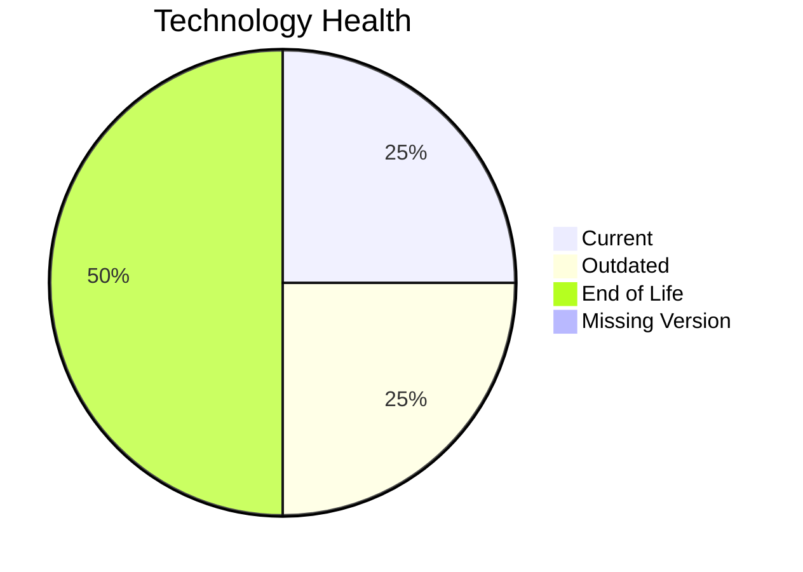

# Application Report: QualityApp-019

**ID:** app019
**Generated:** 2026-05-07

## Overview

| Attribute | Value |
|-----------|-------|
| Owner | N/A |
| Environment | AWS, On-premise |
| Business Criticality | High |
| Users | 180 |
| Servers | 1 |

## Technology Stack

| Component | Technology | Version | Status |
|-----------|-----------|---------|--------|
| Operating System | RHEL | 8 | 🟢 CURRENT_VERSION |
| Database | MySQL | 8.0 | 🟡 OUTDATED |
| Language | Python | 3.8 | 🔴 EOL |
| Framework | N/A | N/A | ⚪ NO_KNOWLEDGE |
| App Server | Tomcat | 8.0 | 🔴 EOL |

## Complexity Assessment

**Score:** 6/10 — **MEDIUM**
**Confidence:** 8

| Factor | Score | Notes |
|--------|-------|-------|
| Technology Age | 9/10 | 2 EOL components were found in the application stack. |
| Integration | 5/10 | The application has 5 interfaces, indicating moderate integration. |
| Infrastructure | 2/10 | 1 server(s) and 1 environment(s) indicate a small footprint. |
| Business Criticality | 8/10 | Criticality is 'High' with 180 users. |
| Architecture | 3/10 | A 3-tier architecture is more separable than 1-tier or 2-tier designs. CI/CD lowers delivery risk. |
| Data | 5/10 | Database footprint (180 GB) indicates moderate data migration effort. |

## Modernization Scenarios

### Applicable Scenarios

#### ✅ Applications Server replacement

- **Priority:** Medium
- **Effort:** Medium
- **Effects:** agility, cost
- **Cost:** €11,565 (one-time)
- **Savings:** €10,800/year
- **Reasoning:** Tomcat 8.0 is out of support.

#### ✅ Application Containerization

- **Priority:** High
- **Effort:** High
- **Effects:** agility, cost, sustainability
- **Cost:** €115,653 (one-time)
- **Savings:** €90,000/year
- **Reasoning:** The application is not containerized and has a deployable server-based stack.

#### ✅ Application Refactoring and De-coupling

- **Priority:** High
- **Effort:** High
- **Effects:** agility, cost, sustainability
- **Cost:** €289,133 (one-time)
- **Savings:** €135,000/year
- **Reasoning:** The architecture indicates coupling or legacy structure that would benefit from refactoring.

#### ✅ Upgrade Legacy Databases

- **Priority:** High
- **Effort:** Medium
- **Effects:** security, agility
- **Cost:** €11,565 (one-time)
- **Savings:** €10,000/year
- **Reasoning:** MySQL 8.0 is aging and treated conservatively as outdated in 2026.

#### ✅ Update outdated components

- **Priority:** High
- **Effort:** High
- **Effects:** security, agility, cost
- **Cost:** €N/A (one-time)
- **Savings:** €N/A/year
- **Reasoning:** At least one language, framework, or application server component is outdated or EOL.

### Not Applicable / Other

| Scenario | Status | Reason |
|----------|--------|--------|
| Operating System Update | FULFILLED | RHEL 8 remains vendor-supported through May 2029. |
| Switch to standard Linux Operating System | FULFILLED | Application already runs on a standard Linux distribution. |
| Switch to ARM-based CPU | LACK_OF_DATA | CPU architecture is not present in the workbook, so ARM suitability cannot be validated. |
| Application Migration to Cloud Infrastructure (Lift & Shift) | PARTIALLY_FULFILLED | Application spans AWS and on-premise environments, so cloud migration is only partially fulfilled. |
| Switch DB Engine to open-source database solution | FULFILLED | The application already uses an open-source or open-source-compatible database engine. |

## Financial Summary

| Metric | Value |
|--------|-------|
| Total One-Time Cost | €427,916 |
| Total Yearly Savings | €245,800 |
| Break-Even | 1.7 years |
