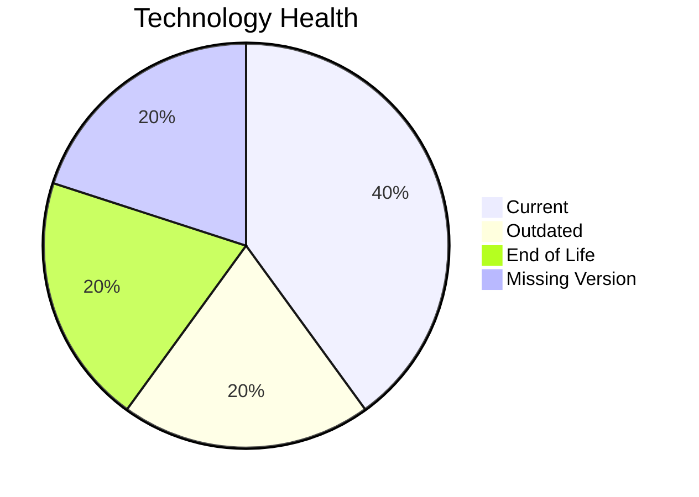

# Application Report: QualityApp-019

**ID:** app019  
**Generated:** 2026-05-17

## Overview

| Attribute | Value |
|-----------|-------|
| Owner | unknown |
| Environment | AWS, On-premise |
| Business Criticality | High |
| Users | 180 |
| Servers | sv28 |

## Technology Stack

| Component | Technology | Version | Status |
|-----------|-----------|---------|--------|
| Operating System | RHEL 8 | 8 | 🟢 CURRENT_VERSION |
| Database | MySQL 8.0 | 8.0 | 🟢 CURRENT_VERSION |
| Language | Python 3.8 | 3.8 | 🔴 EOL |
| Framework | Unknown Framework | N/A | ⚪ NO_KNOWLEDGE |
| App Server | Apache Tomcat  8.0 | 8.0 | 🟡 OUTDATED |

## Complexity Assessment

**Score:** 5/10 — **MEDIUM**  
**Confidence:** 8

Tech age 7/10 (EOL=1, outdated=1, unknown=1); integration 5/10 (5 interfaces); infrastructure 3/10 (1 servers, 1 envs); criticality 8/10 (High); architecture 5/10 (arch=3-Tier, containerized=No, ci/cd=Yes); data 3/10 (1 DB(s), storage≈180GB).

## Modernization Scenarios

### Applicable Scenarios

#### ✅ Applications Server replacement
- **Priority:** Medium
- **Effort:** Medium
- **Effects:** agility, cost
- **Cost:** €10057 (one-time)
- **Savings:** €10800/year
- **Reasoning:** Application server identified as legacy/EOL.

#### ✅ Application Containerization
- **Priority:** High
- **Effort:** High
- **Effects:** agility, cost, sustainability
- **Cost:** €100568 (one-time)
- **Savings:** €90000/year
- **Reasoning:** Traditional deployment without containers on supported OS baseline.

#### ✅ Update outdated components
- **Priority:** High
- **Effort:** High
- **Effects:** security, agility, cost
- **Cost:** €N/A (one-time)
- **Savings:** €N/A/year
- **Reasoning:** Technology assessment found outdated/EOL components.

### Not Applicable / Other

| Scenario | Status | Reason |
|----------|--------|--------|
| Operating System Update | FULFILLED | Operating system is already in supported lifecycle. |
| Switch to standard Linux Operating System | FULFILLED | Application already runs on standard Linux distribution. |
| Switch to ARM-based CPU | LACK_OF_DATA | CPU architecture data not provided and environment is traditional. |
| Application Migration to Cloud Infrastructure (Lift & Shift) | PARTIALLY_FULFILLED | Hybrid deployment exists; further lift-and-shift opportunities remain. |
| Application Refactoring and De-coupling | PARTIALLY_FULFILLED | Moderate complexity with selective decoupling opportunities. |
| Upgrade Legacy Databases | PARTIALLY_FULFILLED | Database is supported; periodic modernization still relevant. |
| Switch DB Engine to open-source database solution | NOT_APPLICABLE | Database engine already open-source or open-source based. |

## Financial Summary

| Metric | Value |
|--------|-------|
| Total One-Time Cost | €110625 |
| Total Yearly Savings | €100800 |
| Break-Even | 1.1 years |
