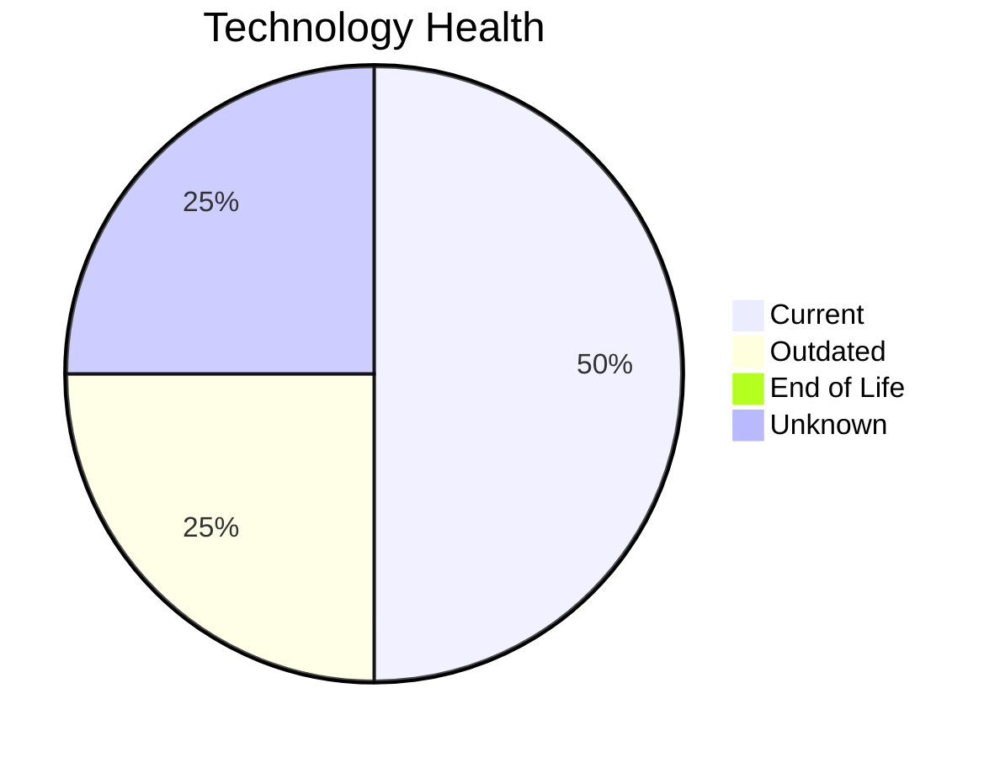

# Application Report: QualityApp-019

**ID:** app019
**Generated:** 2026-05-14

## Overview

| Attribute | Value |
|-----------|-------|
| Owner | Quality |
| Environment | AWS, On-premise |
| Business Criticality | High |
| Users | 180 |
| Servers | 1 |
| Solution Type | Custom made |
| Architecture | 3-Tier |
| Containerized | No |
| CI/CD | Yes |

## Technology Stack

| Component | Technology | Version | Status |
|-----------|-----------|---------|--------|
| Os | RHEL 8 | 8 | 🟢 CURRENT_VERSION |
| Database | MySQL 8.0 | 8.0 | 🟢 CURRENT_VERSION |
| Programming Language | Python 3.8 | 3.8 | 🟡 OUTDATED |
| Application Server | Apache Tomcat  8.0 | Tomcat 8.0 | ⚪ NO_KNOWLEDGE |

## Complexity Assessment

**Score:** 4/10 — **MEDIUM**
**Confidence:** 8/10

| Factor | Score | Notes |
|--------|-------|-------|
| Technology Age | 4/10 | 0 EOL, 1 outdated components |
| Integration | 5/10 | 5 external interfaces |
| Infrastructure | 2/10 | 1 server(s), 1 environment(s) |
| Business Criticality | 7/10 | High criticality |
| Architecture | 3/10 | Containerized: No, CI/CD: Yes |
| Data | 5/10 | DB: MySQL 8.0 |

## Modernization Scenarios

### Applicable Scenarios

#### ✅ Application Containerization

- **Priority:** High
- **Effort:** High
- **Effects:** agility, cost, sustainability
- **Cost:** €87,450 (one-time)
- **Savings:** €90,000/year
- **Reasoning:** Application is custom-developed, runs on Linux, and is not yet containerized. Good candidate for containerization to improve portability and resource efficiency.

#### ✅ Update outdated components

- **Priority:** High
- **Effort:** High
- **Effects:** security, agility, cost
- **Cost:** N/A (one-time)
- **Savings:** N/A/year
- **Reasoning:** Application has outdated components: programming language Python 3.8 is outdated. Update recommended.

### Not Applicable / Other

| Scenario | Status | Reason |
|----------|--------|--------|
| Operating System Update | ✔️ FULFILLED | Operating system RHEL 8 is on a current, supported version. |
| Switch to standard Linux Operating System | ✔️ FULFILLED | Application already runs on standard Linux (RHEL 8). No migration needed. |
| Switch to ARM-based CPU | ⚠️ PARTIALLY_FULFILLED | Application runs on Linux (ARM-compatible) and is custom-developed, but is not yet containerized. AR... |
| Applications Server replacement | ❓ LACK_OF_DATA | Cannot assess application server lifecycle for Apache Tomcat  8.0. |
| Application Migration to Cloud Infrastructure (Lift & Shift) | ⚠️ PARTIALLY_FULFILLED | Application has hybrid deployment (AWS, On-premise). Partial cloud migration is in place; full cloud... |
| Application Refactoring and De-coupling | ⚠️ PARTIALLY_FULFILLED | Application has 3-Tier architecture (moderately decoupled) but is not yet containerized or cloud-nat... |
| Upgrade Legacy Databases | ✔️ FULFILLED | Database MySQL 8.0 is on a current, supported version. No upgrade needed. |
| Switch DB Engine to open-source database solution | ✔️ FULFILLED | Database MySQL 8.0 is already an open-source or managed solution. No commercial license migration ne... |

## Financial Summary

| Metric | Value |
|--------|-------|
| Total One-Time Cost | €87,450 |
| Total Yearly Savings | €90,000 |
| Break-Even | 1.0 years |
