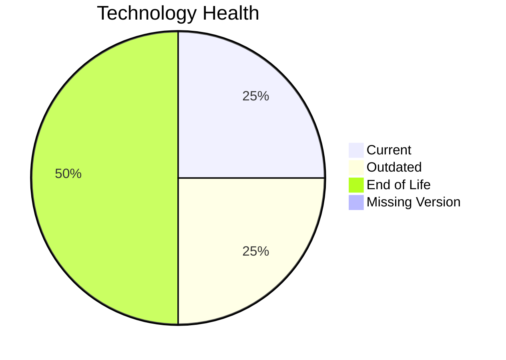

# Application Report: QualityApp-019

**ID:** app019
**Generated:** 2026-05-18T00:00:00Z

## Overview

| Attribute | Value |
|-----------|-------|
| Owner | Quality |
| Environment | AWS, On-premise |
| Business Criticality | High |
| Users | 180 |
| Servers | 1 |

## Technology Stack

| Component | Technology | Version | Status |
|-----------|-----------|---------|--------|
| Operating System | RHEL | 8 | 🟢 CURRENT_VERSION |
| Database | MySQL | 8.0 | 🟡 OUTDATED |
| Language | Python | 3.8 | 🔴 EOL |
| Framework | N/A | N/A | ⚪ N/A |
| App Server | Apache Tomcat | 8.0 | 🔴 EOL |

## Complexity Assessment

**Score:** 5/10 — **MEDIUM**
**Confidence:** 8

| Factor | Score | Notes |
|--------|-------|-------|
| Technology Age | 8/10 | 2 component(s) are EOL. |
| Integration | 5/10 | 5 external interfaces and 9 API endpoints. |
| Infrastructure | 2/10 | 1 server instance(s) across 1 environment(s). |
| Business Criticality | 7/10 | Criticality is High with 180 users. |
| Architecture | 3/10 | Architecture is 3-Tier; containerized=No; CI/CD=Yes. |
| Data | 5/10 | Database storage is 180 GB on MySQL 8.0.  |

## Modernization Scenarios

### Applicable Scenarios

#### ✅ Applications Server replacement

- **Priority:** Medium
- **Effort:** Medium
- **Effects:** agility, cost
- **Cost:** €10,057 (one-time)
- **Savings:** €10,800/year
- **Reasoning:** Apache Tomcat  8.0 is assessed as EOL, which directly triggers server replacement.

#### ✅ Application Containerization

- **Priority:** High
- **Effort:** High
- **Effects:** agility, cost, sustainability
- **Cost:** €100,568 (one-time)
- **Savings:** €90,000/year
- **Reasoning:** The application is not yet containerized and the runtime/OS stack is compatible with container packaging.

#### ✅ Upgrade Legacy Databases

- **Priority:** High
- **Effort:** Medium
- **Effects:** security, agility
- **Cost:** €10,057 (one-time)
- **Savings:** €10,000/year
- **Reasoning:** MySQL 8.0 is assessed as OUTDATED.

#### ✅ Update outdated components

- **Priority:** High
- **Effort:** High
- **Effects:** security, agility, cost
- **Cost:** €N/A (one-time)
- **Savings:** €N/A/year
- **Reasoning:** At least one application runtime component is outdated or end of life.

### Not Applicable / Other

| Scenario | Status | Reason |
|----------|--------|--------|
| Operating System Update | FULFILLED | RHEL 8 is on a supported current-enough release. |
| Switch to standard Linux Operating System | FULFILLED | The application already runs on a supported standard Linux distribution. |
| Switch to ARM-based CPU | LACK_OF_DATA | CPU architecture is not documented in the workbook, so ARM suitability cannot be confirmed. |
| Application Migration to Cloud Infrastructure (Lift & Shift) | PARTIALLY_FULFILLED | The application is already partly on AWS but still has on-premise deployment, so lift-and-shift is only partially complete. |
| Application Refactoring and De-coupling | NOT_APPLICABLE | The workbook does not show strong evidence of monolithic or tightly coupled design that would justify refactoring first. |
| Switch DB Engine to open-source database solution | FULFILLED | MySQL 8.0 is already an open-source or open-source-compatible database option. |

## Financial Summary

| Metric | Value |
|--------|-------|
| Total One-Time Cost | €120,682 |
| Total Yearly Savings | €110,800 |
| Break-Even | 1.1 years |
