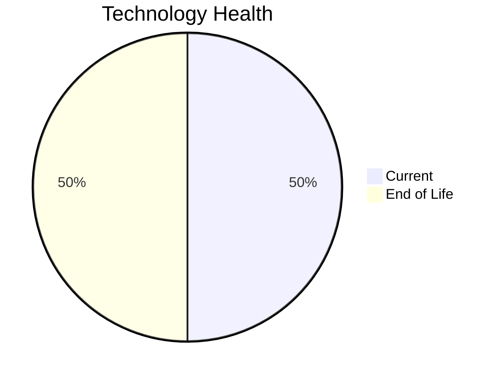

# Application Report: QualityApp-019

**ID:** app019  
**Generated:** 2026-05-05

## Overview

| Attribute | Value |
|-----------|-------|
| Business Unit | Quality |
| Deployment Type | AWS, On-premise |
| Business Criticality | High |
| Users | 180 |
| Servers | sv28 |
| Environments | 1 |
| Architecture | 3-Tier |
| Containerized | No |
| CI/CD | Yes |
| Solution Type | Custom made |
| Data Classification | Confidential |

> Quality management system for tracking service quality metrics and managing audit processes

## Technology Stack

| Component | Technology | Version | Status |
|-----------|-----------|---------|--------|
| Os | RHEL | 8 | 🟢 CURRENT_VERSION |
| Database | MySQL | 8.0 | 🟢 CURRENT_VERSION |
| Language | Python | 3.8 | 🔴 EOL |
| Application Server | Apache Tomcat | 8.0 | 🔴 EOL |

## Complexity Assessment

**Score:** 5/10 — **MEDIUM**  
**Confidence:** 7

> Score 5/10 (MEDIUM). EOL components: 2, Outdated: 0. External interfaces: 5. Servers: 1. Criticality: High. Architecture: 3-Tier. DB storage: 180.0GB.

| Factor | Value |
|--------|-------|
| Servers | 1 |
| Environments | 1 |
| External Interfaces | 5 |
| Business Criticality | High |
| EOL Technologies | 2 |
| Outdated Technologies | 0 |
| CI/CD | Yes |
| Containerized | No |

## Modernization Scenarios

### ✅ Applicable Scenarios

#### ✅ Application Server Replacement

- **Priority:** Medium
- **Effort:** Medium
- **One-Time Cost:** €10,057
- **Yearly Savings:** €10,800
- **Reasoning:** Application server Apache Tomcat 8.0 is EOL. Apache Tomcat 8.0 reached End of Life on June 30, 2018. Replacement with a modern server is recommended.

#### ✅ Application Migration to Cloud (Lift & Shift)

- **Priority:** High
- **Effort:** Low
- **One-Time Cost:** €5,028
- **Yearly Savings:** €2,700
- **Reasoning:** Application has hybrid deployment (on-premise + cloud). Remaining on-premise components can be migrated to cloud.

#### ✅ Application Containerization

- **Priority:** High
- **Effort:** High
- **One-Time Cost:** €100,568
- **Yearly Savings:** €90,000
- **Reasoning:** Application is not containerized and runs on a compatible OS (RHEL 8). Containerization would improve deployment consistency and portability.

#### ✅ Update Outdated Components

- **Priority:** High
- **Effort:** High
- **Reasoning:** Outdated/EOL application components detected: Python 3.8 (EOL), Apache Tomcat 8.0 (EOL). These should be updated to current supported versions.

### Other Scenarios

| Scenario | Status | Reason |
|----------|--------|--------|
| Operating System Update | ✔️ FULFILLED | Operating system RHEL 8 is current and supported. |
| Switch to Standard Linux OS | ✔️ FULFILLED | Application already runs on standard Linux (RHEL 8). |
| Switch to ARM-based CPU | ❓ LACK_OF_DATA | CPU architecture is not explicitly documented in the application record. ARM eligibility cannot be confirmed. |
| Application Refactoring and De-coupling | ❓ LACK_OF_DATA | Insufficient architecture details to determine if full decoupling is needed. |
| Upgrade Legacy Databases | ✔️ FULFILLED | Database MySQL 8.0 is on a current supported version. |
| Switch DB Engine to Open-Source | ✔️ FULFILLED | Application already uses an open-source database engine (MySQL 8.0). |

## Financial Summary

| Metric | Value |
|--------|-------|
| Total One-Time Cost | €115,653 |
| Total Yearly Savings | €103,500 |
| Break-Even | 1.1 years |
