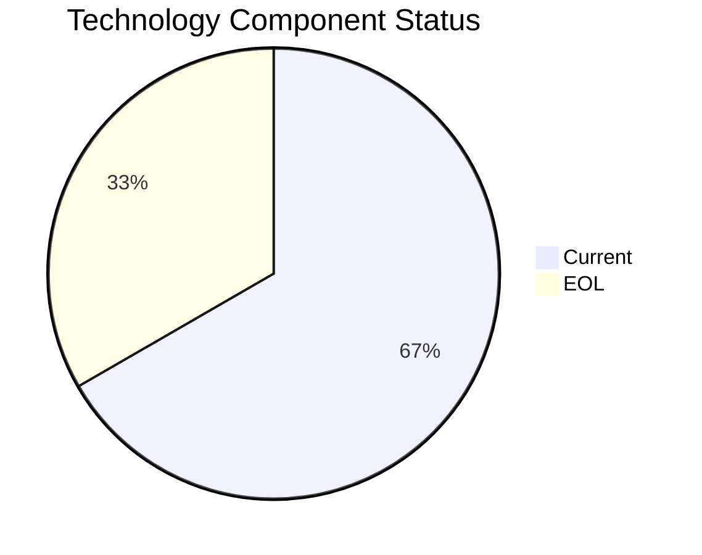

# QualityApp-019 (app019)

> Analysis timestamp: 2025-07-15T00:00:00Z

## Application Overview

| Attribute | Value |
|-----------|-------|
| **Name** | QualityApp-019 |
| **Status** | Production |
| **Criticality** | High |
| **Users** | 180 |
| **Solution Type** | Custom made |
| **Architecture** | 3-Tier |
| **Containerized** | No |
| **CI/CD** | Yes |
| **Environments** | 1 |
| **Servers** | s, v, 2, 8 |
| **External Interfaces** | 5 |

## Technology Stack

| Component | Value | Status |
|-----------|-------|--------|
| **Os** | RHEL 8 | ✅ CURRENT_VERSION |
| **Language** | Python 3.8 | ❌ EOL |
| **Database** | MySQL 8.0 | ✅ CURRENT_VERSION |

## Technology Health

## Complexity Assessment

**Score: 5/10 — MEDIUM**

1 EOL component(s) significantly raise technical debt; 5 external interfaces drive integration complexity; 4 server(s) across 1 environment(s); Business criticality is High.

| Factor | Value |
|--------|-------|
| Servers | 4 |
| Environments | 1 |
| External Interfaces | 5 |
| EOL Technologies | 1 |
| Outdated Technologies | 0 |
| CI/CD Present | Yes |
| Containerized | No |

## Modernization Scenarios

| Scenario | Status | Reason |
|----------|--------|--------|
| OS Security Patch | ✅ FULFILLED | Operating system RHEL 8 is current and maintained. |
| Switch to Linux | ✅ FULFILLED | Application already runs on standard Linux (RHEL 8). |
| ARM CPU | 🔧 APPLICABLE | Custom or open source application that can be compiled for ARM architecture. |
| App Server Replace | ✅ FULFILLED | Application server Apache Tomcat  8.0 is current. |
| Cloud Deploy | 🔧 APPLICABLE | Application can be migrated to cloud infrastructure. |
| Containerization | 🔧 APPLICABLE | Custom/open source application can be containerized to improve portability. |
| Refactor/Decouple | ✅ FULFILLED | 3-Tier architecture already provides modular separation. |
| DB Upgrade | ✅ FULFILLED | Database MySQL 8.0 is current and actively supported. |
| Open Source DB | ✅ FULFILLED | Database MySQL 8.0 is already open source. |
| Update Components | 🔧 APPLICABLE | Application has EOL or outdated components that require updating. |

## Financial Summary

| Metric | Value |
|--------|-------|
| Total Implementation Cost | $110,624.64 |
| Total Annual Savings | $93,700.00 |
| Payback Period | 1.18 years |
| 5-Year Net Benefit | $357,875.36 |

### Applicable Scenario Costs

| Scenario | Impl. Cost | Annual Savings | Payback |
|----------|-----------|----------------|---------|
| ARM CPU | $5,028.39 | $1,000.00 | 5.03 yrs |
| Cloud Deploy | $5,028.39 | $2,700.00 | 1.86 yrs |
| Containerization | $100,567.86 | $90,000.00 | 1.12 yrs |
