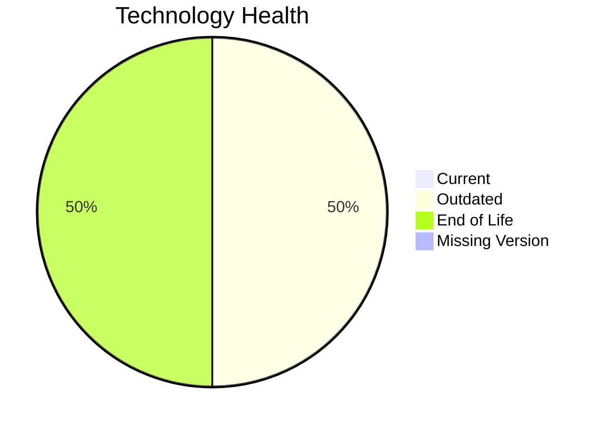

# Application Report: TrainingApp-020

**ID:** app020  
**Generated:** 2026-05-13

## Overview
| Attribute | Value |
|---|---|
| Owner | HR |
| Environment | AWS |
| Business Criticality | Low |
| Users | 750 |
| Servers | 1 |

## Technology Stack
| Component | Technology | Status |
|---|---|---|
| Operating System | Windows Server 2012 | 🔴 EOL |
| Language | Angular 15 | 🟡 OUTDATED |
| Application Server | Microsoft IIS 8.5 | 🔴 EOL |
| Database | SQL Server 2016 | 🟡 OUTDATED |

## Complexity Assessment
**Score:** 6/10 — **MEDIUM**  
**Confidence:** Medium

## Modernization Scenarios
| Applicable Scenario | Priority | Cost | Savings/Year |
|---|---|---:|---:|
| Operating System Update | High | €1157 | €500 |
| Upgrade Legacy Databases | High | €11565 | €10000 |

## Financial Summary
| Metric | Value |
|---|---:|
| Total One-Time Cost | €12722 |
| Total Yearly Savings | €10500 |
| Break-Even | 1.2 years |
