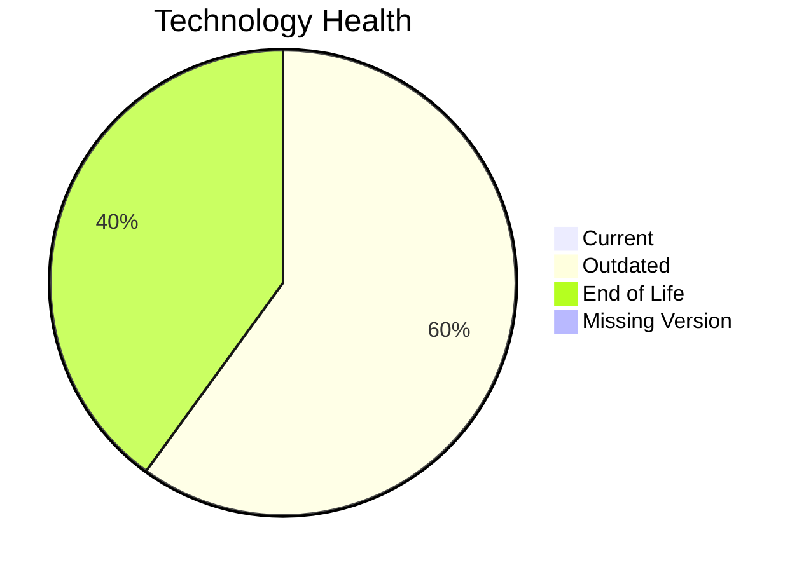

# Application Report: TrainingApp-020

**ID:** app020
**Generated:** 2026-05-11

## Overview

| Attribute | Value |
|-----------|-------|
| Owner | HR |
| Environment | AWS |
| Business Criticality | Low |
| Users | 750 |
| Servers | 1 |

## Technology Stack

| Component | Technology | Version | Status |
|-----------|-----------|---------|--------|
| Operating System | Windows Server | Windows Server 2012 | 🔴 EOL |
| Database | SQL Server | SQL Server 2016 | 🟡 OUTDATED |
| Language | Angular | Angular 15 | 🟡 OUTDATED |
| Framework | Angular | Angular 15 | 🟡 OUTDATED |
| App Server | Microsoft IIS | Microsoft IIS 8.5 | 🔴 EOL |

## Complexity Assessment

**Score:** 6/10 — **MEDIUM**
**Confidence:** 8

Technology age score 9/10 (EOL=2, outdated=3, unknown=0); integration score 8/10 (interfaces=7, api_endpoints=14); infrastructure score 5/10 (servers=1, environments=3); business criticality score 2/10 (Low, users=750); architecture score 5/10 (architecture=2-Tier, CI/CD=Yes, containerized=No); data score 5/10 (db_count=1, db_storage_gb=600).

## Modernization Scenarios

### Applicable Scenarios

#### ✅ Operating System Update

- **Priority:** High
- **Effort:** Low
- **Effects:** security
- **Cost:** €1157 (one-time)
- **Savings:** €500/year
- **Reasoning:** Operating system is outdated or end-of-life per technology assessment.

#### ✅ Upgrade Legacy Databases

- **Priority:** High
- **Effort:** Medium
- **Effects:** security, agility
- **Cost:** €11565 (one-time)
- **Savings:** €10000/year
- **Reasoning:** Database engine is outdated or end-of-life.

### Not Applicable / Other

| Scenario | Status | Reason |
|----------|--------|--------|
| Switch to standard Linux Operating System | NOT_APPLICABLE | Scenario excludes Windows-based operating systems. |
| Switch to ARM-based CPU | BLOCKED | Third-party software dependency may block ARM compatibility changes. |
| Applications Server replacement | BLOCKED | Application server lifecycle for third-party stack is vendor-controlled. |
| Application Migration to Cloud Infrastructure (Lift & Shift) | FULFILLED | Application is already hosted on public cloud infrastructure. |
| Application Containerization | BLOCKED | Third-party software may not permit customer-managed container packaging. |
| Application Refactoring and De-coupling | BLOCKED | Source code ownership is vendor-controlled for third-party software. |
| Switch DB Engine to open-source database solution | BLOCKED | Database migration path for third-party application is constrained. |
| Update outdated components | BLOCKED | Component lifecycle updates are vendor-managed for third-party software. |

## Financial Summary

| Metric | Value |
|--------|-------|
| Total One-Time Cost | €12722 |
| Total Yearly Savings | €10500 |
| Break-Even | 1.2 years |
