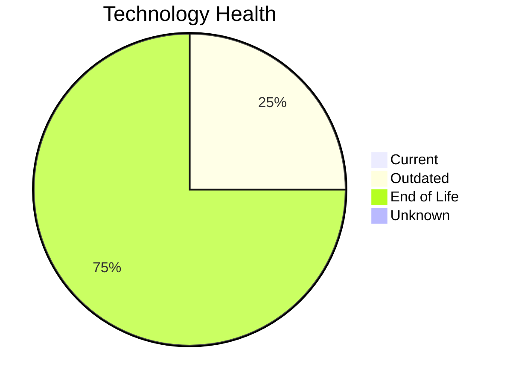

# Application Report: TrainingApp-020

**ID:** app020  
**Generated:** 2026-05-15

## Overview

| Attribute | Value |
|-----------|-------|
| Business Unit | HR |
| Deployment | AWS |
| Business Criticality | Low |
| Users | 750 |
| Solution Type | 3rd party software |
| Architecture | 2-Tier |
| Containerized | No |
| CI/CD | Yes |
| External Interfaces | 7 |

## Technology Stack

| Component | Technology | Status |
|-----------|-----------|--------|
| Operating System | Windows Server 2012 | 🔴 EOL |
| Database | SQL Server 2016 | 🟡 Outdated |
| Language | Angular 15 | 🔴 EOL |
| App Server | Microsoft IIS 8.5 | 🔴 EOL |

## Complexity Assessment

**Score:** 6/10 — **MEDIUM**  
**Confidence:** 8

| Factor | Score | Notes |
|--------|-------|-------|
| Technology Age | 9/10 | 3 EOL and 1 outdated components out of 4 — severe technical debt |
| Integration | 6/10 | 7 external interfaces, 0 dependencies — moderately integrated |
| Infrastructure | 5/10 | 1 server instances, 3 environments |
| Business Criticality | 3/10 | Business criticality: low, 750 users |
| Architecture | 6/10 | 2-tier architecture; not containerized; CI/CD present |
| Data | 4/10 | 600 GB data storage |

## Modernization Scenarios

### Applicable Scenarios

#### ✅ Operating System Update

- **Priority:** High
- **Effort:** Low
- **Effects:** security
- **One-time Cost:** €1,157
- **Yearly Savings:** €500/year
- **Reasoning:** OS 'Windows Server 2012' has reached EOL — critical security risk. Immediate OS update required.

#### ✅ Switch to ARM-based CPU

- **Priority:** Medium
- **Effort:** Medium
- **Effects:** cost, sustainability
- **One-time Cost:** €5,783
- **Yearly Savings:** €1,000/year
- **Reasoning:** Application is cloud-deployed. ARM-based cloud instances offer cost savings potential.

#### ✅ Upgrade Legacy Databases

- **Priority:** High
- **Effort:** Medium
- **Effects:** security, agility
- **One-time Cost:** €11,565
- **Yearly Savings:** €10,000/year
- **Reasoning:** Database 'SQL Server 2016' is outdated. Upgrading to a current version is recommended.

#### ✅ Switch DB Engine to open-source database solution

- **Priority:** High
- **Effort:** Medium
- **Effects:** cost
- **One-time Cost:** N/A
- **Yearly Savings:** N/A
- **Reasoning:** Microsoft SQL Server has licensing costs. Migrating to PostgreSQL or MySQL is a cost-saving option.

#### ✅ Update outdated components

- **Priority:** High
- **Effort:** High
- **Effects:** security, agility, cost
- **One-time Cost:** N/A
- **Yearly Savings:** N/A
- **Reasoning:** Multiple EOL/outdated components detected (3 EOL, 1 outdated). Systematic update program needed.

### Other Scenarios

| Scenario | Status | Reason |
|----------|--------|--------|
| Switch to standard Linux Operating System | ➖ N/A | Application runs on Windows (Windows Server 2012). Scenario excludes Windows-bas... |
| Applications Server replacement | 🚫 Blocked | Third-party or SaaS application — app server managed by vendor, replacement not ... |
| Application Migration to Cloud Infrastructure (Lift & Shift) | ✔️ Fulfilled | Application is already deployed in the cloud. |
| Application Containerization | 🚫 Blocked | Third-party/SaaS application. Containerization not feasible — vendor-managed. |
| Application Refactoring and De-coupling | 🚫 Blocked | Third-party/SaaS application — refactoring not feasible. |

## Business Case Summary

| Metric | Value |
|--------|-------|
| Total One-time Cost | €18,505 |
| Total Yearly Savings | €11,500 |
| ROI Break-even | 1.6 years |
