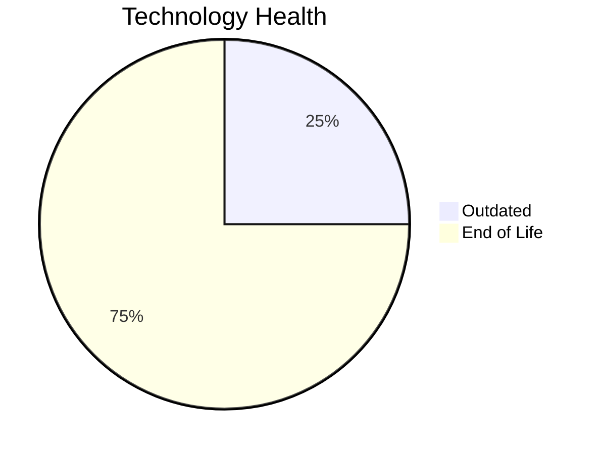

# Application Report: TrainingApp-020

**ID:** app020
**Generated:** 2026-05-14

## Overview

| Attribute | Value |
|-----------|-------|
| Business Unit | HR |
| Business Criticality | Low |
| Solution Type | 3rd party software |
| Deployment Type | AWS |
| Users | 750 |
| Servers | 1 |
| External Interfaces | 7 |
| Containerized | No |
| CI/CD Present | Yes |
| Architecture | 2-Tier |

## Technology Stack

| Component | Technology | Version | Status |
|-----------|-----------|---------|--------|
| Os | Windows Server | 2012 | 🔴 EOL |
| Framework | Angular | 15 | 🔴 EOL |
| Database | SQL Server | 2016 | 🟡 OUTDATED |
| App Server | Microsoft IIS | 8.5 | 🔴 EOL |

## Complexity Assessment

**Score:** 6/10 — **MEDIUM**
**Confidence:** 7

Score 6/10 (MEDIUM): EOL components=3, Outdated=1, Interfaces=7, Servers=1, Criticality=Low, Architecture=2-Tier.

| Factor | Value |
|--------|-------|
| Servers | 1 |
| Environments | 3 |
| Interfaces | 7 |
| EOL Technologies | 3 |
| Outdated Technologies | 1 |
| Business Criticality | Low |

## Modernization Scenarios

### Applicable Scenarios

#### ✅ Operating System Update

- **Priority:** High
- **Effort:** Low
- **Effects:** security
- **One-Time Cost:** $1,157
- **Annual Savings:** $500/year
- **Reasoning:** Operating system Windows Server 2012 is EOL. Update to a current supported OS version is recommended.

#### ✅ Applications Server replacement

- **Priority:** Medium
- **Effort:** Medium
- **Effects:** agility, cost
- **One-Time Cost:** $11,565
- **Annual Savings:** $10,800/year
- **Reasoning:** Application server Microsoft IIS 8.5 is EOL. Replacement with a modern server is recommended.

#### ✅ Upgrade Legacy Databases

- **Priority:** High
- **Effort:** Medium
- **Effects:** security, agility
- **One-Time Cost:** $11,565
- **Annual Savings:** $10,000/year
- **Reasoning:** Database SQL Server 2016 is OUTDATED. Upgrade to a current supported version is required.

#### ✅ Switch DB Engine to open-source database solution

- **Priority:** High
- **Effort:** Medium
- **Effects:** cost
- **Reasoning:** Database SQL Server 2016 is a proprietary licensed database. Switching to PostgreSQL or another open-source solution would eliminate license costs.

#### ✅ Update outdated components

- **Priority:** High
- **Effort:** High
- **Effects:** security, agility, cost
- **Reasoning:** Application has EOL or very legacy components. Update of outdated programming language and framework components is required.

### Other Scenarios

| Scenario | Status | Reason |
|----------|--------|--------|
| Switch to standard Linux Operating System | ❌ NOT_APPLICABLE | Application runs on Windows Server (Windows Server 2012). The scenario excludes Windows-based OS. |
| Switch to ARM-based CPU | ❌ NOT_APPLICABLE | Application is 3rd party software. 3rd party/SaaS applications cannot have their infrastructure arch... |
| Application Migration to Cloud Infrastructure (Lift & Shift) | ✔️ FULFILLED | Application is already deployed on cloud infrastructure (AWS). |
| Application Containerization | 🚫 BLOCKED | Application is 3rd party software. Containerization depends on vendor support. |
| Application Refactoring and De-coupling | 🚫 BLOCKED | Application is 3rd party software. Cannot refactor. |