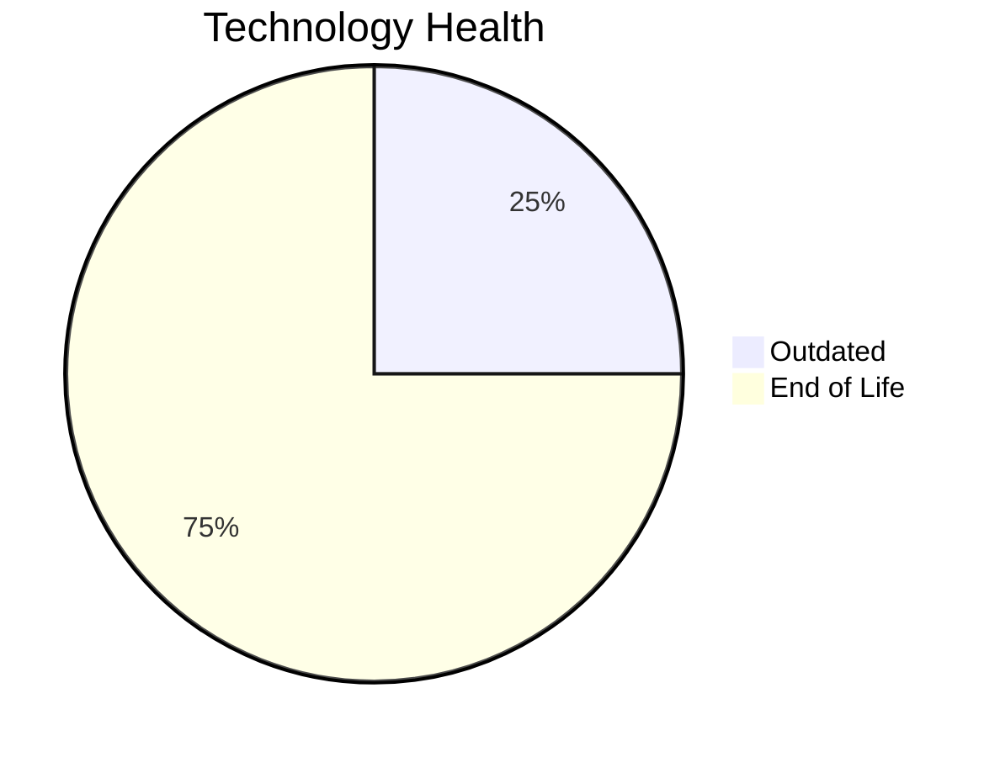

# Application Report: TrainingApp-020

**ID:** app020  
**Generated:** 2026-05-05

## Overview

| Attribute | Value |
|-----------|-------|
| Business Unit | HR |
| Deployment Type | AWS |
| Business Criticality | Low |
| Users | 750 |
| Servers | sv29 |
| Environments | 3 |
| Architecture | 2-Tier |
| Containerized | No |
| CI/CD | Yes |
| Solution Type | 3rd party software |
| Data Classification | Public |

> Learning management system for employee training programs and professional development tracking

## Technology Stack

| Component | Technology | Version | Status |
|-----------|-----------|---------|--------|
| Os | Windows Server | 2012 | 🔴 EOL |
| Database | SQL Server | 2016 | 🟡 OUTDATED |
| Language | Angular | 15 | 🔴 EOL |
| Application Server | Microsoft IIS | 8.5 | 🔴 EOL |

## Complexity Assessment

**Score:** 6/10 — **MEDIUM**  
**Confidence:** 7

> Score 6/10 (MEDIUM). EOL components: 3, Outdated: 1. External interfaces: 7. Servers: 1. Criticality: Low. Architecture: 2-Tier. DB storage: 600.0GB.

| Factor | Value |
|--------|-------|
| Servers | 1 |
| Environments | 3 |
| External Interfaces | 7 |
| Business Criticality | Low |
| EOL Technologies | 3 |
| Outdated Technologies | 1 |
| CI/CD | Yes |
| Containerized | No |

## Modernization Scenarios

### ✅ Applicable Scenarios

#### ✅ Operating System Update

- **Priority:** High
- **Effort:** Low
- **One-Time Cost:** €1,157
- **Yearly Savings:** €500
- **Reasoning:** OS Windows Server 2012 is EOL. Windows Server 2012/2012 R2 reached End of Support on October 10, 2023. OS update is required.

#### ✅ Upgrade Legacy Databases

- **Priority:** High
- **Effort:** Medium
- **One-Time Cost:** €11,565
- **Yearly Savings:** €10,000
- **Reasoning:** Database SQL Server 2016 is OUTDATED. SQL Server 2016 mainstream support ended July 2021. Extended support continues until July 2026. Upgrade is recommended.

### Other Scenarios

| Scenario | Status | Reason |
|----------|--------|--------|
| Switch to Standard Linux OS | ❌ NOT_APPLICABLE | Application runs on Windows OS. Scenario is excluded for Windows-based systems. |
| Switch to ARM-based CPU | ❌ NOT_APPLICABLE | Third-party application; ARM compatibility depends on vendor support, which is not confirmed. |
| Application Server Replacement | ❌ NOT_APPLICABLE | SaaS/3rd-party application; application server is vendor-managed. |
| Application Migration to Cloud (Lift & Shift) | ✔️ FULFILLED | Application is already hosted on cloud (AWS). Lift & Shift is not needed. |
| Application Containerization | ❌ NOT_APPLICABLE | Third-party software; customer cannot modify runtime packaging or container images. |
| Application Refactoring and De-coupling | ❌ NOT_APPLICABLE | Third-party software; internal architecture cannot be refactored by the customer. |
| Switch DB Engine to Open-Source | ❌ NOT_APPLICABLE | Third-party application; database selection may be vendor-mandated. |
| Update Outdated Components | ❌ NOT_APPLICABLE | Third-party software; component versions (language runtime, framework) are vendor-managed and not upgradeable by the cus... |

## Financial Summary

| Metric | Value |
|--------|-------|
| Total One-Time Cost | €12,722 |
| Total Yearly Savings | €10,500 |
| Break-Even | 1.2 years |
