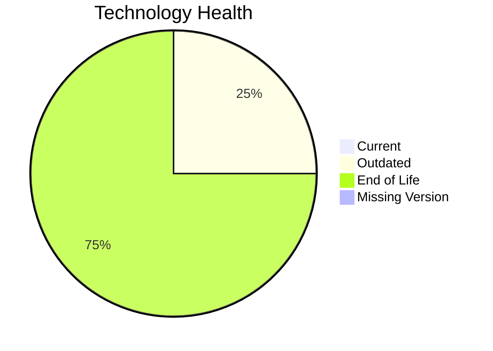

# Application Report: TrainingApp-020

**ID:** app020
**Generated:** 2026-05-07

## Overview

| Attribute | Value |
|-----------|-------|
| Owner | N/A |
| Environment | AWS |
| Business Criticality | Low |
| Users | 750 |
| Servers | 1 |

## Technology Stack

| Component | Technology | Version | Status |
|-----------|-----------|---------|--------|
| Operating System | Windows Server | 2012 | 🔴 EOL |
| Database | SQL Server | 2016 | 🟡 OUTDATED |
| Language | N/A | N/A | ⚪ NO_KNOWLEDGE |
| Framework | Angular | 15 | 🔴 EOL |
| App Server | IIS | 8.5 | 🔴 EOL |

## Complexity Assessment

**Score:** 6/10 — **MEDIUM**
**Confidence:** 8

| Factor | Score | Notes |
|--------|-------|-------|
| Technology Age | 9/10 | 3 EOL components were found in the application stack. |
| Integration | 8/10 | The application exposes 7 interfaces, indicating heavy integration. |
| Infrastructure | 5/10 | 1 servers and 3 environments indicate moderate infrastructure complexity. |
| Business Criticality | 2/10 | Criticality is 'Low' with 750 users. |
| Architecture | 6/10 | A 2-tier architecture suggests some legacy coupling. CI/CD lowers delivery risk. Third-party software reduces architectural control. |
| Data | 5/10 | Database footprint (600 GB) indicates moderate data migration effort. |

## Modernization Scenarios

### Applicable Scenarios

#### ✅ Operating System Update

- **Priority:** High
- **Effort:** Low
- **Effects:** security
- **Cost:** €1,157 (one-time)
- **Savings:** €500/year
- **Reasoning:** Windows Server 2012 is out of support.

#### ✅ Applications Server replacement

- **Priority:** Medium
- **Effort:** Medium
- **Effects:** agility, cost
- **Cost:** €11,565 (one-time)
- **Savings:** €10,800/year
- **Reasoning:** IIS 8.5 is tied to unsupported Windows Server releases.

#### ✅ Upgrade Legacy Databases

- **Priority:** High
- **Effort:** Medium
- **Effects:** security, agility
- **Cost:** €11,565 (one-time)
- **Savings:** €10,000/year
- **Reasoning:** SQL Server 2016 is nearing its support end and is treated as outdated.

### Not Applicable / Other

| Scenario | Status | Reason |
|----------|--------|--------|
| Switch to standard Linux Operating System | NOT_APPLICABLE | The scenario excludes Windows-based operating systems. |
| Switch to ARM-based CPU | LACK_OF_DATA | CPU architecture is not present in the workbook, so ARM suitability cannot be validated. |
| Application Migration to Cloud Infrastructure (Lift & Shift) | FULFILLED | Application is already hosted on AWS, which satisfies the public cloud hosting indicator. |
| Application Containerization | BLOCKED | The application is third-party software and container packaging cannot be assumed to be under customer control. |
| Application Refactoring and De-coupling | BLOCKED | The application is third-party software, so internal refactoring is not under customer control. |
| Switch DB Engine to open-source database solution | BLOCKED | The scenario excludes third-party applications because database portability is not under customer control. |
| Update outdated components | BLOCKED | The scenario excludes third-party applications because runtime components are vendor-managed. |

## Financial Summary

| Metric | Value |
|--------|-------|
| Total One-Time Cost | €24,287 |
| Total Yearly Savings | €21,300 |
| Break-Even | 1.1 years |
