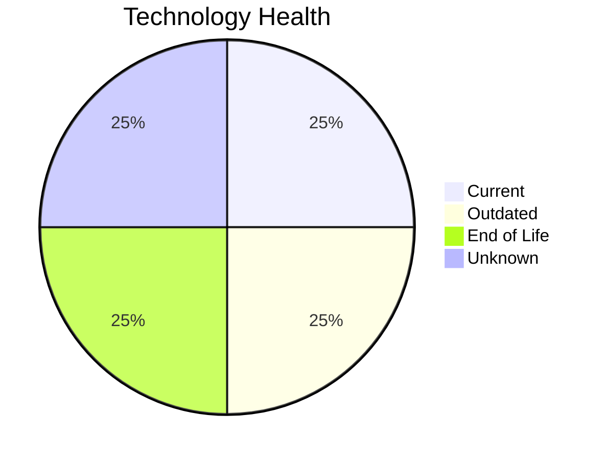

# Application Report: TrainingApp-020

**ID:** app020
**Generated:** 2026-05-14

## Overview

| Attribute | Value |
|-----------|-------|
| Owner | HR |
| Environment | AWS |
| Business Criticality | Low |
| Users | 750 |
| Servers | 1 |
| Solution Type | 3rd party software |
| Architecture | 2-Tier |
| Containerized | No |
| CI/CD | Yes |

## Technology Stack

| Component | Technology | Version | Status |
|-----------|-----------|---------|--------|
| Os | Windows Server 2012 | Server 2012 | 🔴 EOL |
| Database | SQL Server 2016 | Server 2016 | 🟡 OUTDATED |
| Programming Language | Angular 15 | 15 | 🟢 CURRENT_VERSION |
| Application Server | Microsoft IIS 8.5 | IIS 8.5 | ⚪ NO_KNOWLEDGE |

## Complexity Assessment

**Score:** 5/10 — **MEDIUM**
**Confidence:** 8/10

| Factor | Score | Notes |
|--------|-------|-------|
| Technology Age | 7/10 | 1 EOL, 1 outdated components |
| Integration | 7/10 | 7 external interfaces |
| Infrastructure | 4/10 | 1 server(s), 3 environment(s) |
| Business Criticality | 2/10 | Low criticality |
| Architecture | 3/10 | Containerized: No, CI/CD: Yes |
| Data | 5/10 | DB: SQL Server 2016 |

## Modernization Scenarios

### Applicable Scenarios

#### ✅ Operating System Update

- **Priority:** High
- **Effort:** Low
- **Effects:** security
- **Cost:** €1,006 (one-time)
- **Savings:** €500/year
- **Reasoning:** Operating system Windows Server 2012 has reached End of Life and no longer receives security patches. Immediate OS update required.

#### ✅ Upgrade Legacy Databases

- **Priority:** High
- **Effort:** Medium
- **Effects:** security, agility
- **Cost:** €10,057 (one-time)
- **Savings:** €10,000/year
- **Reasoning:** Database SQL Server 2016 is outdated (past mainstream support). Upgrading to a current version will improve security and performance.

### Not Applicable / Other

| Scenario | Status | Reason |
|----------|--------|--------|
| Switch to standard Linux Operating System | ❌ NOT_APPLICABLE | Application runs on Windows OS. Switching to Linux would require significant re-platforming; not app... |
| Switch to ARM-based CPU | 🚫 BLOCKED | 3rd party software has potential x86-specific dependencies that are vendor-managed; customer cannot ... |
| Applications Server replacement | ❓ LACK_OF_DATA | Cannot assess application server lifecycle for Microsoft IIS 8.5. |
| Application Migration to Cloud Infrastructure (Lift & Shift) | ✔️ FULFILLED | Application is already deployed on cloud infrastructure (AWS). No migration needed. |
| Application Containerization | 🚫 BLOCKED | Application is 3rd party software. Containerization is a vendor responsibility and cannot be modifie... |
| Application Refactoring and De-coupling | 🚫 BLOCKED | Application is 3rd party software; internal architecture is not under customer control and cannot be... |
| Switch DB Engine to open-source database solution | 🚫 BLOCKED | Proprietary database SQL Server 2016 is part of a 3rd party vendor stack. |
| Update outdated components | 🚫 BLOCKED | 3rd party application — component versions (language, framework, app server) are vendor-managed and ... |

## Financial Summary

| Metric | Value |
|--------|-------|
| Total One-Time Cost | €11,063 |
| Total Yearly Savings | €10,500 |
| Break-Even | 1.1 years |
