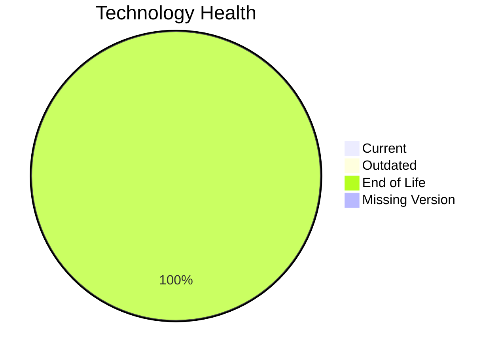

# Application Report: TrainingApp-020

Modernization assessment for TrainingApp-020 based solely on the Excel portfolio row and derived workflow outputs.

**ID:** app020  
**Generated:** 2026-05-07

## Overview

| Attribute | Value |
|-----------|-------|
| Owner | HR |
| Environment | AWS |
| Business Criticality | Low |
| Users | 750 |
| Servers | sv29 |

## Technology Stack

| Component | Technology | Version | Status |
|-----------|-----------|---------|--------|
| Operating System | Windows Server | 2012 | 🔴 |
| Database | SQL Server | 2016 | 🔴 |
| Language | Angular | 15 | 🔴 |
| Framework | Angular | 15 | 🔴 |
| App Server | Microsoft IIS | 8.5 | 🔴 |

## Complexity Assessment

**Score:** 7/10 — **HIGH**  
**Confidence:** 8

| Factor | Score | Notes |
|--------|-------|-------|
| Technology Age | 9/10 | 5 EOL, 0 outdated, 0 unknown lifecycle components. |
| Integration | 8/10 | 7 external interfaces and 14 API endpoints indicate the integration footprint. |
| Infrastructure | 5/10 | 1 listed server instances and 3 environments drive infrastructure coordination. |
| Business Criticality | 2/10 | Business criticality is Low with approximately 750 users. |
| Architecture | 8/10 | 2-tier architecture still carries coupling risk; application is not containerized; third-party software limits internal modernization control; application stack contains EOL runtime components |
| Data | 7/10 | database storage is 600 GB; moderate database footprint; proprietary or enterprise database migration complexity; database platform is EOL |

## Modernization Scenarios

### Applicable Scenarios

#### ✅ Operating System Update

- **Priority:** High
- **Effort:** Low
- **Effects:** security
- **Cost:** €1330 (one-time)
- **Savings:** €500/year
- **Reasoning:** Operating system Windows Server 2012 is eol and matches the OS update trigger.

### Not Applicable / Other

| Scenario | Status | Reason |
|----------|--------|--------|
| Switch to standard Linux Operating System | NOT_APPLICABLE | The application already runs on Windows; this Linux standardization scenario is not a natural fit. |
| Switch to ARM-based CPU | LACK_OF_DATA | CPU architecture is not present in the Excel input, so the primary ARM migration trigger cannot be confirmed. |
| Applications Server replacement | BLOCKED | The application server is legacy, but the application is third-party software and likely tied to a vendor-managed stack. |
| Application Migration to Cloud Infrastructure (Lift & Shift) | FULFILLED | The application is already hosted on AWS, which fulfills the lift-and-shift cloud target. |
| Application Containerization | BLOCKED | The application is third-party software and container packaging is unlikely to be under customer control. |
| Application Refactoring and De-coupling | BLOCKED | The application is third-party software, so internal refactoring is not under customer control. |
| Upgrade Legacy Databases | BLOCKED | Database upgrade looks relevant, but the application is third-party software and may require vendor-managed migration. |
| Switch DB Engine to open-source database solution | BLOCKED | The application is third-party software and database engine substitution is unlikely to be customer-controlled. |
| Update outdated components | BLOCKED | The application is third-party software, so runtime component upgrades are likely vendor-managed. |

## Financial Summary

| Metric | Value |
|--------|-------|
| Total One-Time Cost | €1330 |
| Total Yearly Savings | €500 |
| Break-Even | 2.7 years |
