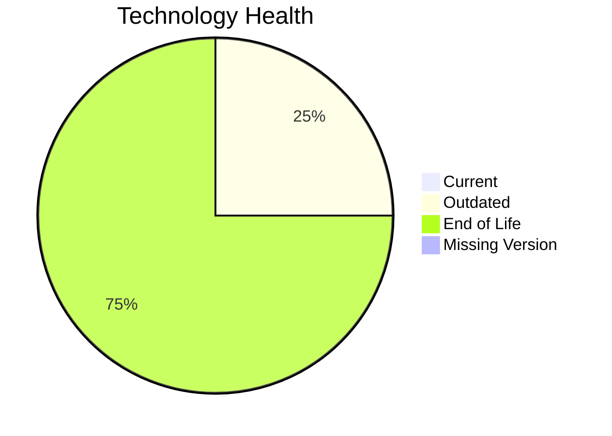

# Application Report: TrainingApp-020

**ID:** app020  
**Generated:** 2026-05-17

## Overview

| Attribute | Value |
|-----------|-------|
| Owner | N/A |
| Environment | AWS |
| Business Criticality | Low |
| Users | 750 |
| Servers | 1 |

## Technology Stack

| Component | Technology | Version | Status |
|-----------|-----------|---------|--------|
| Operating System | Windows Server | 2012 | 🔴 EOL |
| Database | SQL Server | 2016 | 🟡 OUTDATED |
| Language | N/A | N/A | ⚪ NO_KNOWLEDGE |
| Framework | Angular | 15 | 🔴 EOL |
| App Server | IIS | 8.5 | 🔴 EOL |

## Complexity Assessment

**Score:** 7/10 — **HIGH**  
**Confidence:** 8

| Factor | Score | Notes |
|--------|-------|-------|
| Technology Age | 9/10 | 3 components are EOL. |
| Integration | 8/10 | High integration surface with 7 external interfaces and 14 APIs. |
| Infrastructure | 5/10 | Moderate infrastructure footprint with 1 servers and 3 environments. |
| Business Criticality | 2/10 | Business criticality is Low. |
| Architecture | 9/10 | not containerized, CI/CD exists, multi-tier but still coupled, legacy application server, vendor-controlled architecture. |
| Data | 6/10 | 1 database engine(s), 600 GB storage, aging database platform. |

## Modernization Scenarios

### Applicable Scenarios

#### ✅ Operating System Update

- **Priority:** High
- **Effort:** Low
- **Effects:** security
- **Cost:** €1330 (one-time)
- **Savings:** €500/year
- **Reasoning:** Windows Server 2012 is assessed as EOL, which triggers an OS update scenario.

#### ✅ Upgrade Legacy Databases

- **Priority:** High
- **Effort:** Medium
- **Effects:** security, agility
- **Cost:** €13300 (one-time)
- **Savings:** €10000/year
- **Reasoning:** SQL Server 2016 is assessed as OUTDATED and is a candidate for upgrade.

### Not Applicable / Other

| Scenario | Status | Reason |
|----------|--------|--------|
| Switch to standard Linux Operating System | NOT_APPLICABLE | Application runs on Windows; this scenario targets proprietary non-Linux Unix platforms rather than Windows estates. |
| Switch to ARM-based CPU | LACK_OF_DATA | CPU architecture is not documented in the workbook, so ARM suitability cannot be assessed confidently. |
| Applications Server replacement | BLOCKED | The application is third-party software, so replacing the application server is likely constrained by vendor certification. |
| Application Migration to Cloud Infrastructure (Lift & Shift) | FULFILLED | Deployment target already points to AWS/public cloud only. |
| Application Containerization | BLOCKED | Third-party packaging is likely vendor-controlled, so customer-led containerization is blocked. |
| Application Refactoring and De-coupling | BLOCKED | Application is third-party software and its internal architecture is not under customer control. |
| Switch DB Engine to open-source database solution | BLOCKED | Third-party application/database certification likely constrains engine replacement. |
| Update outdated components | BLOCKED | Application is third-party software and component upgrades are likely vendor-managed. |

## Financial Summary

| Metric | Value |
|--------|-------|
| Total One-Time Cost | €14630 |
| Total Yearly Savings | €10500 |
| Break-Even | 1.4 years |
