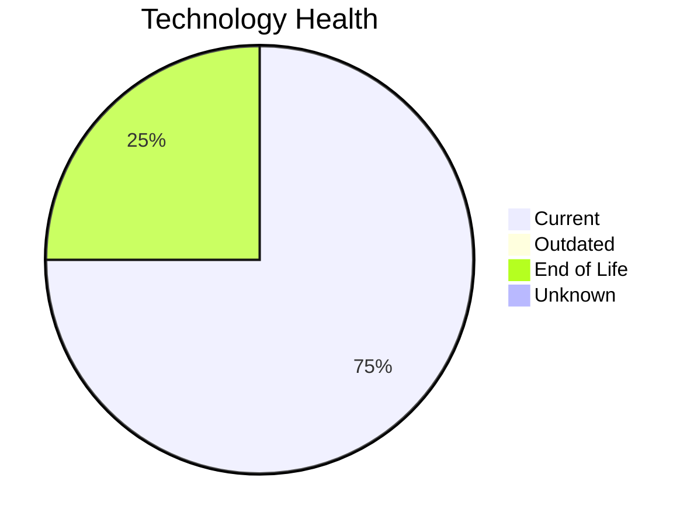

# Application Report: FleetApp-021

**ID:** app021  
**Generated:** 2026-05-15

## Overview

| Attribute | Value |
|-----------|-------|
| Business Unit | Operations |
| Deployment | On-Premise |
| Business Criticality | High |
| Users | 420 |
| Solution Type | Custom made |
| Architecture | 2-Tier |
| Containerized | No |
| CI/CD | No |
| External Interfaces | 4 |

## Technology Stack

| Component | Technology | Status |
|-----------|-----------|--------|
| Operating System | Windows Server 2022 | 🟢 Current |
| Database | Oracle 11g | 🔴 EOL |
| Language | C++ 17 | 🟢 Current |
| App Server | Microsoft IIS 10.0 | 🟢 Current |

## Complexity Assessment

**Score:** 6/10 — **MEDIUM**  
**Confidence:** 8

| Factor | Score | Notes |
|--------|-------|-------|
| Technology Age | 6/10 | 1 EOL component(s) detected |
| Integration | 6/10 | 4 external interfaces, 0 dependencies — moderately integrated |
| Infrastructure | 5/10 | 2 server instances, 3 environments |
| Business Criticality | 8/10 | Business criticality: high, 420 users |
| Architecture | 8/10 | 2-tier architecture; not containerized; no CI/CD |
| Data | 5/10 | Oracle DB — complex licensing and migration |

## Modernization Scenarios

### Applicable Scenarios

#### ✅ Application Migration to Cloud Infrastructure (Lift & Shift)

- **Priority:** High
- **Effort:** Low
- **Effects:** security, agility
- **One-time Cost:** €5,783
- **Yearly Savings:** €2,700/year
- **Reasoning:** Application is fully on-premise. Migration to cloud (Lift & Shift) can reduce infrastructure costs and improve agility.

#### ✅ Application Containerization

- **Priority:** High
- **Effort:** High
- **Effects:** agility, cost, sustainability
- **One-time Cost:** €115,653
- **Yearly Savings:** €90,000/year
- **Reasoning:** Application is not containerized. Containerization would improve deployment consistency and scalability.

#### ✅ Application Refactoring and De-coupling

- **Priority:** High
- **Effort:** High
- **Effects:** agility, cost, sustainability
- **One-time Cost:** €289,133
- **Yearly Savings:** €135,000/year
- **Reasoning:** No CI/CD, not containerized — indicates potential for architectural modernization.

#### ✅ Upgrade Legacy Databases

- **Priority:** High
- **Effort:** Medium
- **Effects:** security, agility
- **One-time Cost:** €11,565
- **Yearly Savings:** €10,000/year
- **Reasoning:** Database 'Oracle 11g' has reached EOL. Urgent upgrade required to maintain support and security.

#### ✅ Switch DB Engine to open-source database solution

- **Priority:** High
- **Effort:** Medium
- **Effects:** cost
- **One-time Cost:** N/A
- **Yearly Savings:** N/A
- **Reasoning:** Oracle DB has high licensing costs. Migrating to PostgreSQL or MySQL would significantly reduce licensing expenses.

#### ✅ Update outdated components

- **Priority:** High
- **Effort:** High
- **Effects:** security, agility, cost
- **One-time Cost:** N/A
- **Yearly Savings:** N/A
- **Reasoning:** Component(s) detected as EOL. Targeted component updates recommended.

### Other Scenarios

| Scenario | Status | Reason |
|----------|--------|--------|
| Operating System Update | ✔️ Fulfilled | OS 'Windows Server 2022' is on a current, supported version with no end-of-life ... |
| Switch to standard Linux Operating System | ➖ N/A | Application runs on Windows (Windows Server 2022). Scenario excludes Windows-bas... |
| Switch to ARM-based CPU | ❓ No Data | On-premise application. CPU architecture not specified in available data. |
| Applications Server replacement | ✔️ Fulfilled | Application server 'Microsoft IIS 10.0' is on a current, supported version. |

## Business Case Summary

| Metric | Value |
|--------|-------|
| Total One-time Cost | €422,134 |
| Total Yearly Savings | €237,700 |
| ROI Break-even | 1.8 years |
