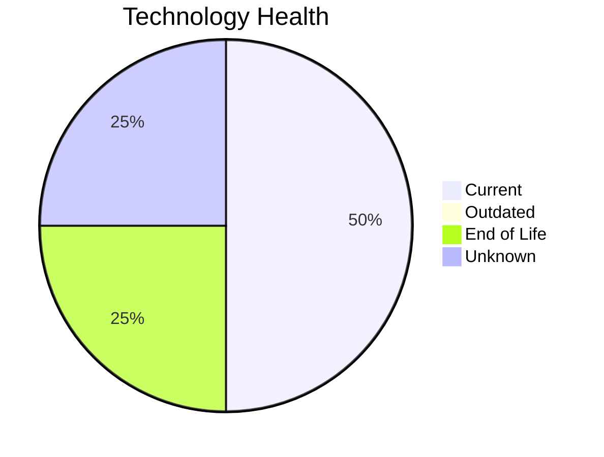

# Application Report: FleetApp-021

**ID:** app021  
**Generated:** 2026-05-06

## Overview

| Attribute | Value |
|-----------|-------|
| Business Unit | Operations |
| Deployment | On-Premise |
| Business Criticality | High |
| Users | 420 |
| Servers | 2 |
| Architecture | 2-Tier |
| Containerized | No |
| CI/CD | No |

## Technology Stack

| Component | Technology | Status |
|-----------|-----------|--------|
| Operating System | Windows Server 2022 | 🟢 CURRENT_VERSION |
| Database | Oracle 11g | 🔴 EOL |
| Language | C++ 17 | 🟢 CURRENT_VERSION |
| App Server | Microsoft IIS 10.0 | ⚪ NO_KNOWLEDGE |

## Complexity Assessment

**Score:** 6/10 — **MEDIUM**  
**Confidence:** 8/10

> Complexity score 6/10 (MEDIUM). 1 EOL component(s), High business criticality.

| Factor | Score |
|--------|-------|
| Technology Age & EOL | 7/10 |
| Integration Complexity | 5/10 |
| Infrastructure Scale | 6/10 |
| Business Criticality | 7/10 |
| Code & Architecture | 7/10 |
| Data Complexity | 6/10 |

## Modernization Scenarios

### Applicable Scenarios

#### ✅ Application Migration to Cloud Infrastructure (Lift & Shift)

- **Priority:** High
- **Effort:** Low
- **Effects:** security, agility
- **Cost:** €5,783 (one-time)
- **Savings:** €2,700/year
- **Reasoning:** Application is on-premise; cloud migration could reduce infrastructure costs.

#### ✅ Application Containerization

- **Priority:** High
- **Effort:** High
- **Effects:** agility, cost, sustainability
- **Cost:** €115,653 (one-time)
- **Savings:** €90,000/year
- **Reasoning:** Application is not containerized; containerization could improve portability and deployment efficiency.

#### ✅ Application Refactoring and De-coupling

- **Priority:** High
- **Effort:** High
- **Effects:** agility, cost, sustainability
- **Cost:** €289,133 (one-time)
- **Savings:** €135,000/year
- **Reasoning:** 2-tier architecture could benefit from decoupling into services.

#### ✅ Upgrade Legacy Databases

- **Priority:** High
- **Effort:** Medium
- **Effects:** security, agility
- **Cost:** €11,565 (one-time)
- **Savings:** €10,000/year
- **Reasoning:** Database (Oracle 11g) is EOL; upgrade required.

#### ✅ Switch DB Engine to open-source database solution

- **Priority:** High
- **Effort:** Medium
- **Effects:** cost
- **Cost:** N/A (one-time)
- **Savings:** N/A
- **Reasoning:** Oracle database requires expensive licensing; migration to PostgreSQL could reduce costs.

#### ✅ Update outdated components

- **Priority:** High
- **Effort:** High
- **Effects:** security, agility, cost
- **Cost:** N/A (one-time)
- **Savings:** N/A
- **Reasoning:** Components need updating. EOL: Oracle 11g.

### Other Scenarios

| Scenario | Status | Reason |
|----------|--------|--------|
| Operating System Update | FULFILLED | Operating system is on a current, supported version. |
| Switch to standard Linux Operating System | NOT_APPLICABLE | Windows Server OS; this scenario targets proprietary Unix-like systems. |
| Switch to ARM-based CPU | LACK_OF_DATA | CPU architecture not documented in application data. |
| Applications Server replacement | LACK_OF_DATA | Application server lifecycle status unknown. |

## Financial Summary

| Metric | Value |
|--------|-------|
| Total One-Time Investment | €422,134 |
| Total Annual Savings | €237,700 |
| Break-Even | 1.8 years |
