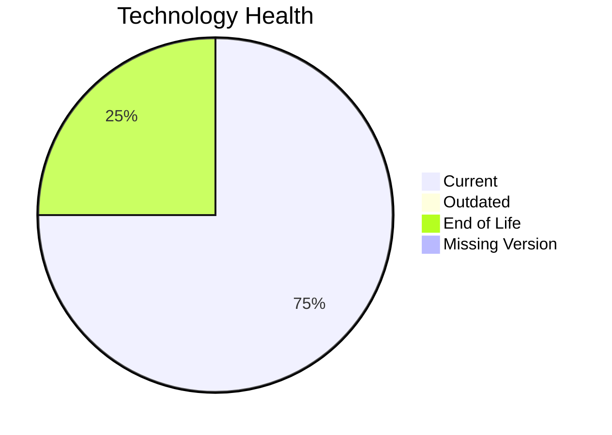

# Application Report: FleetApp-021

Modernization assessment for FleetApp-021 based solely on the Excel portfolio row and derived workflow outputs.

**ID:** app021  
**Generated:** 2026-05-07

## Overview

| Attribute | Value |
|-----------|-------|
| Owner | Operations |
| Environment | On-Premise |
| Business Criticality | High |
| Users | 420 |
| Servers | sv30, sv31 |

## Technology Stack

| Component | Technology | Version | Status |
|-----------|-----------|---------|--------|
| Operating System | Windows Server | 2022 | 🟢 |
| Database | Oracle Database | 11g | 🔴 |
| Language | C++ | 17 | 🟢 |
| Framework | N/A | N/A | ⚪ |
| App Server | Microsoft IIS | 10.0 | 🟢 |

## Complexity Assessment

**Score:** 7/10 — **HIGH**  
**Confidence:** 8

| Factor | Score | Notes |
|--------|-------|-------|
| Technology Age | 7/10 | 1 EOL, 0 outdated, 0 unknown lifecycle components. |
| Integration | 5/10 | 4 external interfaces and 3 API endpoints indicate the integration footprint. |
| Infrastructure | 5/10 | 2 listed server instances and 3 environments drive infrastructure coordination. |
| Business Criticality | 8/10 | Business criticality is High with approximately 420 users. |
| Architecture | 8/10 | 2-tier architecture still carries coupling risk; application is not containerized; CI/CD is not present |
| Data | 7/10 | database storage is 400 GB; moderate database footprint; proprietary or enterprise database migration complexity; database platform is EOL |

## Modernization Scenarios

### Applicable Scenarios

#### ✅ Application Migration to Cloud Infrastructure (Lift & Shift)

- **Priority:** High
- **Effort:** Low
- **Effects:** security, agility
- **Cost:** €6650 (one-time)
- **Savings:** €2400/year
- **Reasoning:** The application is still on-premise and matches the lift-and-shift trigger.

#### ✅ Application Containerization

- **Priority:** High
- **Effort:** High
- **Effects:** agility, cost, sustainability
- **Cost:** €133001 (one-time)
- **Savings:** €80000/year
- **Reasoning:** The application is not containerized and no hard blocker is visible in the input.

#### ✅ Application Refactoring and De-coupling

- **Priority:** High
- **Effort:** High
- **Effects:** agility, cost, sustainability
- **Cost:** €332502 (one-time)
- **Savings:** €120000/year
- **Reasoning:** Architecture and complexity indicators suggest a refactoring/de-coupling opportunity.

#### ✅ Upgrade Legacy Databases

- **Priority:** High
- **Effort:** Medium
- **Effects:** security, agility
- **Cost:** €13300 (one-time)
- **Savings:** €10000/year
- **Reasoning:** Database platform Oracle 11g is eol.

#### ✅ Switch DB Engine to open-source database solution

- **Priority:** High
- **Effort:** Medium
- **Effects:** cost
- **Cost:** N/A (one-time)
- **Savings:** N/A/year
- **Reasoning:** Database engine Oracle 11g is proprietary and matches the open-source migration trigger.

### Not Applicable / Other

| Scenario | Status | Reason |
|----------|--------|--------|
| Operating System Update | FULFILLED | Operating system Windows Server 2022 is already on a supported version. |
| Switch to standard Linux Operating System | NOT_APPLICABLE | The application already runs on Windows; this Linux standardization scenario is not a natural fit. |
| Switch to ARM-based CPU | LACK_OF_DATA | CPU architecture is not present in the Excel input, so the primary ARM migration trigger cannot be confirmed. |
| Applications Server replacement | FULFILLED | Application server Microsoft IIS 10.0 is already current. |
| Update outdated components | FULFILLED | Application runtime components are already current. |

## Financial Summary

| Metric | Value |
|--------|-------|
| Total One-Time Cost | €485453 |
| Total Yearly Savings | €212400 |
| Break-Even | 2.3 years |
