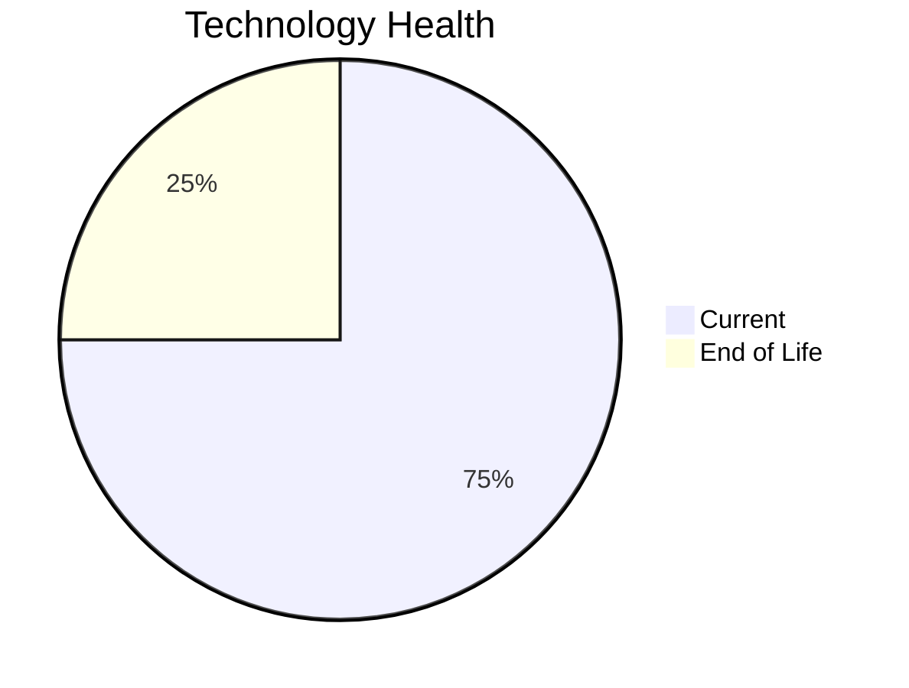

# Application Report: FleetApp-021

**ID:** app021
**Generated:** 2026-05-14

## Overview

| Attribute | Value |
|-----------|-------|
| Business Unit | Operations |
| Business Criticality | High |
| Solution Type | Custom made |
| Deployment Type | On-Premise |
| Users | 420 |
| Servers | 2 |
| External Interfaces | 4 |
| Containerized | No |
| CI/CD Present | No |
| Architecture | 2-Tier |

## Technology Stack

| Component | Technology | Version | Status |
|-----------|-----------|---------|--------|
| Os | Windows Server | 2022 | 🟢 CURRENT_VERSION |
| Language | C++ | 17 | 🟢 CURRENT_VERSION |
| Database | Oracle | 11g | 🔴 EOL |
| App Server | Microsoft IIS | 10.0 | 🟢 CURRENT_VERSION |

## Complexity Assessment

**Score:** 6/10 — **MEDIUM**
**Confidence:** 7

Score 6/10 (MEDIUM): EOL components=1, Outdated=0, Interfaces=4, Servers=2, Criticality=High, Architecture=2-Tier.

| Factor | Value |
|--------|-------|
| Servers | 2 |
| Environments | 3 |
| Interfaces | 4 |
| EOL Technologies | 1 |
| Outdated Technologies | 0 |
| Business Criticality | High |

## Modernization Scenarios

### Applicable Scenarios

#### ✅ Application Migration to Cloud Infrastructure (Lift & Shift)

- **Priority:** High
- **Effort:** Low
- **Effects:** security, agility
- **One-Time Cost:** $5,783
- **Annual Savings:** $2,700/year
- **Reasoning:** Application is On-Premise. Lift & Shift to cloud infrastructure is applicable to reduce infrastructure costs.

#### ✅ Application Containerization

- **Priority:** High
- **Effort:** High
- **Effects:** agility, cost, sustainability
- **One-Time Cost:** $115,653
- **Annual Savings:** $90,000/year
- **Reasoning:** Application is not containerized. Containerization would improve deployment consistency and resource efficiency.

#### ✅ Application Refactoring and De-coupling

- **Priority:** High
- **Effort:** High
- **Effects:** agility, cost, sustainability
- **One-Time Cost:** $289,133
- **Annual Savings:** $135,000/year
- **Reasoning:** Application uses 2-tier architecture. Decoupling into separate frontend/backend services is applicable.

#### ✅ Upgrade Legacy Databases

- **Priority:** High
- **Effort:** Medium
- **Effects:** security, agility
- **One-Time Cost:** $11,565
- **Annual Savings:** $10,000/year
- **Reasoning:** Database Oracle 11g is EOL. Upgrade to a current supported version is required.

#### ✅ Switch DB Engine to open-source database solution

- **Priority:** High
- **Effort:** Medium
- **Effects:** cost
- **Reasoning:** Database Oracle 11g is a proprietary licensed database. Switching to PostgreSQL or another open-source solution would eliminate license costs.

#### ✅ Update outdated components

- **Priority:** High
- **Effort:** High
- **Effects:** security, agility, cost
- **Reasoning:** Application has EOL or very legacy components. Update of outdated programming language and framework components is required.

### Other Scenarios

| Scenario | Status | Reason |
|----------|--------|--------|
| Operating System Update | ✔️ FULFILLED | Operating system Windows Server 2022 is on a current, supported version within its vendor support li... |
| Switch to standard Linux Operating System | ❌ NOT_APPLICABLE | Application runs on Windows Server (Windows Server 2022). The scenario excludes Windows-based OS. |
| Switch to ARM-based CPU | ❓ LACK_OF_DATA | CPU architecture is not explicitly documented as x86/x64. Cannot confirm primary trigger for ARM mig... |
| Applications Server replacement | ✔️ FULFILLED | Application server Microsoft IIS 10.0 is on a current supported version. |