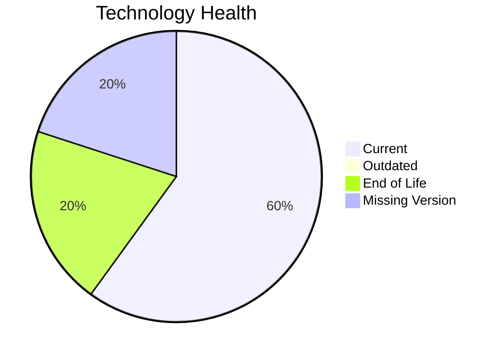

# Application Report: FleetApp-021

**ID:** app021
**Generated:** 2026-05-14

## Overview

| Attribute | Value |
|-----------|-------|
| Owner | Operations |
| Environment | On-Premise |
| Business Criticality | High |
| Users | 420 |
| Servers | sv30, sv31 |

## Technology Stack

| Component | Technology | Status |
|-----------|-----------|--------|
| Operating System | Windows Server 2022 | 🔴 |
| Database | Oracle 11g | 🔴 |
| Language | C++ 17 | 🟢 |

## Complexity Assessment

**Score:** 6/10 — **MEDIUM**

## Modernization Scenarios

### ✅ Os Update Security Patch
- **Reasoning:** EOL operating system/server components require security remediation.

### ✅ App Deployment To Cloud
- **Reasoning:** On-premise deployment model is a direct cloud-migration opportunity.

### ✅ App Containerization
- **Reasoning:** Application is not containerized and can benefit from platform standardization.

### ✅ Switch To Managed Db
- **Reasoning:** On-prem database workloads can move to managed database services.

### ✅ Switch Db Engine Postgresql
- **Reasoning:** Licensed DB engine can be modernized to PostgreSQL for cost reduction.

## Financial Summary

| Metric | Value |
|--------|-------|
| Total One-Time Cost | €157289 |
| Total Yearly Savings | €118200 |
| Break-Even | 1.3 years |
