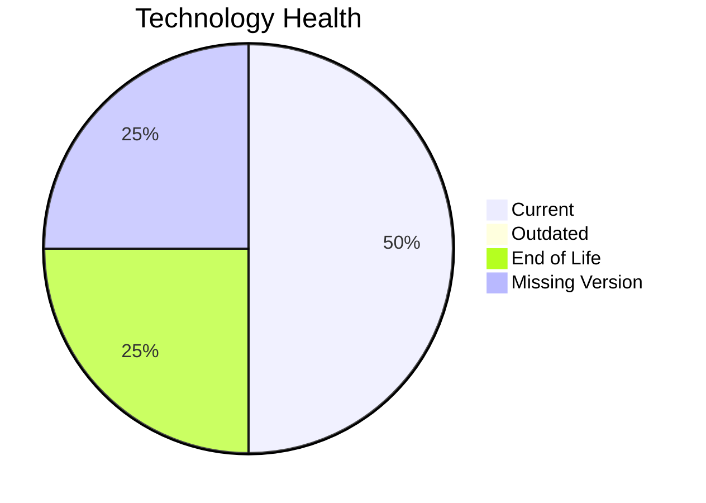

# Application Report: FleetApp-021

**ID:** app021
**Generated:** 2026-05-18T00:00:00Z

## Overview

| Attribute | Value |
|-----------|-------|
| Owner | Operations |
| Environment | On-Premise |
| Business Criticality | High |
| Users | 420 |
| Servers | 2 |

## Technology Stack

| Component | Technology | Version | Status |
|-----------|-----------|---------|--------|
| Operating System | Windows Server | 2022 | 🟢 CURRENT_VERSION |
| Database | Oracle | 11g | 🔴 EOL |
| Language | C++ | 17 | ⚪ NO_KNOWLEDGE |
| Framework | N/A | N/A | ⚪ N/A |
| App Server | Microsoft IIS | 10.0 | 🟢 CURRENT_VERSION |

## Complexity Assessment

**Score:** 6/10 — **MEDIUM**
**Confidence:** 8

| Factor | Score | Notes |
|--------|-------|-------|
| Technology Age | 7/10 | 1 component(s) are EOL. |
| Integration | 5/10 | 4 external interfaces and 3 API endpoints. |
| Infrastructure | 6/10 | 2 server instance(s) across 3 environment(s). |
| Business Criticality | 7/10 | Criticality is High with 420 users. |
| Architecture | 6/10 | Architecture is 2-Tier; containerized=No; CI/CD=No. |
| Data | 6/10 | Database storage is 400 GB on Oracle 11g.  |

## Modernization Scenarios

### Applicable Scenarios

#### ✅ Application Migration to Cloud Infrastructure (Lift & Shift)

- **Priority:** High
- **Effort:** Low
- **Effects:** security, agility
- **Cost:** €5,783 (one-time)
- **Savings:** €2,700/year
- **Reasoning:** The application is still on-premise, which is the main trigger for lift-and-shift cloud migration.

#### ✅ Upgrade Legacy Databases

- **Priority:** High
- **Effort:** Medium
- **Effects:** security, agility
- **Cost:** €11,565 (one-time)
- **Savings:** €10,000/year
- **Reasoning:** Oracle 11g is assessed as EOL.

#### ✅ Switch DB Engine to open-source database solution

- **Priority:** High
- **Effort:** Medium
- **Effects:** cost
- **Cost:** €N/A (one-time)
- **Savings:** €N/A/year
- **Reasoning:** Oracle 11g is a proprietary engine, so moving to an open-source database is a valid modernization option.

### Not Applicable / Other

| Scenario | Status | Reason |
|----------|--------|--------|
| Operating System Update | FULFILLED | Windows Server 2022 is on a supported current-enough release. |
| Switch to standard Linux Operating System | NOT_APPLICABLE | The application already runs on Windows Server, so this Linux migration scenario is not a natural fit. |
| Switch to ARM-based CPU | BLOCKED | The current OS/platform choice is a blocker for an ARM move in the scenario definition. |
| Applications Server replacement | FULFILLED | Microsoft IIS 10.0 is already on a current supported release family. |
| Application Containerization | BLOCKED | The application runs on Windows without evidence of .NET 6+ runtime support. |
| Application Refactoring and De-coupling | NOT_APPLICABLE | The workbook does not show strong evidence of monolithic or tightly coupled design that would justify refactoring first. |
| Update outdated components | LACK_OF_DATA | Component versions are too incomplete to determine whether an update program is required. |

## Financial Summary

| Metric | Value |
|--------|-------|
| Total One-Time Cost | €17,348 |
| Total Yearly Savings | €12,700 |
| Break-Even | 1.4 years |
