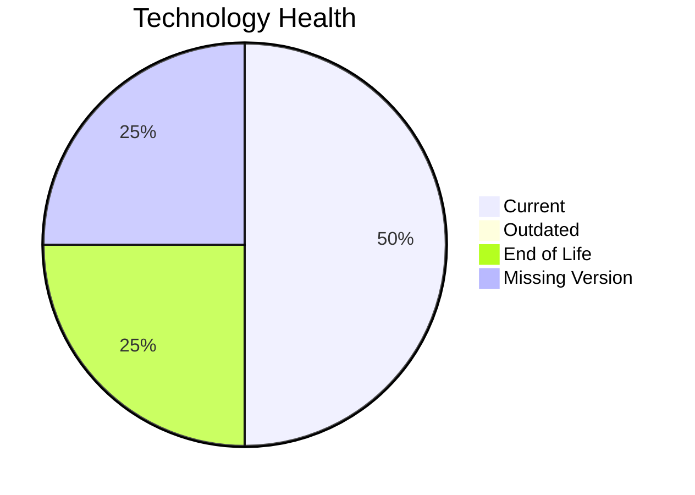

# Application Report: FleetApp-021

**ID:** app021
**Generated:** 2026-05-11

## Overview

| Attribute | Value |
|-----------|-------|
| Owner | Operations |
| Environment | On-Premise |
| Business Criticality | High |
| Users | 420 |
| Servers | 2 |

## Technology Stack

| Component | Technology | Version | Status |
|-----------|-----------|---------|--------|
| Operating System | Windows Server | Windows Server 2022 | 🟢 CURRENT_VERSION |
| Database | Oracle | Oracle 11g | 🔴 EOL |
| Language | C++ 17 | C++ 17 | ⚪ NO_KNOWLEDGE |
| Framework | N/A | N/A | ⚪ |
| App Server | Microsoft IIS | Microsoft IIS 10.0 | 🟢 CURRENT_VERSION |

## Complexity Assessment

**Score:** 6/10 — **MEDIUM**
**Confidence:** 7

Technology age score 8/10 (EOL=1, outdated=0, unknown=1); integration score 5/10 (interfaces=4, api_endpoints=3); infrastructure score 5/10 (servers=2, environments=3); business criticality score 8/10 (High, users=420); architecture score 5/10 (architecture=2-Tier, CI/CD=No, containerized=No); data score 7/10 (db_count=1, db_storage_gb=400).

## Modernization Scenarios

### Applicable Scenarios

#### ✅ Application Migration to Cloud Infrastructure (Lift & Shift)

- **Priority:** High
- **Effort:** Low
- **Effects:** security, agility
- **Cost:** €5783 (one-time)
- **Savings:** €2700/year
- **Reasoning:** On-premise deployment indicates lift-and-shift opportunity to cloud.

#### ✅ Upgrade Legacy Databases

- **Priority:** High
- **Effort:** Medium
- **Effects:** security, agility
- **Cost:** €11565 (one-time)
- **Savings:** €10000/year
- **Reasoning:** Database engine is outdated or end-of-life.

#### ✅ Switch DB Engine to open-source database solution

- **Priority:** High
- **Effort:** Medium
- **Effects:** cost
- **Cost:** N/A
- **Savings:** N/A
- **Reasoning:** Proprietary database engine creates open-source migration opportunity.

### Not Applicable / Other

| Scenario | Status | Reason |
|----------|--------|--------|
| Operating System Update | FULFILLED | Operating system is on a supported current version. |
| Switch to standard Linux Operating System | NOT_APPLICABLE | Scenario excludes Windows-based operating systems. |
| Switch to ARM-based CPU | LACK_OF_DATA | CPU architecture (x86/x64/ARM) is not provided in source data. |
| Applications Server replacement | FULFILLED | Application server is already on a supported version. |
| Application Containerization | LACK_OF_DATA | Containerization prerequisites are unclear from source data. |
| Application Refactoring and De-coupling | PARTIALLY_FULFILLED | Some modularity exists, but additional decoupling opportunities remain. |
| Update outdated components | LACK_OF_DATA | Component version data is incomplete for full assessment. |

## Financial Summary

| Metric | Value |
|--------|-------|
| Total One-Time Cost | €17348 |
| Total Yearly Savings | €12700 |
| Break-Even | 1.4 years |
